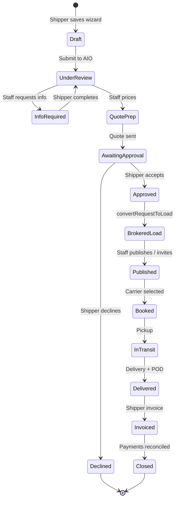

# AIO Freight Lifecycle (Authoritative)

From **shipper request** through **closed load**. One connected record chain.

## Lifecycle diagram



## Status mapping

### Shipper-visible request statuses

| Internal status | Shipper label |
|-----------------|---------------|
| `draft` | Draft |
| `info_required` | Action Required |
| `under_review` | Under AIO Review |
| `quote_preparation` | Quote in Preparation |
| `awaiting_shipper_approval` | Awaiting Your Approval |
| `converted_to_load` | Brokerage Load Created |

### Quote statuses

`draft` → `sent` → `accepted` → `converted`  
Revisions: `revised` / `superseded` via new revision rows — never overwrite sent prices.

### Load operational statuses (existing dispatch)

Shipper sees simplified projection: Booked → Pickup Scheduled → In Transit → Delivered → Documents Processing → Invoiced.

Internal carrier negotiation statuses are **not** exposed to shippers.

## Financial lifecycle

1. **Quote acceptance** — locks `confirmedShipperChargeMinor` from accepted quote revision
2. **Load creation** — seeds `brokerageLoadFinancials` with shipper charge + initial carrier rate (internal)
3. **Carrier booking** — locks agreed carrier rate snapshot
4. **Accessorials** — separate shipper charge vs carrier pay (future authorization flows)
5. **Invoice** — shipper invoice from accepted shipper rate + authorized accessorials
6. **Payable** — carrier payable from agreed carrier rate + authorized carrier accessorials
7. **Margin** — `shipper invoice − carrier payable` (estimated vs realized tracked separately)

## Data flow (no duplicate entry)

```
Wizard fields (once)
  → ShipmentRequest
  → BrokerageFreightQuote.revisions
  → Load.origin/destination/dates/equipment/commodity/instructions
  → LoadBoardPublication
  → Rate confirmation (from load)
  → Shipper tracking view
  → Shipper invoice linehaul
```

## Notifications (demo wiring)

| Event | Recipient |
|-------|-----------|
| Request submitted | AIO staff |
| More info required | Shipper |
| Quote ready | Shipper |
| Quote accepted | Shipper + staff path |
| Private load invite | Carrier |
| Load awarded | Carrier |

## Demo mode scenario

End-to-end path supported in demo store:

1. Shipper submits via **Ship with AIO** wizard
2. Office opens **New Shipper Requests** → create & send quote
3. Shipper accepts quote on quote detail page
4. Load appears with draft publication; staff sets carrier rate + publishes
5. Carrier uses existing load board / brokerage portal offers
6. Staff creates shipper invoice from load detail (existing action)

Synthetic data only — no production mutation in demo mode.
