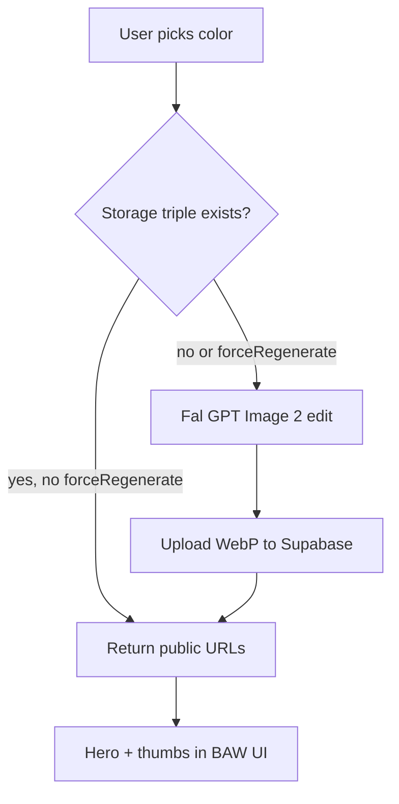

# AI Image Pipeline Map — Build-a-Wig

Maps Fal/OpenAI image generation, storage, access control, and batch tooling.

---

## Golden models (`motherboard/golden-models/`)

| Model | Fal slug | Use in app | Evidence |
|-------|----------|------------|----------|
| GPT Image 2 | `openai/gpt-image-2/edit` | NOIR live color, after-color styling, legacy hairstyle Fal mode | `gpt-image-2.md`; `live-noir-color.ts` |
| NBP | `fal-ai/nano-banana-pro/edit` | Lobby scenes, PSA avatars, live try-on overlays | `nbp-nano-banana-pro.md` |
| Ideogram | Fal background removal | PSA avatar cutouts | `ideogram.md` |

---

## Golden prompts (`motherboard/golden-prompts/`)

| File | Paired model | Wired in code |
|------|--------------|---------------|
| `psa-founder-voice.md` | — | `api/_lib/psaInstructions.ts` |
| `psa-avatar-likeness-nbp.md` | NBP | PSA avatar gen scripts |
| `psa-avatar-background-removal-ideogram.md` | Ideogram | flatten scripts |
| `psa-avatar-expressions-nbp.md` | NBP | expressions |
| PSA nudge holo prompts | NBP | nudge assets |

Wig preview long templates: `scripts/wig-preview/promptTemplate.mjs` — pointed to from golden-prompts README.

---

## Fal API endpoints (runtime)

| Endpoint | Input | Output storage | Auth | Regenerate |
|----------|-------|----------------|------|------------|
| `POST /api/wig-preview/live-noir-color` | color tier hash, angles | `wig-preview-live/{v}/NOIR/{hash}/{angle}.webp` | Bearer | `forceRegenerate` any signed-in user |
| `POST /api/live-wig-after-color-styling` | salon/bangs/part | `after-color/*` paths | Bearer / cacheOnly public | `forceRegenerate` signed-in |
| `POST /api/live-try-on-studio-render` | selfie + wig ref | try-on storage paths | Bearer | admin batch |
| `POST /api/build-a-wig-unit-image` | unit config | Storage | Bearer | rate limited |
| Hairstyle hair-only | template + mannequin | composite in memory → PNG | Bearer+p | per generation |

**Fidelity prompts:** `api/_lib/bawFalEditFidelityPrompt.ts`; duplicated inline in `live-noir-color.ts` (Vercel import constraint per CORE).

---

## OpenAI image-related endpoints

| Endpoint | Purpose |
|----------|---------|
| `POST /api/psa/selfie-style-analysis` | Rank units from selfie |
| `POST /api/psa/chat` | Text; may reference catalog images |
| Hairstyle `HAIRSTYLE_ANALYSIS_RENDER_MODE=fal` | **legacy** full-template GPT2 edit |

---

## Input assets

| Asset type | Location |
|------------|----------|
| UI mannequin overlays | `public/assets/live-preview/Noir/image (27\|26\|28).png` — `bawStaticMannequinReferencePaths.ts` |
| Fal gray-brick refs | Storage `fal-gray-brick-{left\|front\|right}.png` — `bawNoirFalMannequinUrls.ts` |
| Natural part refs | `/assets/natural {left\|front\|right}.png` for flat-iron |
| Hairstyle blueprint | `hairstyleAnalysisCardBlueprint.ts` (code-built, not Fal template) |

**Build scripts:** `npm run wig-preview:build-noir-fal-gray-brick-refs`, `wig-preview:verify-noir-mannequins`.

---

## Output paths (Storage)

| Pattern | Content |
|---------|---------|
| `wig-preview/{v}/NOIR/{hash}.webp` | Offline batch combined |
| `wig-preview-live/{v}/NOIR/{colorTierHash}/{angle}.webp` | Live color triple |
| `after-color/layers-*-part/` | Salon outputs |
| `after-color/crimps-*-part/` | |
| `after-color/flat-iron-*-part/` | |
| `after-color/*-with-bangs-*` | Bangs combos |
| Live try-on | per `liveTryOnStudio.ts` manifest |

**OFF BLACK / JET BLACK hashing:** special cases in CORE — `colorTierHash` rules.

---

## Cache rules

| Rule | Behavior |
|------|----------|
| Missing angle only | `live-noir-color` generates missing angles |
| All angles exist | skip Fal unless `forceRegenerate` |
| Styling `cacheOnly` | return URLs if all `after-color` exist; no auth required |
| Optimistic UI | hash-based public URL + HEAD verify `front.webp` |

---

## Access rules

| Feature | Customer | Premium | Founder/admin |
|---------|----------|---------|---------------|
| NOIR live color view | signed-in | signed-in | signed-in |
| NOIR color Fal regen UI | hidden | hidden | DOM hidden but APIs exist |
| Styling Fal text | on styling routes | premium gate | founder regen strip |
| Live try-on | signed-in | — | batch tools in admin backend |
| Hairstyle generate | — | premium | — |
| Admin batch try-on | — | — | founder |

Evidence: `CORE.md` NOIR BAW section; `isFounderNoirFalRegenUiVisible()`.

---

## Cost controls

| Control | Status |
|---------|--------|
| `build-a-wig-unit-image` IP/user caps | **yes** — `rateLimit.ts` |
| PSA message usage | **yes** — DB RPC `psa_try_consume_message` |
| Hairstyle analysis | **yes** — `hairstyle_analysis_try_consume` |
| NOIR live color / styling | **no durable limit** — **P1** |
| In-memory rate limiter | resets per serverless instance — **P1** |

---

## Manual / batch scripts (`scripts/`, `package.json`)

| Script | Purpose |
|--------|---------|
| `wig-preview:manifest:noir` | Generate manifest JSON |
| `wig-preview:batch` | Batch Fal + Supabase upload |
| `wig-preview:build-noir-fal-gray-brick-refs` | Upload Fal refs |
| `wig-preview:verify-noir-mannequins` | Verify assets |
| `pregenerate-wig-previews.mjs` | Offline pregen |
| Admin `live-try-on-batch-*` API | Founder batch from admin UI |

**Local env:** `.env.wig-preview.example.txt` — **never commit** filled file (`docs/SECURITY_SECRETS_ROTATION.md`).

---

## Missing / planned

| Item | Status |
|------|--------|
| Job queue + status table for Fal jobs | `planned` |
| Cost ledger per user | `planned` |
| Durable rate limits (Redis/Upstash) | `planned` |
| DRM for lounge MP4 | `planned` (CORE deferred) |

---

## Pipeline diagram (NOIR live color)

