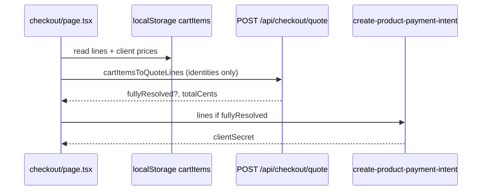

# Product & Pricing Genome — Build-a-Wig

Canonical map of **sellable** and **configurable** items, price sources, server authority, and duplication.  
Evidence: `api/_lib/pricing/resolveQuote.ts`, `bcfProductOptions.ts`, `build-a-wig/page.tsx`, subagent pricing audit.

**Server-priced legend:** `yes` = fully resolved in `resolveCheckoutQuoteLines` for Stripe PI; `partial` = base/metadata only; `no` = client-only.

---

## Six wig units (PDP + BAW base)

| Canonical name | Routes | Display assets | Base price source | Server | Stripe PI | Inventory |
|----------------|--------|----------------|-------------------|--------|-----------|-----------|
| **NOIR** | `/straight/noir`, `/build-a-wig/noir/*` | `public/assets/` mannequins | `resolveQuote.ts:78` **$740**; hub `page.tsx:404` | partial (+cap) | partial | `productInventoryAvailability.ts` |
| **BLANCO** | `/straight/blanco`, BAW | assets | **$820** `resolveQuote.ts:80` | partial | partial | same |
| **SOFT WAVE** | `/wavy/soft-wave` | assets | **$760** `resolveQuote.ts:81` | partial | partial | same |
| **BEACH WAVE** | `/wavy/beach-wave` | assets | **$760** `resolveQuote.ts:83` | partial | partial | same |
| **SOFT CURL** | `/curly/soft-curl` | assets | **$780** `resolveQuote.ts:81` | partial | partial | same |
| **OCEAN CURL** | `/curly/ocean-curl` | assets | **$782** `resolveQuote.ts:82` | partial | partial | same |

**Cap size surcharge:** +$40 flexible — `resolveQuote.ts:92-96`; `build-a-wig/page.tsx:425-426`.

**Duplicated base maps:** `CartDropdown.tsx:289-298`, `wishlistListItemDetails.ts:14-21`, `products/units/page.tsx`, each PDP, `psaCatalogPricing.ts`.

**Known bug:** `wishlistListItemDetails.ts:18` BEACH WAVE **$780** vs canonical **$760** — `verify-first` fix.

**Recommended owner:** `src/catalog/unitCatalog.ts` (planned) + `resolveQuote.ts` server mirror.

---

## Build-a-Wig customizations

| Category | Option price source | Server | Cart line shape |
|----------|---------------------|--------|-----------------|
| Length | `build-a-wig/page.tsx:444-457` | **no** | `build-a-wig` custom line + `selections` JSON |
| Density | `page.tsx:485-504`; `density/page.tsx` | **no** | same |
| Lace | `page.tsx:508-521` | **no** | same |
| Texture | `page.tsx:526-532` | **no** | same |
| Color | `page.tsx:468-477`; `color/page.tsx` | **no** | same |
| Hairline | `page.tsx:537-558` | **no** | same |
| Styling | `bawUnitStylingOptions.ts` | **no** | same |
| Add-ons | `page.tsx:574-593` | **no** | same |

**Server:** `resolveQuote.ts:207-209` — BAW custom lines **not** fully resolved (`resolved: false`).

**Duplication:** hub calculator + **8** step pages each re-declare option tables.

**Recommended owner:** shared `bawPricingCatalog.ts` consumed by hub, steps, and `resolveQuote.ts`.

---

## BCF (bundles, closures, frontals)

| Item | Routes | Price source | Server | Notes |
|------|--------|--------------|--------|-------|
| Straight bundle base | `/shop/bundles` | `bcfProductOptions.ts:465` **$370** | **no** | texture delta wavy +$20, curly +$40 |
| Closure base | `/shop/closures` | **$310** `:466` | **no** | |
| Frontal base | `/shop/frontals` | **$370** `:467` | **no** | |
| Premium color | BCF picker | **$80** `:320` (BAW uses $120) | **no** | |
| Lace treatments | PLUCK/BLEACH | `:390-393` | **no** | |
| Bundle deal (3×) | cart `bcfBundleDeal` | list − **$60** `:626` | **no** | `resolveQuote.ts:228-238` explicit unresolved |

**Cart resolver:** `bcfResolveCartLineUnitPriceUsd` in `bcfProductOptions.ts:404-446`.

**Recommended owner:** `bcfProductOptions.ts` + server port in `resolveQuote.ts`.

---

## Bookings (hair install)

| Item | Route | Price | Server |
|------|-------|-------|--------|
| NEW INSTALL | `/booking/appointment` | **$275** `resolveQuote.ts:46-48` | **yes** |
| RE-INSTALL | same | **$225** | **yes** |
| LAYERED CURLS | add-on | **+$40** | **yes** |
| Braids, brow, lashes, makeup, clean lace, travel | add-ons | `resolveQuote.ts:51-58` | **yes** |

**Checkout:** `/checkout/bookings` — **skips** Stripe product PI (`productCheckoutPolicy.ts`).

---

## Consults

| Item | Route | Price | Server |
|------|-------|-------|--------|
| Consult deposit | `/booking/consultation` | **$40** `resolveQuote.ts:61` | **yes** |
| Style analysis add-on | consult picker | **$20/$40/$60** (1/3/6) `resolveQuote.ts:63-71` | **yes** |

**Duplication:** `consultStyleAnalysisAddon.ts` mirrors API tiers (also used by hairstyle purchase client).

---

## Memberships

| Tier | Route | Price | Server |
|------|-------|-------|--------|
| 3 months | `/account/rewards` → `/checkout/upgrade` | **$280** `stripeMembership.ts:6-9` | **yes** (Stripe Price ID) |
| 6 months | same | **$520** | **yes** |
| 12 months | same | **$960** | **yes** |

**Client duplicate:** `src/constants/subscriptionPricing.ts`.

**Not in resolveQuote** — separate Stripe Checkout path.

---

## Gift cards

| Item | Route | Denominations | Server |
|------|-------|---------------|--------|
| Gift card | `/tools/gift-card` | $10–$500 `GiftCardBalancePicker.tsx:3` | **no** |

Checkout: `/checkout/gift-card` — skips product PI.

---

## Hairstyle analysis (standalone)

| Item | Route | Price | Server |
|------|-------|-------|--------|
| 1 / 3 / 6 comparisons | `/tools/hairstyle-analysis` | **$20/$40/$60** `hairstyleAnalysisPricing.ts:4-8` | **yes** |

Same tiers as consult style analysis by design.

---

## PSA-purchasable / gated (not direct SKU)

| Feature | Gate | Monetization |
|---------|------|--------------|
| PSA chat | Premium subscription | Usage limits `psaUsageLimit.ts` |
| FIND MY BEST LOOKS | Premium | `psa/selfie-style-analysis` |
| Live try-on | Signed-in | Fal cost; limited rate on unit image |
| NOIR live previews | Signed-in (+ premium for some styling) | Fal per generation |

---

## Digital products

| Product | Fulfillment | Price owner |
|---------|-------------|-------------|
| Membership | Stripe subscription + webhook profile update | `stripeMembership.ts` |
| Consult deposit | Meeting + quote flow | `resolveQuote.ts` |
| Hairstyle analysis card | Generated PNG/WebP | `hairstyleAnalysisPricing.ts` |
| Gift card balance | profile `gift_card_balance` | client picker |
| Wig units (simple PDP) | Order JSONB | partial server base |

---

## Cart → checkout → server quote flow

**Gap:** BAW/BCF/gift lines → `fullyResolved: false` → PI rejected (`create-product-payment-intent.ts`).

---

## Duplication heat map (action priority)

| Priority | Area | Locations |
|----------|------|-----------|
| P1 | Six-unit base USD | 6+ files (see units table) |
| P1 | BAW option tables | hub + 8 steps |
| P1 | Consult/hairstyle tiers | API + `consultStyleAnalysisAddon.ts` |
| P2 | Membership USD | `subscriptionPricing.ts` + `stripeMembership.ts` |
| P2 | Cart fallback prices | `CartDropdown.tsx` (twice), wishlist |

---

## Recommended canonical owners (target state)

| Domain | Owner module | Consumers |
|--------|--------------|-----------|
| Unit bases + cap | `catalog/units.ts` + `resolveQuote.ts` | PDP, BAW hub, cart, wishlist, PSA |
| BAW options | `catalog/bawOptions.ts` + server quote | hub, steps, checkout |
| BCF | `bcfProductOptions.ts` + server quote | shop PDP, cart, checkout |
| Bookings/consults | `resolveQuote.ts` only | booking pages (display from shared) |
| Membership | `stripeMembership.ts` | rewards, checkout upgrade |
| Gift card | `catalog/giftCards.ts` | tools, checkout |
