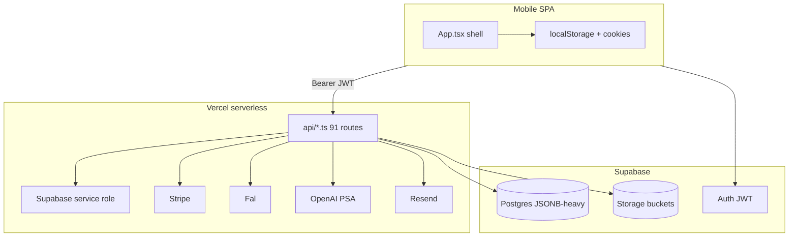

# Product Genome Index — Build-a-Wig / Frontal Slayer

**Repo:** `https://github.com/yoteenz/fsbw.git`  
**Genome generated:** 2026-06-12  
**Baseline commit:** `2ea7bd9e` (after P0 security remediation)  
**Purpose:** Master index for architecture, integrations, pricing, state, tests, and launch risk.

---

## What this app is

A **mobile-first** React SPA for **Frontal Slayer / Build-a-Wig**: shop six wig units, customize via Build-a-Wig, book installs/consults, manage account/concierge, premium membership, PSA (AI concierge), live try-on, hairstyle analysis, and a large **admin/founder CRM** in the same bundle. Commerce mixes **browser localStorage** with **Supabase** sync and **partial** server-authoritative Stripe checkout.

**Evidence:** `motherboard/CORE.md` (mobile-only, flows); `src/App.tsx` (251 routes); `package.json` (React 19, Vite 5).

---

## Current stack

| Layer | Technology | Evidence |
|-------|------------|----------|
| Frontend | React 19, TypeScript, Vite 5, React Router 6, Tailwind | `package.json`; `motherboard/CORE.md:9` |
| Hosting | Vercel (SPA + serverless `api/`) | `api/*.ts` convention; `.env.example` |
| Auth / DB | Supabase Auth + Postgres + Storage | `src/utils/supabase.ts`; `supabase/migrations/` |
| Payments | Stripe Checkout (membership) + PaymentIntent (products) + webhooks | `api/stripe/`; `docs/CHECKOUT_SERVER_QUOTE.md` |
| AI images | Fal (`openai/gpt-image-2/edit`, NBP, Ideogram) | `motherboard/golden-models/`; `api/wig-preview/` |
| AI chat | OpenAI Responses API (PSA) | `.env.example:93-97`; `api/psa/chat.ts` |
| Email | Resend (newsletter, brand contact) | `api/admin/newsletter-send.ts`; `.env.example:88-91` |
| E2E | Playwright (mobile viewport) | `e2e/`; `npm run test:e2e -- --list` → 24 tests |

---

## Major domains

| Domain | Primary surfaces | Canonical code |
|--------|------------------|----------------|
| Storefront | `/home/shop`, unit PDPs, BCF shop | `src/pages/products/`, `src/pages/straight|wavy|curly/` |
| Build-a-Wig | 146 BAW routes, hub + steps | `src/pages/build-a-wig/` |
| Cart / checkout | `/bag`, `/checkout/*` | `src/pages/shopping-bag/`, `checkout/` |
| Account | `/account/*`, `/orders` | `src/pages/account/` |
| Premium / PSA | `/account/rewards`, PSA widget, `/api/psa/*` | `src/components/psa/`; `api/psa/` |
| Admin / founder | `/admin/*` (30 routes) | `src/pages/admin/`; `AdminGuard` |
| AI previews | NOIR live color, styling, try-on, hairstyle cards | `api/wig-preview/`, `api/live-*`, `api/hairstyle-analysis-*` |
| Analytics | Social clicks, admin dashboards | `api/analytics/event.ts`; `site_analytics_events` migration |

---

## Major integrations

See **`INTEGRATION_CONTRACT_REGISTRY.md`**. Summary: Supabase (auth, DB, storage), Stripe, Fal, OpenAI, Resend, browser storage, Playwright.

---

## Evidence classes (used throughout genome)

| Class | Meaning |
|-------|---------|
| `motherboard-backed` | Claim appears in `motherboard/CORE.md` or `MEMORY.md` |
| `code-backed` | Verified in `src/` or `api/` with file:line |
| `db-backed` | Verified in `supabase/migrations/` |
| `runtime-verified` | Observed via command in this audit (`npm run build`, etc.) |
| `deploy-verified` | Confirmed on Vercel/production (not run in this audit) |
| `business-backed` | Product-owner docs in `docs/` |
| `verify-first` | Motherboard/docs claim not fully reconciled to code |
| `legacy` | Still present but superseded or redirect-only |
| `planned` | Documented future work, not implemented |

---

## Baseline checks (runtime-verified)

| Check | Result | Evidence |
|-------|--------|----------|
| `git status --short` | Clean at audit time | command output |
| `git log --oneline -10` | Tip `2ea7bd9e` P0 security | command output |
| `npm ci` | Pass | exit 0 |
| `npm run build` | Pass (`tsc --noEmit` + Vite); chunk size warnings | exit 0 |
| `npm run test:e2e -- --list` | **24 tests** in 5 files | command output |
| `npm audit --omit=dev` | **24 moderate** vulnerabilities | command output |
| `tsconfig.json` `include` | **`src` only** — API not in normal build | `tsconfig.json:23` |
| Separate API `tsc` on `api/**/*.ts` | **19 TypeScript errors** | command output |
| `.env.wig-preview` tracked | **No** (removed at `2ea7bd9e`) | `git ls-files` empty |
| `public/assets` size | **~1.2G** | `du -sh` |
| `canonical-backup/` size | **~830M** | `du -sh` |

---

## Top risks (P0 / P1 / P2)

### P0 — launch blockers / security

| ID | Risk | Status | Evidence |
|----|------|--------|----------|
| P0-1 | Committed secrets in Git history | **Partial fix** — file untracked; history may still contain blobs | `docs/SECURITY_SECRETS_ROTATION.md`; MEMORY 2026-06-12 |
| P0-2 | Plaintext passwords in browser storage | **Fixed** in code at `2ea7bd9e` | `src/utils/authPasswordSanitize.ts`; `src/main.tsx` |
| P0-3 | User must rotate Fal + Supabase keys if leaked | **verify-first** (manual) | `docs/SECURITY_SECRETS_ROTATION.md` |

### P1 — commerce / auth / quality

| ID | Risk | Evidence |
|----|------|----------|
| P1-1 | Checkout not fully server-priced (BAW, BCF, gift card) | `api/_lib/pricing/resolveQuote.ts:207-209`; `docs/CHECKOUT_SERVER_QUOTE.md` |
| P1-2 | `AccountRouteGuard` trusts localStorage when Supabase session missing | `src/components/AccountRouteGuard.tsx:31-34` |
| P1-3 | `session-restore` reflects arbitrary `Origin`; returns refresh token in JSON | `api/session-restore.ts:92-141` |
| P1-4 | API routes not in `tsc` build; **19** API type errors | `tsconfig.json:23`; separate API tsc |
| P1-5 | In-memory rate limits on serverless (Fal cost) | `api/_lib/rateLimit.ts:1-7` |
| P1-6 | Pricing duplicated across ≥6 files; wishlist BEACH WAVE mismatch ($780 vs $760) | `PRODUCT_AND_PRICING_GENOME.md` |

### P2 — architecture / hygiene

| ID | Risk | Evidence |
|----|------|----------|
| P2-1 | 251 manually declared routes; BAW explosion | `src/App.tsx` |
| P2-2 | JSONB cart/orders/wishlist blobs | `20260325120000_full_app_sync.sql` |
| P2-3 | `build-a-wig/page.tsx` ~705 localStorage touches | grep count |
| P2-4 | 1.2G `public/assets` + 830M `canonical-backup` in repo | `du -sh` |
| P2-5 | Admin + customer in one SPA | `src/App.tsx` admin + storefront routes |
| P2-6 | `motherboard/CODEBASE.md` stale (~29 API files; actual **91** routes) | compare `CODEBASE.md:51` vs `api/` glob |

---

## Current architecture shape

**Plain language:** The phone app is the main UI and still acts like a local database for cart, BAW drafts, and auth flags. Supabase holds profiles and synced JSON blobs. Vercel APIs enforce some rules (admin, Stripe, AI) but checkout totals are only partly recomputed on the server.

---

## Recommended remediation phases

### Phase 1 — Security and launch blockers
- Rotate keys + scrub Git history (`docs/SECURITY_SECRETS_ROTATION.md`)
- Harden `session-restore` origin allowlist
- Add `api/` to CI typecheck; fix 19 errors
- Durable rate limits for Fal/OpenAI routes

### Phase 2 — Architecture / source of truth
- Canonical product + pricing catalog (single module)
- Server-resolve all Stripe-chargeable lines
- Reduce localStorage to UI draft/cache only
- Repo hygiene: untrack `canonical-backup`, asset split

### Phase 3 — Test automation and release discipline
- Implement **`FULL_GENOME_TEST_MATRIX.md`**
- Enforce **`RELEASE_GATE_PRODUCT_GENOME.md`** in CI
- Refresh `motherboard/CODEBASE.md` after major changes

---

## Genome document map

| File | Contents |
|------|----------|
| [MOTHERBOARD_RECONCILIATION.md](./MOTHERBOARD_RECONCILIATION.md) | Motherboard vs code truth table |
| [APP_TOPOLOGY_MAP.md](./APP_TOPOLOGY_MAP.md) | System topology |
| [ROUTE_SURFACE_CATALOG.md](./ROUTE_SURFACE_CATALOG.md) | All routes, guards, tests |
| [PRODUCT_AND_PRICING_GENOME.md](./PRODUCT_AND_PRICING_GENOME.md) | Sellable products and price owners |
| [INTEGRATION_CONTRACT_REGISTRY.md](./INTEGRATION_CONTRACT_REGISTRY.md) | External services |
| [API_CONTRACT_REGISTRY.md](./API_CONTRACT_REGISTRY.md) | All API routes |
| [STATE_AND_PERSISTENCE_OWNERSHIP_MAP.md](./STATE_AND_PERSISTENCE_OWNERSHIP_MAP.md) | Who owns what state |
| [AI_IMAGE_PIPELINE_MAP.md](./AI_IMAGE_PIPELINE_MAP.md) | Fal, previews, storage |
| [../testing/FULL_GENOME_TEST_MATRIX.md](../testing/FULL_GENOME_TEST_MATRIX.md) | Test plan |
| [../testing/RELEASE_GATE_PRODUCT_GENOME.md](../testing/RELEASE_GATE_PRODUCT_GENOME.md) | Release gates |
