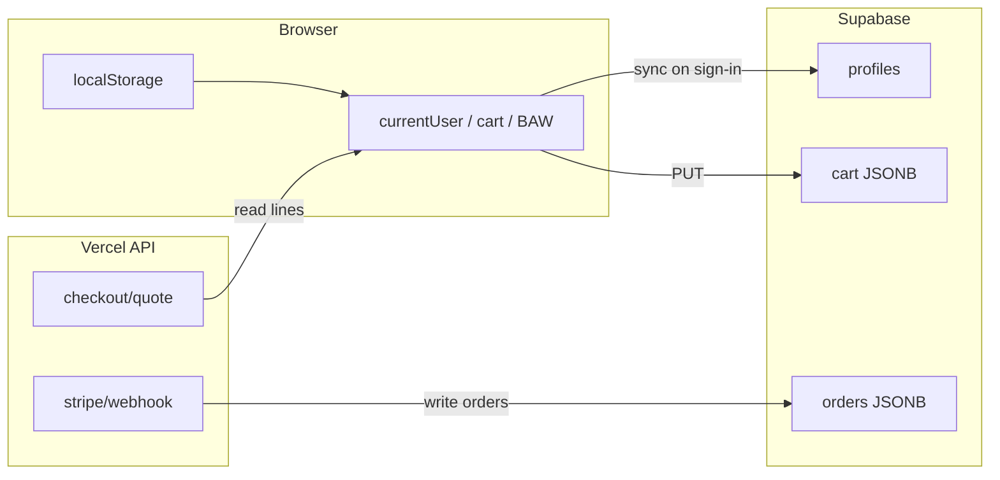

# State & Persistence Ownership Map — Build-a-Wig

Who writes, reads, and owns each domain of application state.  
**Drift risk:** high where both localStorage and Supabase hold the same concept without version/sync.

---

## Auth / session

| Aspect | Detail |
|--------|--------|
| **Current owner** | Hybrid: Supabase JWT + `localStorage` `isSignedIn`/`currentUser` + cookies |
| Writers | `sign-in/page.tsx`, `syncFromApi.ts`, `adminAuth.ts` (`persistAuthBackup`), `session-cookie.ts` |
| Readers | `AccountRouteGuard`, `adminAuth.ts`, all gated pages |
| Sync path | Supabase session → `syncAllFromApi`; cookie `session-restore` |
| Source of truth | **Should be** Supabase JWT; **actually** localStorage flag can gate UI alone |
| Drift risk | **P1** — `AccountRouteGuard.tsx:31-34` |
| Recommended owner | Supabase session + short-lived UI cache only |

---

## Profile / currentUser

| Aspect | Detail |
|--------|--------|
| **Current owner** | `profiles` table + `localStorage.currentUser` mirror |
| Writers | `syncProfileFromApi`, `patchProfile`, `applyMinimalUserToStorage`, settings page |
| Readers | All account pages, checkout, admin client merge |
| Sync path | GET/PATCH `/api/profile`; admin sync-profile |
| Source of truth | Supabase `profiles` when online; local merge preserves non-empty fields |
| Drift risk | **P2** — privileged fields guarded by trigger `20260604120000` |
| Recommended owner | Server profile; client display cache |

---

## Cart

| Aspect | Detail |
|--------|--------|
| **Current owner** | `localStorage` `cartItems` (+ per-user keys via `cartWishlistStorage.ts`) + `cart` table |
| Writers | PDP pages, bag, checkout, `pushCartAndWishlistToCloud`, API PUT |
| Readers | `CartDropdown`, checkout, server quote |
| Sync path | Sign-in → `syncCartFromApi`; `cart.version` optimistic concurrency |
| Source of truth | **Split** — client prices authoritative until server quote |
| Drift risk | **P1** for paid checkout |
| Recommended owner | Server cart identities + server pricing; client UI draft |

---

## Wishlist

| Aspect | Detail |
|--------|--------|
| **Current owner** | `localStorage` + `wishlist` table |
| Writers | wishlist pages, bag "+ LIST", API PUT |
| Readers | wishlist UI, share token page |
| Sync path | Same as cart |
| Drift risk | **P2** (display price fallbacks wrong for BEACH WAVE) |
| Recommended owner | Server wishlist items |

---

## Orders

| Aspect | Detail |
|--------|--------|
| **Current owner** | `localStorage` `userOrders_{email}` + `orders` JSONB |
| Writers | checkout confirm, webhook `recordProductOrderFromPaymentIntent`, mock injectors |
| Readers | `/orders`, concierge, admin |
| Sync path | GET `/api/orders`; webhook append (service role) |
| Source of truth | **Should be** server after payment; legacy local create paths **legacy** |
| Drift risk | **P1** |
| Recommended owner | Relational `orders` + `order_items` (planned); until then JSONB via webhook only |

---

## Build-a-Wig selections

| Aspect | Detail |
|--------|--------|
| **Current owner** | `localStorage` (hub **705** touches on `build-a-wig/page.tsx`) |
| Keys | `selected*`, `customizeSelected*`, `editingCartItem`, unit-specific |
| Writers | BAW hub + step pages |
| Readers | Cart line builder, live preview resolvers |
| Sync path | None to server until add-to-bag |
| Drift risk | **P2** complexity / bugs |
| Recommended owner | Typed reducer + optional server draft (`planned`) |

---

## Build-a-Wig preview state

| Aspect | Detail |
|--------|--------|
| **Current owner** | localStorage pending flags + Supabase Storage WebPs |
| Writers | `bawNoirLivePreviewStorage.ts`, live color API |
| Readers | `resolveAdminNoirHubLiveWigViewsFromStorage`, color/styling pages |
| Source of truth | Storage paths `wig-preview-live/{v}/NOIR/...` |
| Drift risk | **P2** cache vs Fal regen |
| Recommended owner | Storage manifest table (`planned`) |

---

## Pricing state

| Aspect | Detail |
|--------|--------|
| **Current owner** | Client calculators (hub, BCF, checkout) |
| Server | `resolveQuote.ts` partial |
| Drift risk | **P1** |
| Recommended owner | `catalog/*` + `resolveQuote.ts` |

---

## Checkout state

| Aspect | Detail |
|--------|--------|
| **Current owner** | `checkout/page.tsx` React state + localStorage vouchers, addresses |
| Writers | checkout flow, consult codes |
| Server | quote + PI |
| Drift risk | **P1** |
| Recommended owner | Server quote drives all charge amounts |

---

## Inventory

| Aspect | Detail |
|--------|--------|
| **Current owner** | Derived from orders + `adminInventoryOverride` in localStorage |
| Writers | `adminRevenueStats.ts`, admin revenue UI |
| Readers | `productInventoryAvailability.ts`, PDP sold-out |
| Source of truth | **Client-derived** — not DB SKU table |
| Drift risk | **P2** |
| Recommended owner | `inventory` table or `app_config` (`planned`) |

---

## Admin overrides

| Aspect | Detail |
|--------|--------|
| Keys | `adminSubscriptionOverride`, `adminTierOverride`, `adminInventoryOverride`, founder view-as-client |
| Writers | founder account UI, `adminSubscriptionOverrideSync.ts` |
| Readers | `getEffectiveTierName`, premium gates |
| Sync | Founder subscription → Supabase profile (partial) |
| Drift risk | **P2** (intentional for demos) |

---

## Notifications

| Aspect | Detail |
|--------|--------|
| **Current owner** | `localStorage` `notifications_{email}` + `notifications` table |
| Writers | order lifecycle, admin alerts API, stock notify |
| Readers | account notifications page |
| Drift risk | **P2** |

---

## PSA context

| Aspect | Detail |
|--------|--------|
| **Current owner** | `psa_member_context` JSONB + client `psaSessionContext.ts` |
| Writers | PSA chat prefetch, thread store |
| Readers | `api/psa/chat.ts` tools |
| Drift risk | **P2** |

---

## AI-generated images

| Aspect | Detail |
|--------|--------|
| **Current owner** | Supabase Storage objects |
| Paths | `wig-preview-live/`, `after-color/`, try-on overlays |
| Writers | Fal APIs, batch scripts |
| Readers | Public URLs in UI |
| Drift risk | **P2** cost/orphans |
| Recommended owner | Storage index table + CDN (`planned`) |

---

## Analytics

| Aspect | Detail |
|--------|--------|
| **Current owner** | `site_analytics_events` + client visitor id `analyticsVisitor.ts` |
| Writers | `POST /api/analytics/event` |
| Readers | admin analytics |
| Drift risk | **P2** |

---

## Motherboard / project memory

| Aspect | Detail |
|--------|--------|
| **Current owner** | `motherboard/` folder (CORE, MEMORY, CODEBASE, golden-*) |
| Writers | agents per ADDING.md |
| Readers | all agents |
| Drift risk | **P2** CODEBASE stale vs genome docs |
| Recommended owner | This genome + periodic CODEBASE snapshot |

---

## Persistence flow diagram

