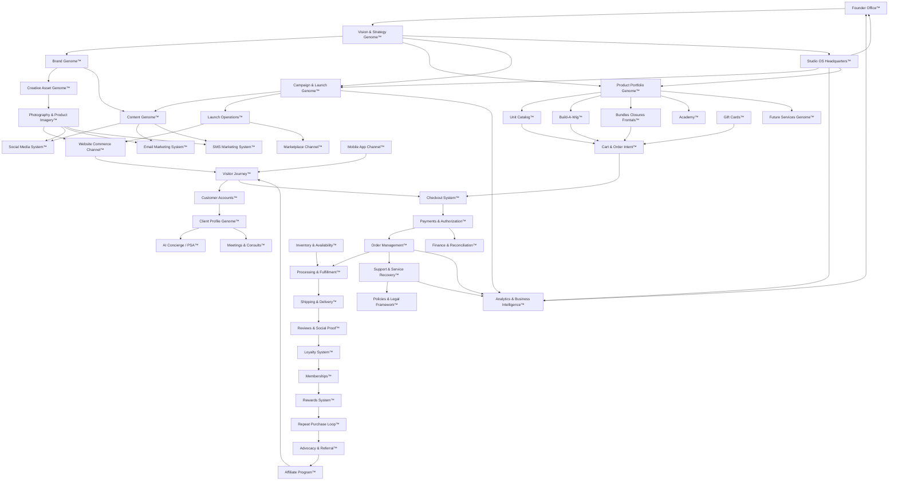

# Frontal Slayer Company Genome™

**Mission:** Define the architectural DNA of Frontal Slayer as a business organism: its systems, owners, dependencies, data, events, rules, risks, revenue paths, customer impact, founder impact, automation potential, AI opportunities, and future expansion.

**Scope:** This is a business architecture blueprint. It does not describe the software implementation as the center of the company. Website, mobile app, AI Concierge, and Studio OS appear here as business channels and operating systems, not as the business itself.

---

## 0. Genome Thesis

Frontal Slayer is a luxury hair commerce, customization, education, and client-relationship company. Its operating organism is built from five connected engines:

1. **Desire Engine** — brand, vision, content, campaigns, social proof, creative assets.
2. **Product Engine** — units, bundles, closures, frontals, Build-A-Wig™, gift cards, future services.
3. **Client Engine** — visitor conversion, customer accounts, client profiles, loyalty, support, reviews, community.
4. **Revenue Engine** — orders, checkout, payments, memberships, rewards, affiliate program, launches, marketplace.
5. **Operating Engine** — founder decisions, inventory, photography, processing, shipping, policies, legal, finance, analytics, Studio OS, AI Concierge.

The company grows when these engines share events cleanly:

> Founder Vision → Brand Direction → Campaign → Content → Launch → Traffic → Conversion → Payment → Fulfillment → Delivery → Review → Loyalty → Membership → Rewards → Repeat Purchase → Advocacy → Referral → New Customer

---

## 1. Company Genome Graph™

### System classes

| Class | Systems |
|---|---|
| Core business systems | Brand, Vision, Founder Office, Product Portfolio, Client Profile, Orders, Payments, Fulfillment, Studio OS |
| Supporting systems | Policies, Legal, Support, Inventory, Photography, Creative Assets, Analytics, Finance |
| Revenue systems | Units, Build-A-Wig™, Bundles/Closures/Frontals, Memberships, Rewards, Affiliate, Gift Cards, Academy, Marketplace, Launches |
| Customer systems | Website, Mobile App, Customer Accounts, Client Profiles, AI Concierge, Meetings, Reviews, Loyalty, Community |
| Knowledge systems | Vision, Founder Decisions, Studio OS, Analytics, Client Profiles, Policies, Academy, Company Genome |
| Creative systems | Brand, Photography, Creative Assets, Content, Campaigns, Social Media, Email, SMS |
| Operational systems | Checkout, Payments, Orders, Processing, Shipping, Inventory, Support, Finance |
| Expansion systems | Academy, Certification, Community, Marketplace, Future Services, AI Concierge, Studio OS |

---

## 2. System Register

Each system below is a business object. It may have software surfaces, but its genome definition is operational.

### 01. Brand Genome™

- **Purpose:** Preserve the luxury, editorial, trust-centered identity of Frontal Slayer across every customer and founder touchpoint.
- **Primary Owner:** Founder / Chief Brand Owner.
- **Inputs:** Founder taste, customer perception, product visuals, campaign themes, cultural references, testimonials.
- **Outputs:** Brand rules, voice, visual standards, storytelling rules, campaign direction, trust signals.
- **Upstream Dependencies:** Vision, Founder Office, Creative Assets, Customer Reviews.
- **Downstream Dependencies:** Website, Mobile App, Marketing, Social, Email, SMS, Packaging, Support, Academy.
- **Owned Data:** Brand principles, vocabulary, approved unit names, tone rules, visual references, do/don't guidance.
- **Events Produced:** Brand direction approved, brand rule changed, campaign theme approved, voice standard updated.
- **Events Consumed:** Founder decision made, customer sentiment changed, new product launched, creative asset approved.
- **Business Rules:** Trust over sales; luxury editorial tone; handcrafted storytelling; real catalog products only; brand coherence over uniformity.
- **Failure Risks:** Generic AI output, inconsistent visuals, discount-brand perception, confusing product language.
- **Operational Importance:** Critical.
- **Revenue Impact:** High; brand trust raises conversion and repeat purchase.
- **Customer Impact:** High; shapes confidence before purchase.
- **Founder Impact:** High; protects founder taste from dilution.
- **Automation Potential:** Medium; audits and checklists can automate consistency, final taste should remain founder-governed.
- **AI Opportunities:** Brand voice review, campaign copy scoring, visual coherence critique, customer sentiment synthesis.
- **Future Expansion:** Brand licensing, partner style guide, marketplace brand standards, franchise-grade creative governance.

### 02. Vision & Strategy Genome™

- **Purpose:** Convert founder ambition into business priorities, market positioning, and long-term operating direction.
- **Primary Owner:** Founder / Executive Council.
- **Inputs:** Founder goals, market signals, revenue data, customer needs, competitor movements, operational constraints.
- **Outputs:** Strategic priorities, expansion bets, product roadmap, service roadmap, campaign direction.
- **Upstream Dependencies:** Founder Office, Analytics, Finance, Client Profiles, Market Intelligence.
- **Downstream Dependencies:** Brand, Products, Campaigns, Studio OS, Academy, Marketplace, Future Services.
- **Owned Data:** Vision statements, strategic pillars, market assumptions, roadmap themes, decision history.
- **Events Produced:** Strategic priority approved, expansion thesis created, roadmap updated, initiative paused.
- **Events Consumed:** Revenue milestone reached, bottleneck detected, customer segment emerging, competitive threat identified.
- **Business Rules:** Strategy must serve the brand promise; expansion should strengthen the core before adding complexity.
- **Failure Risks:** Reactive launches, scattered priorities, founder overload, diluted positioning.
- **Operational Importance:** Critical.
- **Revenue Impact:** High; determines where the company places capital and attention.
- **Customer Impact:** Medium to high; shapes product and service evolution.
- **Founder Impact:** Critical; protects the founder from running the business by memory alone.
- **Automation Potential:** Medium; dashboards and briefings can surface tradeoffs.
- **AI Opportunities:** Scenario planning, opportunity ranking, decision briefs, risk prediction.
- **Future Expansion:** Multi-year operating plan, capital allocation model, franchise or licensing strategy.

### 03. Founder Office™

- **Purpose:** Central authority for final taste, major decisions, approvals, prioritization, and company memory.
- **Primary Owner:** Founder.
- **Inputs:** Briefings, customer issues, campaign proposals, financial reports, product ideas, operational exceptions.
- **Outputs:** Approvals, rejections, creative direction, priority changes, policy decisions, cultural standards.
- **Upstream Dependencies:** Studio OS, Analytics, Support, Marketing, Finance, Operations.
- **Downstream Dependencies:** All systems.
- **Owned Data:** Decision log, founder preferences, approval history, escalation rules, non-negotiables.
- **Events Produced:** Founder approved, founder rejected, founder override issued, new standard declared.
- **Events Consumed:** Critical support issue, launch ready, revenue anomaly, campaign proposal, product risk.
- **Business Rules:** High-impact, brand-shaping, financial, legal, or customer-trust decisions require founder visibility.
- **Failure Risks:** Bottleneck, decision fatigue, undocumented rationale, inconsistent delegation.
- **Operational Importance:** Critical.
- **Revenue Impact:** High; founder decisions steer launches, product quality, and trust.
- **Customer Impact:** High when decisions affect service recovery, policies, or products.
- **Founder Impact:** Critical; this is the founder's control plane.
- **Automation Potential:** Medium; automate preparation, not authority.
- **AI Opportunities:** Daily briefings, approval packets, issue triage, memory retrieval, founder-preference calibration.
- **Future Expansion:** Executive delegation model, trusted approval tiers, founder apprenticeship library.

### 04. Executive Decisions System™

- **Purpose:** Turn business signals into documented decisions with ownership, rationale, risk, and follow-through.
- **Primary Owner:** Founder / Chief of Staff.
- **Inputs:** Analytics, customer feedback, financial data, launch retrospectives, support escalations.
- **Outputs:** Decision records, assigned actions, policy updates, roadmap changes, approval trails.
- **Upstream Dependencies:** Founder Office, Analytics, Finance, Support, Studio OS.
- **Downstream Dependencies:** Campaigns, Product Portfolio, Operations, Legal, Knowledge Systems.
- **Owned Data:** Decision ID, date, owner, context, alternatives, final call, follow-up requirements.
- **Events Produced:** Decision recorded, action assigned, decision revisited, decision superseded.
- **Events Consumed:** Escalation created, metric crossed threshold, founder asks for review.
- **Business Rules:** Major decisions must record why, not just what; superseded decisions remain historical.
- **Failure Risks:** Repeating old debates, hidden commitments, conflicting policies.
- **Operational Importance:** High.
- **Revenue Impact:** Medium to high.
- **Customer Impact:** Medium.
- **Founder Impact:** High; reduces memory burden.
- **Automation Potential:** High for capture, reminders, and relationship mapping.
- **AI Opportunities:** Decision summarization, risk analysis, precedent search, follow-up monitoring.
- **Future Expansion:** Constitution-style business governance and operating history.

### 05. Product Portfolio Genome™

- **Purpose:** Own what the company sells, why it exists, how it is priced, and how products relate to each other.
- **Primary Owner:** Founder / Product Lead.
- **Inputs:** Vision, demand, supplier capability, margin targets, inventory, product photography, customer feedback.
- **Outputs:** Product catalog, SKU hierarchy, pricing principles, bundle logic, launch sequence, retirement decisions.
- **Upstream Dependencies:** Brand, Vision, Inventory, Finance, Photography.
- **Downstream Dependencies:** Units, Build-A-Wig™, BCF, Checkout, Marketing, Support, Marketplace.
- **Owned Data:** Product families, unit list, product attributes, price bands, margin assumptions, lifecycle status.
- **Events Produced:** Product created, product updated, price changed, product retired, product launched.
- **Events Consumed:** Inventory changed, customer demand spike, margin issue, review trend, supplier constraint.
- **Business Rules:** Catalog must stay understandable; customization cannot destroy fulfillment feasibility or margin.
- **Failure Risks:** SKU confusion, price drift, misquoted orders, dead inventory, inconsistent product claims.
- **Operational Importance:** Critical.
- **Revenue Impact:** Critical.
- **Customer Impact:** High; clarity drives confidence.
- **Founder Impact:** High; product quality embodies the brand.
- **Automation Potential:** High for catalog validation and margin checks.
- **AI Opportunities:** assortment analysis, price consistency checks, product recommendation logic, gap detection.
- **Future Expansion:** Marketplace listings, limited collections, wholesale/partner catalog, service-product bundles.

### 06. Collections System™

- **Purpose:** Group products into editorial, seasonal, texture, lifestyle, or launch narratives that make shopping feel curated.
- **Primary Owner:** Founder / Brand + Product.
- **Inputs:** Product catalog, campaign themes, seasonal timing, inventory, photography, customer segments.
- **Outputs:** Collection pages, drop names, creative stories, launch assortments, buying guides.
- **Upstream Dependencies:** Brand, Product Portfolio, Inventory, Creative Assets.
- **Downstream Dependencies:** Website, Marketing, Social, Email, Launches, Marketplace.
- **Owned Data:** Collection name, story, included products, hero assets, launch window, target audience.
- **Events Produced:** Collection planned, collection launched, collection refreshed, collection retired.
- **Events Consumed:** Product available, campaign approved, inventory depleted, content ready.
- **Business Rules:** Collections must be coherent in style, availability, and price story.
- **Failure Risks:** Beautiful campaign with unavailable product, unclear customer path, stale collection pages.
- **Operational Importance:** High.
- **Revenue Impact:** High during launches and campaigns.
- **Customer Impact:** High; reduces choice overload.
- **Founder Impact:** Medium; supports creative storytelling.
- **Automation Potential:** Medium.
- **AI Opportunities:** collection composition recommendations, naming concepts, inventory-aware merchandising.
- **Future Expansion:** capsule drops, member-only collections, celebrity/client-inspired edits.

### 07. Unit Catalog™

- **Purpose:** Own the six primary wig unit identities and their business meaning: NOIR, BLANCO, SOFT WAVE, BEACH WAVE, SOFT CURL, OCEAN CURL.
- **Primary Owner:** Product Lead / Founder.
- **Inputs:** Hair sourcing, unit specs, base prices, inventory, product imagery, customer preferences.
- **Outputs:** Unit PDPs, base unit options, Build-A-Wig™ starting points, marketing product references.
- **Upstream Dependencies:** Product Portfolio, Inventory, Photography, Finance.
- **Downstream Dependencies:** Build-A-Wig™, Cart, Checkout, Content, AI Concierge, Support.
- **Owned Data:** Unit names, textures, base prices, descriptions, assets, availability, care instructions.
- **Events Produced:** Unit available, unit unavailable, unit price changed, unit imagery updated.
- **Events Consumed:** Supplier stock changed, review trend found, product photo approved, order volume changed.
- **Business Rules:** Unit names are canonical; descriptions and visuals must match real catalog units.
- **Failure Risks:** wrong unit expectation, overselling, price mismatch, visual misrepresentation.
- **Operational Importance:** Critical.
- **Revenue Impact:** Critical.
- **Customer Impact:** Critical; the unit is the core buying decision.
- **Founder Impact:** High.
- **Automation Potential:** High for availability and price consistency.
- **AI Opportunities:** fit recommendation, unit comparison, review summarization by unit.
- **Future Expansion:** new textures, limited colors, pro collections, wholesale unit catalog.

### 08. Build-A-Wig™

- **Purpose:** Let customers configure a wig as a luxury guided build instead of a generic product picker.
- **Primary Owner:** Product + Client Experience.
- **Inputs:** Unit catalog, length, density, lace, texture, color, hairline, styling, cap size, add-ons, membership gates.
- **Outputs:** Custom wig configuration, cart line, visual preview, customer expectation, fulfillment instructions.
- **Upstream Dependencies:** Unit Catalog, Product Portfolio, Inventory, Pricing, Photography, AI Preview Assets.
- **Downstream Dependencies:** Cart, Checkout, Orders, Processing, Support, AI Concierge, Reviews.
- **Owned Data:** Configuration selections, option prices, option rules, draft builds, final build summary.
- **Events Produced:** Build started, option selected, build completed, build added to cart, build edited.
- **Events Consumed:** Unit selected, inventory changed, membership status changed, customer signed in.
- **Business Rules:** Customization must remain fulfillable; selected options must be explicit before payment; premium gates must be clear.
- **Failure Risks:** wrong build, incomplete specs, underpriced options, fulfillment ambiguity, customer disappointment.
- **Operational Importance:** Critical.
- **Revenue Impact:** Critical; customization increases AOV.
- **Customer Impact:** Critical; this is a signature experience.
- **Founder Impact:** High; expresses innovation and brand differentiation.
- **Automation Potential:** High for option validation, quote checks, preview generation, fulfillment summary.
- **AI Opportunities:** guided build assistant, style compatibility warnings, visual preview, upsell suggestions, care plan generation.
- **Future Expansion:** saved builds, build comparison, stylist-approved builds, member-exclusive customizations.

### 09. Bundles / Closures / Frontals System™

- **Purpose:** Sell hair components separately or in bundle deals for customers and stylists who need modular purchases.
- **Primary Owner:** Product + Inventory.
- **Inputs:** Texture, length, color, lace treatment, quantity, bundle deal rules, supplier stock.
- **Outputs:** BCF cart lines, bundle deal offers, component fulfillment instructions.
- **Upstream Dependencies:** Product Portfolio, Inventory, Pricing, Supplier Relationships.
- **Downstream Dependencies:** Checkout, Orders, Processing, Support, Marketing.
- **Owned Data:** Bundle SKUs, closure SKUs, frontal SKUs, option choices, deal rules, availability.
- **Events Produced:** Component selected, bundle deal applied, component stock changed, BCF order placed.
- **Events Consumed:** Product catalog update, supplier stock update, cart changed, campaign launched.
- **Business Rules:** Bundle math must be clear; lace/color treatments must be priced and fulfillable.
- **Failure Risks:** wrong component mix, inventory mismatch, unclear deal rules, undercollection of custom fees.
- **Operational Importance:** High.
- **Revenue Impact:** High; supports broader hair commerce beyond full units.
- **Customer Impact:** Medium to high.
- **Founder Impact:** Medium.
- **Automation Potential:** High for bundle validation and fulfillment checklists.
- **AI Opportunities:** bundle builder, stylist recommendations, compatibility checks.
- **Future Expansion:** stylist wholesale packs, salon pro bundles, recurring replenishment.

### 10. Gift Cards™

- **Purpose:** Let customers buy stored value that can introduce new customers or drive future purchases.
- **Primary Owner:** Finance + Customer Experience.
- **Inputs:** Gift amount, sender details, recipient details, payment authorization, redemption rules.
- **Outputs:** Gift card balance, recipient notification, redemption credit, liability record.
- **Upstream Dependencies:** Checkout, Payments, Email/SMS, Finance, Policies.
- **Downstream Dependencies:** Customer Accounts, Orders, Rewards, Support.
- **Owned Data:** Gift card ID, amount, balance, purchaser, recipient, redemption history, expiration policy if any.
- **Events Produced:** Gift card purchased, gift card delivered, gift card redeemed, balance changed.
- **Events Consumed:** Payment authorized, account created, checkout started, support adjustment approved.
- **Business Rules:** Balance must reconcile to payment; redemption must not exceed available value; policy must be clear.
- **Failure Risks:** liability mismatch, lost recipient delivery, fraud, support disputes.
- **Operational Importance:** Medium.
- **Revenue Impact:** Medium; cash-forward revenue and acquisition.
- **Customer Impact:** Medium.
- **Founder Impact:** Low to medium.
- **Automation Potential:** High.
- **AI Opportunities:** gift recommendation prompts, recipient journey personalization, breakage/liability forecasting.
- **Future Expansion:** branded gifting campaigns, member gifting, corporate/client appreciation cards.

### 11. Academy™

- **Purpose:** Turn Frontal Slayer expertise into structured education, certification, authority, and community growth.
- **Primary Owner:** Founder / Education Lead.
- **Inputs:** Founder expertise, product knowledge, installation standards, styling methods, content curriculum, student goals.
- **Outputs:** Courses, workshops, certifications, student progress, alumni community, professional credibility.
- **Upstream Dependencies:** Brand, Education, Product Portfolio, Studio OS, Community.
- **Downstream Dependencies:** Certification, Community, Affiliate, Marketplace, Future Services.
- **Owned Data:** curriculum, modules, instructors, student profiles, completion records, certification status.
- **Events Produced:** Student enrolled, module completed, certification issued, workshop launched.
- **Events Consumed:** Founder approves curriculum, student purchases course, community question emerges, industry trend appears.
- **Business Rules:** Education must protect brand standards and teach craft, not only sell products.
- **Failure Risks:** low completion, weak certification credibility, content becoming stale, support burden.
- **Operational Importance:** Expansion-critical.
- **Revenue Impact:** Medium now, high future.
- **Customer Impact:** Medium; high for students/pros.
- **Founder Impact:** High; scales founder knowledge.
- **Automation Potential:** Medium to high.
- **AI Opportunities:** personalized learning paths, skill assessments, practice feedback, curriculum updates.
- **Future Expansion:** Professional licenses, stylist directory, paid mentorship, studio exchange education products.

### 12. Certification System™

- **Purpose:** Validate Academy learning into recognized achievement, status, and future economic opportunity.
- **Primary Owner:** Education Lead / Founder.
- **Inputs:** coursework, assessments, portfolio submissions, mentor reviews, conduct standards.
- **Outputs:** certification credential, alumni status, community access, marketplace eligibility.
- **Upstream Dependencies:** Academy, Policies, Community, Founder Standards.
- **Downstream Dependencies:** Community, Marketplace, Affiliate, Future Services.
- **Owned Data:** credential ID, certified person, level, scope, issue date, renewal status, portfolio evidence.
- **Events Produced:** Certification awarded, certification renewed, certification suspended, graduate spotlighted.
- **Events Consumed:** Module completed, assessment passed, mentor approved, policy violation reported.
- **Business Rules:** Certification should represent demonstrated ability, not attendance alone.
- **Failure Risks:** credibility loss, inconsistent evaluation, legal ambiguity, unfair access.
- **Operational Importance:** Medium now, high future.
- **Revenue Impact:** Medium future.
- **Customer Impact:** High for students and future clients.
- **Founder Impact:** High; protects the standard attached to the brand.
- **Automation Potential:** Medium.
- **AI Opportunities:** rubric scoring support, portfolio review prep, renewal reminders.
- **Future Expansion:** certified stylist network, marketplace badges, professional license tiers.

### 13. Memberships™

- **Purpose:** Create premium access, loyalty depth, recurring revenue, and elevated client treatment.
- **Primary Owner:** Growth + Customer Experience.
- **Inputs:** customer profile, payment status, tier duration, perks, reward rules, premium feature gates.
- **Outputs:** member status, benefit access, recurring revenue, member-only campaigns, retention signals.
- **Upstream Dependencies:** Customer Accounts, Payments, Rewards, AI Concierge, Policies.
- **Downstream Dependencies:** Rewards, AI Concierge, Launches, Website, Support, Loyalty.
- **Owned Data:** membership tier, start/end dates, renewal preference, benefits used, eligibility.
- **Events Produced:** Membership started, membership renewed, membership expired, benefit unlocked.
- **Events Consumed:** Payment authorized, customer upgraded, reward earned, support adjustment approved.
- **Business Rules:** Benefits must be clear; premium access must match payment status; renewal expectations must be transparent.
- **Failure Risks:** customer confusion, unpaid benefit access, churn, benefit overpromising.
- **Operational Importance:** High.
- **Revenue Impact:** Critical for recurring revenue.
- **Customer Impact:** High for premium clients.
- **Founder Impact:** Medium; creates VIP relationship layer.
- **Automation Potential:** High.
- **AI Opportunities:** churn prediction, personalized member perks, premium concierge prompts, next-best-offer recommendations.
- **Future Expansion:** tiers beyond duration, founder circle, members-only drops, service credits.

### 14. Rewards System™

- **Purpose:** Convert customer behavior into points, perks, vouchers, status, and repeat purchase motivation.
- **Primary Owner:** Growth + Finance.
- **Inputs:** orders, referrals, affiliate activity, birthdays, reviews, membership status, policy rules.
- **Outputs:** points, vouchers, tier status, reward emails/SMS, redemption credits.
- **Upstream Dependencies:** Orders, Payments, Memberships, Reviews, Affiliate, Customer Accounts.
- **Downstream Dependencies:** Loyalty, Repeat Purchase, Email, SMS, Support, Finance.
- **Owned Data:** points balance, earning events, redemptions, vouchers, tier, expiration dates.
- **Events Produced:** Points earned, reward redeemed, tier upgraded, voucher expiring, reward adjusted.
- **Events Consumed:** Order paid, referral converted, review submitted, membership upgraded, support adjustment approved.
- **Business Rules:** Rewards must be earned from valid events; redemptions must reconcile financially; abuse must be prevented.
- **Failure Risks:** points fraud, margin leakage, angry customers from unclear rules, support load.
- **Operational Importance:** High.
- **Revenue Impact:** High for retention and AOV.
- **Customer Impact:** High; reward trust matters.
- **Founder Impact:** Medium.
- **Automation Potential:** High.
- **AI Opportunities:** reward optimization, abuse detection, personalized redemption suggestions.
- **Future Expansion:** VIP tiers, gamified milestones, partner rewards, experiential perks.

### 15. Affiliate Program™

- **Purpose:** Turn customers, creators, and community advocates into measurable acquisition partners.
- **Primary Owner:** Growth / Creator Partnerships.
- **Inputs:** affiliate applications, creator content, referral links/codes, orders, approvals, payout rules.
- **Outputs:** affiliate status, content approvals, commission/points, creator campaigns, new customer traffic.
- **Upstream Dependencies:** Brand, Rewards, Customer Accounts, Analytics, Legal.
- **Downstream Dependencies:** Social, Campaigns, Reviews, Referral, Finance, Support.
- **Owned Data:** affiliate ID, link/code, content submissions, approval status, attributed customers, rewards/payouts.
- **Events Produced:** Affiliate approved, content submitted, referral converted, payout issued, affiliate suspended.
- **Events Consumed:** Application submitted, order paid, review created, policy violation reported.
- **Business Rules:** Content must meet brand standards; attribution must be clear; payouts require valid conversion.
- **Failure Risks:** brand-inconsistent content, commission disputes, fraudulent referrals, tax/payment complexity.
- **Operational Importance:** Medium to high.
- **Revenue Impact:** High if scaled.
- **Customer Impact:** Medium; trust depends on authentic advocates.
- **Founder Impact:** Medium.
- **Automation Potential:** High for attribution, approval queues, fraud flags.
- **AI Opportunities:** content quality review, creator matching, payout anomaly detection.
- **Future Expansion:** ambassador tiers, creator marketplace, paid campaign briefs, certified stylist affiliates.

### 16. Orders System™

- **Purpose:** Convert paid or approved purchase intent into accountable fulfillment obligations.
- **Primary Owner:** Operations.
- **Inputs:** checkout data, payment authorization, customer profile, cart lines, shipping details, notes.
- **Outputs:** order record, fulfillment task, customer confirmation, admin visibility, revenue record.
- **Upstream Dependencies:** Checkout, Payments, Customer Accounts, Product Portfolio, Inventory.
- **Downstream Dependencies:** Processing, Shipping, Support, Reviews, Rewards, Finance, Analytics.
- **Owned Data:** order ID, customer, items, options, totals, payment status, fulfillment status, timestamps.
- **Events Produced:** Order created, order paid, order updated, order cancelled, order fulfilled.
- **Events Consumed:** Payment authorized, checkout submitted, inventory reserved, support change approved.
- **Business Rules:** No fulfillment without payment/authorization; custom details must be preserved; status must match reality.
- **Failure Risks:** lost orders, wrong specs, duplicate fulfillment, revenue mismatch.
- **Operational Importance:** Critical.
- **Revenue Impact:** Critical.
- **Customer Impact:** Critical.
- **Founder Impact:** High; order problems escalate quickly.
- **Automation Potential:** High.
- **AI Opportunities:** order risk triage, fulfillment summaries, delay prediction, customer update drafting.
- **Future Expansion:** order lifecycle portal, production queue, supplier handoff, wholesale order management.

### 17. Checkout System™

- **Purpose:** Collect purchase intent, confirm customer details, calculate due amounts, and route to payment authorization.
- **Primary Owner:** Commerce Operations.
- **Inputs:** cart, product configuration, customer profile, shipping address, discounts, rewards, gift cards.
- **Outputs:** confirmed quote, payment request, order draft, customer receipt path.
- **Upstream Dependencies:** Cart, Product Portfolio, Pricing, Customer Accounts, Rewards, Gift Cards.
- **Downstream Dependencies:** Payments, Orders, Finance, Analytics, Support.
- **Owned Data:** checkout session, line items, totals, discounts, taxes/shipping assumptions, address, payment route.
- **Events Produced:** Checkout started, quote confirmed, checkout abandoned, checkout submitted.
- **Events Consumed:** Cart changed, reward applied, gift card applied, customer signed in, inventory changed.
- **Business Rules:** Customer must understand total and obligations before authorization; custom lines require authoritative quote.
- **Failure Risks:** mispriced orders, abandonment, payment failure, legal disputes.
- **Operational Importance:** Critical.
- **Revenue Impact:** Critical.
- **Customer Impact:** Critical.
- **Founder Impact:** High.
- **Automation Potential:** High.
- **AI Opportunities:** abandoned checkout recovery, quote validation, friction analysis, smart assistance.
- **Future Expansion:** one-click member checkout, deposits, financing, marketplace checkout.

### 18. Payments & Authorization™

- **Purpose:** Securely authorize money movement, subscriptions, deposits, credits, refunds, and financial status changes.
- **Primary Owner:** Finance / Commerce Operations.
- **Inputs:** checkout quote, customer payment method, membership choice, deposits, refunds, gift card/redemption offsets.
- **Outputs:** authorization status, receipt, payment record, webhook event, financial reconciliation entry.
- **Upstream Dependencies:** Checkout, Memberships, Gift Cards, Finance, Policies.
- **Downstream Dependencies:** Orders, Memberships, Rewards, Finance, Support, Analytics.
- **Owned Data:** payment ID, authorization status, amount, currency, customer, subscription ID, refund status.
- **Events Produced:** Payment authorized, payment failed, refund issued, subscription paid, dispute opened.
- **Events Consumed:** Checkout submitted, membership selected, refund requested, dispute received.
- **Business Rules:** Fulfillment depends on valid authorization; payment events must reconcile to orders and memberships.
- **Failure Risks:** unpaid fulfillment, duplicate charges, failed subscriptions, disputes, compliance risk.
- **Operational Importance:** Critical.
- **Revenue Impact:** Critical.
- **Customer Impact:** Critical.
- **Founder Impact:** High when disputes or failed payments occur.
- **Automation Potential:** High for reconciliation and alerts.
- **AI Opportunities:** dispute packet prep, anomaly detection, failed-payment recovery messaging.
- **Future Expansion:** payment plans, deposits, split payments, store credit ledger.

### 19. Processing & Fulfillment™

- **Purpose:** Convert orders into prepared products or services that meet the promised specifications.
- **Primary Owner:** Operations / Production.
- **Inputs:** paid order, custom specs, inventory, supplier availability, quality standards, timeline.
- **Outputs:** fulfilled item, production status, delay alerts, quality checks, handoff to shipping or appointment.
- **Upstream Dependencies:** Orders, Inventory, Product Portfolio, Founder Standards, Support.
- **Downstream Dependencies:** Shipping, Reviews, Support, Analytics, Finance.
- **Owned Data:** processing status, assigned worker/vendor, spec checklist, quality notes, expected completion.
- **Events Produced:** Processing started, item completed, quality issue found, delay detected, ready to ship.
- **Events Consumed:** Order paid, inventory reserved, customer change requested, supplier issue reported.
- **Business Rules:** Custom specs must be checked before production; quality control gates must happen before delivery.
- **Failure Risks:** wrong product, delays, rework, margin loss, trust damage.
- **Operational Importance:** Critical.
- **Revenue Impact:** High; delays and rework reduce margin.
- **Customer Impact:** Critical.
- **Founder Impact:** High; product quality reflects directly on founder.
- **Automation Potential:** Medium to high.
- **AI Opportunities:** fulfillment checklist generation, delay prediction, exception triage, spec summarization.
- **Future Expansion:** production command center, supplier portal, standardized build sheets.

### 20. Shipping & Delivery™

- **Purpose:** Move fulfilled products to customers with trackable, reliable, brand-consistent delivery.
- **Primary Owner:** Operations.
- **Inputs:** fulfilled order, shipping address, carrier options, packaging standards, customer communication rules.
- **Outputs:** shipment, tracking number, delivery confirmation, delivery issue workflow.
- **Upstream Dependencies:** Processing, Orders, Customer Profiles, Policies.
- **Downstream Dependencies:** Reviews, Support, Loyalty, Analytics, Finance.
- **Owned Data:** carrier, tracking number, ship date, delivery date, package status, delivery exception.
- **Events Produced:** Shipment created, order shipped, delivery confirmed, delivery failed, return initiated.
- **Events Consumed:** Ready to ship, address updated, customer requested change, carrier exception.
- **Business Rules:** Ship only completed/quality-approved orders; tracking must be communicated; exceptions must be visible.
- **Failure Risks:** lost package, wrong address, delayed delivery, poor communication.
- **Operational Importance:** Critical.
- **Revenue Impact:** Medium to high; issues cause refunds and support costs.
- **Customer Impact:** Critical.
- **Founder Impact:** Medium; escalations can consume attention.
- **Automation Potential:** High.
- **AI Opportunities:** proactive delivery updates, exception prediction, support response drafting.
- **Future Expansion:** premium shipping tiers, local pickup, white-glove delivery, branded unboxing.

### 21. Inventory & Availability™

- **Purpose:** Know what can be sold, reserved, produced, reordered, or paused.
- **Primary Owner:** Operations / Product.
- **Inputs:** supplier stock, on-hand stock, product catalog, order volume, returns, forecast.
- **Outputs:** availability status, reorder alerts, low-stock campaigns, product pause decisions.
- **Upstream Dependencies:** Product Portfolio, Suppliers, Orders, Finance, Analytics.
- **Downstream Dependencies:** Website, Checkout, Processing, Marketing, Support.
- **Owned Data:** SKU availability, reorder thresholds, supplier lead times, reserved stock, stockout history.
- **Events Produced:** Stock low, stock out, restock received, inventory reserved, item paused.
- **Events Consumed:** Order paid, product created, supplier update received, return received, demand forecast changed.
- **Business Rules:** Do not promise unavailable items; custom options must reflect operational reality.
- **Failure Risks:** overselling, launch failures, emergency buying, customer disappointment.
- **Operational Importance:** Critical.
- **Revenue Impact:** Critical; availability controls conversion.
- **Customer Impact:** High.
- **Founder Impact:** Medium to high.
- **Automation Potential:** High.
- **AI Opportunities:** demand forecasting, reorder recommendations, stockout risk alerts.
- **Future Expansion:** supplier portal, dropship/warehouse model, inventory-backed launch planning.

### 22. Photography & Product Imagery™

- **Purpose:** Create trustworthy, desirable, brand-consistent visual evidence for products, campaigns, and client confidence.
- **Primary Owner:** Creative Director / Founder.
- **Inputs:** products, units, campaign direction, lighting standards, model/mannequin references, editing rules.
- **Outputs:** PDP images, Build-A-Wig™ visuals, campaign stills, social assets, email assets, AI reference assets.
- **Upstream Dependencies:** Brand, Product Portfolio, Creative Assets, Inventory.
- **Downstream Dependencies:** Website, Social, Email, SMS, AI Concierge, Product Portfolio, Marketplace.
- **Owned Data:** image files, shoot briefs, angle requirements, approval status, usage rights, derivative assets.
- **Events Produced:** Shoot planned, asset captured, asset approved, asset retired, derivative created.
- **Events Consumed:** Product launch planned, campaign approved, product updated, asset request submitted.
- **Business Rules:** Product imagery must not misrepresent real products; luxury visuals must remain clear enough to sell.
- **Failure Risks:** low conversion, customer distrust, off-brand assets, asset chaos.
- **Operational Importance:** High.
- **Revenue Impact:** High.
- **Customer Impact:** High; visuals reduce buying anxiety.
- **Founder Impact:** High; visual taste is core brand equity.
- **Automation Potential:** Medium.
- **AI Opportunities:** derivative generation, crop/format adaptation, missing-angle detection, visual QA.
- **Future Expansion:** product photography bible, visual asset factory, marketplace asset packs.

### 23. Creative Assets Genome™

- **Purpose:** Manage every reusable creative object: images, videos, copy blocks, icons, templates, campaign visuals, product renders.
- **Primary Owner:** Creative Operations.
- **Inputs:** photography, design direction, campaign needs, content calendar, product requirements.
- **Outputs:** asset library, usage-ready derivatives, platform-specific formats, approval metadata.
- **Upstream Dependencies:** Brand, Photography, Campaigns, Product Portfolio.
- **Downstream Dependencies:** Marketing, Website, Email, SMS, Social, Studio OS, Marketplace.
- **Owned Data:** asset ID, type, status, campaign, rights, source, derivative list, approval owner.
- **Events Produced:** Asset requested, asset approved, asset published, asset deprecated.
- **Events Consumed:** Campaign planned, product created, brand rule changed, content scheduled.
- **Business Rules:** Only approved assets should reach customer surfaces; assets should be reusable and traceable.
- **Failure Risks:** duplicate work, wrong asset used, expired rights, inconsistent creative.
- **Operational Importance:** High.
- **Revenue Impact:** Medium to high.
- **Customer Impact:** Medium.
- **Founder Impact:** Medium to high.
- **Automation Potential:** High.
- **AI Opportunities:** tagging, derivative generation, brand-fit scoring, asset gap detection.
- **Future Expansion:** asset compiler, creator submissions, licensed asset marketplace.

### 24. Marketing System™

- **Purpose:** Generate demand through coherent campaigns, channels, offers, content, and launch strategy.
- **Primary Owner:** Growth / Marketing Lead.
- **Inputs:** brand direction, product catalog, content, customer segments, calendar, revenue goals.
- **Outputs:** marketing plan, channel briefs, offers, campaign schedule, acquisition and retention motions.
- **Upstream Dependencies:** Vision, Brand, Product Portfolio, Analytics, Creative Assets.
- **Downstream Dependencies:** Email, SMS, Social, Campaigns, Launches, Website, Affiliate, Analytics.
- **Owned Data:** channel plan, audience segments, offers, calendars, campaign goals, performance summaries.
- **Events Produced:** Campaign planned, offer created, audience selected, marketing calendar updated.
- **Events Consumed:** Product launch approved, revenue target set, inventory changed, customer segment emerged.
- **Business Rules:** Marketing must match available inventory and brand tone; offers cannot harm margin blindly.
- **Failure Risks:** inconsistent channels, overpromotion, missed launches, low conversion.
- **Operational Importance:** High.
- **Revenue Impact:** Critical.
- **Customer Impact:** Medium to high.
- **Founder Impact:** Medium; founder often approves major creative.
- **Automation Potential:** High for scheduling, segmentation, reporting.
- **AI Opportunities:** audience clustering, copy variants, send-time optimization, campaign retrospectives.
- **Future Expansion:** lifecycle marketing engine, predictive campaigns, marketplace co-marketing.

### 25. Email Marketing System™

- **Purpose:** Deliver transactional, lifecycle, promotional, reward, membership, and support communications through email.
- **Primary Owner:** Marketing + Customer Experience.
- **Inputs:** customer email, order events, reward events, campaign content, product launches, support events.
- **Outputs:** emails, receipts, winbacks, newsletters, launch announcements, reward notices.
- **Upstream Dependencies:** Marketing, Orders, Rewards, Memberships, Support, Creative Assets.
- **Downstream Dependencies:** Customer Accounts, Loyalty, Repeat Purchase, Analytics, Support.
- **Owned Data:** subscriber status, templates, send history, segments, performance metrics.
- **Events Produced:** Email sent, email opened, email clicked, subscriber joined, subscriber unsubscribed.
- **Events Consumed:** Order paid, reward earned, campaign launched, product restocked, support case updated.
- **Business Rules:** Consent and unsubscribe rules must be honored; transactional emails must be accurate.
- **Failure Risks:** compliance issues, poor deliverability, wrong customer messaging, missed confirmations.
- **Operational Importance:** High.
- **Revenue Impact:** High.
- **Customer Impact:** High for receipts and trust.
- **Founder Impact:** Medium.
- **Automation Potential:** High.
- **AI Opportunities:** lifecycle sequencing, subject testing, personalized copy, churn recovery.
- **Future Expansion:** member editorial, Academy nurture, VIP client letters.

### 26. SMS Marketing System™

- **Purpose:** Deliver high-urgency, consent-based reminders, launches, order updates, and retention nudges.
- **Primary Owner:** Marketing + Customer Experience.
- **Inputs:** phone consent, campaign messages, order status, appointment reminders, reward notices.
- **Outputs:** SMS messages, replies, clicks, opt-outs, urgent alerts.
- **Upstream Dependencies:** Marketing, Orders, Meetings, Rewards, Support, Policies.
- **Downstream Dependencies:** Customer Accounts, Loyalty, Support, Analytics.
- **Owned Data:** phone number, consent status, message history, segment, opt-out status.
- **Events Produced:** SMS sent, link clicked, reply received, opt-out recorded.
- **Events Consumed:** Appointment booked, order shipped, launch begins, reward expiring.
- **Business Rules:** Consent is mandatory; frequency must respect trust; urgent does not mean noisy.
- **Failure Risks:** compliance penalties, customer irritation, high opt-outs, support confusion.
- **Operational Importance:** Medium to high.
- **Revenue Impact:** High for launches and reminders.
- **Customer Impact:** Medium to high.
- **Founder Impact:** Low to medium.
- **Automation Potential:** High.
- **AI Opportunities:** message timing, concise copy, reply triage, opt-out risk prediction.
- **Future Expansion:** two-way concierge SMS, appointment automation, member alerts.

### 27. Social Media System™

- **Purpose:** Build demand, trust, culture, proof, and advocacy through visible public content.
- **Primary Owner:** Growth / Creative.
- **Inputs:** campaign assets, product imagery, client reviews, behind-the-scenes content, affiliate content.
- **Outputs:** posts, stories, reels, lives, community responses, traffic, social proof.
- **Upstream Dependencies:** Brand, Content, Creative Assets, Affiliate, Reviews.
- **Downstream Dependencies:** Campaigns, Website, Community, Affiliate, Analytics.
- **Owned Data:** content calendar, posts, captions, performance, UGC permissions, audience insights.
- **Events Produced:** Post published, content engaged, UGC submitted, social lead created.
- **Events Consumed:** Campaign approved, asset approved, review received, launch scheduled.
- **Business Rules:** Social must feel authentic and luxury, not generic; UGC requires permission and brand fit.
- **Failure Risks:** inconsistent posting, off-brand content, missed engagement, weak social proof.
- **Operational Importance:** High.
- **Revenue Impact:** High for acquisition.
- **Customer Impact:** Medium; shapes first impression.
- **Founder Impact:** Medium; founder voice may be central.
- **Automation Potential:** Medium.
- **AI Opportunities:** caption drafts, engagement summaries, content repurposing, trend detection.
- **Future Expansion:** creator network, shoppable social, live selling, community shows.

### 28. Campaigns System™

- **Purpose:** Package strategy, product, creative, timing, audience, and offer into coordinated demand events.
- **Primary Owner:** Marketing / Founder.
- **Inputs:** founder vision, product availability, creative assets, audience segments, calendar, revenue target.
- **Outputs:** campaign brief, channel plan, content set, launch plan, performance report.
- **Upstream Dependencies:** Vision, Brand, Marketing, Product Portfolio, Inventory, Creative Assets.
- **Downstream Dependencies:** Content, Email, SMS, Social, Website, Launches, Analytics.
- **Owned Data:** campaign ID, objective, audience, offer, assets, channel schedule, KPIs, budget.
- **Events Produced:** Campaign brief created, campaign approved, campaign launched, campaign ended, campaign reviewed.
- **Events Consumed:** Founder vision approved, product ready, asset approved, inventory low, performance signal.
- **Business Rules:** Campaigns require product truth, creative readiness, and operational readiness.
- **Failure Risks:** launch chaos, wasted creative, no attribution, inventory mismatch.
- **Operational Importance:** High.
- **Revenue Impact:** Critical.
- **Customer Impact:** Medium to high.
- **Founder Impact:** High during major launches.
- **Automation Potential:** High.
- **AI Opportunities:** brief generation, channel sequencing, KPI monitoring, postmortem analysis.
- **Future Expansion:** campaign operating room, launch simulations, predictive campaign scoring.

### 29. Content System™

- **Purpose:** Produce educational, inspirational, persuasive, and trust-building material across every channel.
- **Primary Owner:** Creative / Marketing.
- **Inputs:** brand voice, product knowledge, customer questions, campaign briefs, founder expertise, reviews.
- **Outputs:** captions, emails, product copy, guides, tutorials, Academy materials, landing page copy.
- **Upstream Dependencies:** Brand, Campaigns, Academy, Support, Reviews, Product Portfolio.
- **Downstream Dependencies:** Website, Email, SMS, Social, Academy, Community, AI Concierge.
- **Owned Data:** content pieces, topics, tags, status, channel, source assets, performance.
- **Events Produced:** Content requested, content drafted, content approved, content published, content refreshed.
- **Events Consumed:** Campaign planned, customer question trending, product launched, review received.
- **Business Rules:** Content should educate and convert without sounding generic or robotic.
- **Failure Risks:** inconsistent voice, stale information, misleading claims, missed customer objections.
- **Operational Importance:** High.
- **Revenue Impact:** High.
- **Customer Impact:** High; content reduces uncertainty.
- **Founder Impact:** Medium to high.
- **Automation Potential:** High for drafts and repurposing, medium for final taste.
- **AI Opportunities:** FAQ mining, content generation, repurposing, SEO planning, objection handling.
- **Future Expansion:** content library, editorial shows, Academy curriculum pipeline.

### 30. Launch Operations™

- **Purpose:** Coordinate product, creative, marketing, website, inventory, support, and founder approval into launch moments.
- **Primary Owner:** Chief of Staff / Growth.
- **Inputs:** campaign brief, product readiness, inventory, creative assets, channel schedule, checkout readiness.
- **Outputs:** launch checklist, go/no-go decision, live launch, performance monitoring, retrospective.
- **Upstream Dependencies:** Campaigns, Inventory, Website, Checkout, Support, Founder Office.
- **Downstream Dependencies:** Revenue, Customer Accounts, Orders, Analytics, Reviews, Loyalty.
- **Owned Data:** launch plan, readiness status, owners, risks, timeline, launch metrics, retrospective.
- **Events Produced:** Launch planned, launch ready, launch started, launch paused, launch completed.
- **Events Consumed:** Product ready, asset approved, inventory confirmed, founder approved, issue detected.
- **Business Rules:** No launch without product, inventory, creative, checkout, support, and communications readiness.
- **Failure Risks:** broken links, sold-out confusion, low conversion, support overload, founder fire drill.
- **Operational Importance:** Critical for campaigns.
- **Revenue Impact:** Critical.
- **Customer Impact:** High during launch windows.
- **Founder Impact:** High.
- **Automation Potential:** High.
- **AI Opportunities:** readiness scoring, launch anomaly alerts, retrospective generation.
- **Future Expansion:** launch command center, launch templates, predictive launch capacity.

### 31. Customer Accounts™

- **Purpose:** Give customers an identity for purchases, rewards, memberships, profiles, support, and personalized experiences.
- **Primary Owner:** Customer Experience.
- **Inputs:** sign-in information, contact data, order history, membership status, rewards, preferences.
- **Outputs:** account access, saved info, account updates, personalization, security events.
- **Upstream Dependencies:** Website/Mobile, Customer Profile, Payments, Rewards, Support.
- **Downstream Dependencies:** Checkout, Orders, Memberships, AI Concierge, Loyalty, Analytics.
- **Owned Data:** user ID, email, phone, account status, addresses, notification preferences, auth-related status.
- **Events Produced:** Account created, account updated, account signed in, account deleted.
- **Events Consumed:** Purchase made, support update, profile sync, membership changed.
- **Business Rules:** Account data must be accurate, consented, and protected; customer-facing status must match business truth.
- **Failure Risks:** access issues, privacy risk, duplicate accounts, poor personalization.
- **Operational Importance:** Critical.
- **Revenue Impact:** High through repeat purchase and membership.
- **Customer Impact:** Critical.
- **Founder Impact:** Medium.
- **Automation Potential:** High.
- **AI Opportunities:** duplicate detection, profile completion nudges, account risk signals.
- **Future Expansion:** unified client passport, family/gift profiles, pro stylist accounts.

### 32. Client Profile Genome™

- **Purpose:** Own the living relationship record for each client: identity, preferences, hair goals, purchases, rewards, support history, and concierge context.
- **Primary Owner:** Client Experience / Founder.
- **Inputs:** account info, orders, meetings, consults, photos, style preferences, rewards, support notes, reviews.
- **Outputs:** client profile, personalization, concierge context, segmentation, service recommendations.
- **Upstream Dependencies:** Customer Accounts, Orders, Meetings, Reviews, Support, AI Concierge.
- **Downstream Dependencies:** AI Concierge, Marketing, Loyalty, Support, Meetings, Analytics, Founder Office.
- **Owned Data:** contact details, preferences, birthdays, social handles, measurements/preferences, profile photo, client notes.
- **Events Produced:** Profile created, profile updated, preference learned, client milestone reached.
- **Events Consumed:** Order placed, meeting booked, support issue resolved, reward earned, review submitted.
- **Business Rules:** Profile insights must be respectful, useful, and accurate; sensitive notes need care.
- **Failure Risks:** weak personalization, wrong recommendations, privacy concerns, founder lacks client context.
- **Operational Importance:** Critical for premium relationship.
- **Revenue Impact:** High.
- **Customer Impact:** Critical for feeling known.
- **Founder Impact:** High.
- **Automation Potential:** High for summarization and reminders.
- **AI Opportunities:** client memory, next-best-action, style recommendations, support context briefs.
- **Future Expansion:** client passport, stylist notes, concierge timeline, lifetime value model.

### 33. Loyalty System™

- **Purpose:** Turn satisfaction into repeat purchase, higher membership depth, referrals, and emotional attachment.
- **Primary Owner:** Growth + Client Experience.
- **Inputs:** purchase history, rewards, reviews, membership, support outcomes, delivery experience.
- **Outputs:** loyalty segments, retention offers, VIP moments, reactivation campaigns, advocacy prompts.
- **Upstream Dependencies:** Orders, Rewards, Reviews, Memberships, Support, Analytics.
- **Downstream Dependencies:** Marketing, Memberships, Rewards, Affiliate, Community, Repeat Purchase.
- **Owned Data:** loyalty status, lifecycle stage, engagement score, retention risk, VIP events.
- **Events Produced:** Client retained, churn risk detected, loyalty milestone reached, VIP action triggered.
- **Events Consumed:** Delivery confirmed, review received, reward earned, support case closed.
- **Business Rules:** Loyalty must be earned by experience quality, not only discounts.
- **Failure Risks:** treating VIPs generically, over-discounting, missing churn signals.
- **Operational Importance:** High.
- **Revenue Impact:** Critical for lifetime value.
- **Customer Impact:** High.
- **Founder Impact:** Medium.
- **Automation Potential:** High.
- **AI Opportunities:** churn prediction, VIP moment suggestions, retention copy, lifecycle journey mapping.
- **Future Expansion:** loyalty clubs, birthday rituals, private drops, community status.

### 34. Reviews & Social Proof™

- **Purpose:** Capture customer proof, feedback, trust signals, product insights, and advocacy.
- **Primary Owner:** Customer Experience / Marketing.
- **Inputs:** delivered orders, customer satisfaction, photos, ratings, comments, support outcomes.
- **Outputs:** reviews, testimonials, product insights, content opportunities, issue alerts.
- **Upstream Dependencies:** Delivery, Orders, Support, Customer Accounts.
- **Downstream Dependencies:** Product Portfolio, Marketing, Website, Social, Loyalty, Analytics.
- **Owned Data:** review text, rating, product/order link, customer permission, media, response status.
- **Events Produced:** Review requested, review submitted, review approved, negative review escalated.
- **Events Consumed:** Delivery confirmed, support case closed, customer milestone reached.
- **Business Rules:** Reviews must be authentic; UGC needs permission; negative feedback must inform operations.
- **Failure Risks:** missed trust signals, unaddressed quality issues, fake-looking proof.
- **Operational Importance:** High.
- **Revenue Impact:** High.
- **Customer Impact:** High; proof lowers risk.
- **Founder Impact:** Medium to high.
- **Automation Potential:** High.
- **AI Opportunities:** sentiment analysis, product issue clustering, testimonial extraction, response drafts.
- **Future Expansion:** video reviews, member spotlights, certified stylist case studies.

### 35. Support & Service Recovery™

- **Purpose:** Resolve questions, problems, delays, disputes, and recovery moments while protecting trust.
- **Primary Owner:** Client Experience.
- **Inputs:** customer inquiries, order data, shipping events, policies, payment status, profile context.
- **Outputs:** support replies, case resolutions, refunds/adjustments, escalations, knowledge updates.
- **Upstream Dependencies:** Orders, Shipping, Payments, Policies, Client Profiles.
- **Downstream Dependencies:** Loyalty, Reviews, Founder Office, Analytics, Legal, Finance.
- **Owned Data:** support case, category, priority, customer, resolution, internal notes, escalation status.
- **Events Produced:** Case opened, case escalated, case resolved, refund requested, policy gap detected.
- **Events Consumed:** Delivery issue, payment dispute, customer message, negative review, delay detected.
- **Business Rules:** Recovery must be fast, brand-aligned, policy-aware, and empathetic.
- **Failure Risks:** lost trust, chargebacks, social complaints, founder escalations.
- **Operational Importance:** Critical.
- **Revenue Impact:** High through retention and loss prevention.
- **Customer Impact:** Critical.
- **Founder Impact:** High for escalations.
- **Automation Potential:** High for triage and drafts, medium for final judgment.
- **AI Opportunities:** case summarization, sentiment detection, policy matching, escalation prediction.
- **Future Expansion:** concierge support tier, self-service knowledge base, proactive issue prevention.

### 36. Policies System™

- **Purpose:** Define the rules customers and operators rely on for orders, refunds, returns, shipping, privacy, memberships, rewards, and conduct.
- **Primary Owner:** Founder / Legal / Operations.
- **Inputs:** legal requirements, operational constraints, customer disputes, finance rules, brand promise.
- **Outputs:** published policies, internal procedures, support scripts, approval thresholds.
- **Upstream Dependencies:** Legal, Finance, Support, Operations, Founder Office.
- **Downstream Dependencies:** Website, Checkout, Support, Payments, Rewards, Memberships, Academy.
- **Owned Data:** policy text, effective date, version, owner, exceptions, approval history.
- **Events Produced:** Policy created, policy updated, exception approved, policy gap detected.
- **Events Consumed:** Legal change, dispute trend, support escalation, business model update.
- **Business Rules:** Policies must be clear before enforcement; exceptions need documented approval.
- **Failure Risks:** disputes, inconsistent support, legal exposure, customer distrust.
- **Operational Importance:** High.
- **Revenue Impact:** Medium to high through risk control.
- **Customer Impact:** High.
- **Founder Impact:** High; unclear policies become founder escalations.
- **Automation Potential:** Medium to high.
- **AI Opportunities:** policy search, support answer generation, contradiction detection.
- **Future Expansion:** policy engine, localized policies, marketplace seller policies.

### 37. Legal & Compliance™

- **Purpose:** Protect the business from legal, privacy, intellectual property, advertising, payment, and employment/contract risk.
- **Primary Owner:** Legal / Founder.
- **Inputs:** policies, contracts, customer data practices, affiliate terms, Academy claims, payment disputes.
- **Outputs:** terms, privacy rules, affiliate agreements, disclaimers, compliance reviews, risk guidance.
- **Upstream Dependencies:** Founder Office, Policies, Finance, Marketing, Academy, Affiliate.
- **Downstream Dependencies:** Website, Checkout, Support, Marketing, Community, Marketplace.
- **Owned Data:** legal documents, contract versions, consent requirements, dispute records, compliance obligations.
- **Events Produced:** Legal review completed, terms updated, risk flagged, contract approved.
- **Events Consumed:** New program launched, policy changed, complaint received, regulation changed.
- **Business Rules:** Public claims, data use, subscriptions, rewards, affiliate payouts, and certifications require clear terms.
- **Failure Risks:** regulatory penalties, IP issues, customer claims, affiliate disputes.
- **Operational Importance:** High.
- **Revenue Impact:** Medium; prevents costly downside.
- **Customer Impact:** Medium; supports trust and clarity.
- **Founder Impact:** High when risk escalates.
- **Automation Potential:** Medium.
- **AI Opportunities:** contract clause search, policy contradiction checks, claim risk review.
- **Future Expansion:** marketplace terms, certification agreements, partner contracts.

### 38. Finance & Reconciliation™

- **Purpose:** Track revenue, costs, margins, payouts, liabilities, taxes, refunds, and business performance truth.
- **Primary Owner:** Finance / Founder.
- **Inputs:** payments, orders, refunds, gift card balances, rewards liabilities, affiliate payouts, inventory costs.
- **Outputs:** revenue reports, cash summaries, margin reports, payout schedules, reconciliation exceptions.
- **Upstream Dependencies:** Payments, Orders, Inventory, Rewards, Affiliate, Gift Cards.
- **Downstream Dependencies:** Founder Office, Analytics, Product Pricing, Operations, Legal.
- **Owned Data:** transaction ledger, revenue categories, cost assumptions, liabilities, payout records, exceptions.
- **Events Produced:** Revenue recognized, payout due, reconciliation mismatch, margin alert, refund recorded.
- **Events Consumed:** Payment authorized, order fulfilled, reward redeemed, affiliate converted, refund issued.
- **Business Rules:** Financial records must reconcile to payment truth; liabilities must be visible.
- **Failure Risks:** cash confusion, tax issues, margin leakage, unpaid affiliates, wrong reporting.
- **Operational Importance:** Critical.
- **Revenue Impact:** Critical.
- **Customer Impact:** Medium; affects refunds and credits.
- **Founder Impact:** Critical.
- **Automation Potential:** High.
- **AI Opportunities:** anomaly detection, margin forecasting, financial briefing, reconciliation assistant.
- **Future Expansion:** unit economics dashboard, cash-flow forecasting, investor/lender reporting.

### 39. Analytics & Business Intelligence™

- **Purpose:** Convert business activity into decisions, forecasts, bottleneck detection, and founder clarity.
- **Primary Owner:** Founder / Analytics Lead.
- **Inputs:** traffic, orders, payments, campaigns, support, reviews, inventory, membership, rewards, affiliate data.
- **Outputs:** dashboards, KPI alerts, segment insights, funnel reports, retrospectives, forecasts.
- **Upstream Dependencies:** Website, Marketing, Orders, Payments, Support, Reviews, Finance.
- **Downstream Dependencies:** Founder Office, Vision, Campaigns, Product Portfolio, Operations, Loyalty.
- **Owned Data:** metrics definitions, events, KPIs, reports, forecasts, historical benchmarks.
- **Events Produced:** KPI changed, anomaly detected, report generated, forecast updated.
- **Events Consumed:** Order paid, campaign launched, review submitted, support case opened, traffic spike.
- **Business Rules:** Metrics must be defined consistently; vanity metrics cannot replace revenue and trust indicators.
- **Failure Risks:** blind decisions, false confidence, missed bottlenecks, channel waste.
- **Operational Importance:** Critical.
- **Revenue Impact:** Critical.
- **Customer Impact:** Medium through improved experience.
- **Founder Impact:** Critical; reduces uncertainty.
- **Automation Potential:** High.
- **AI Opportunities:** automated insights, anomaly explanation, segment discovery, forecast narratives.
- **Future Expansion:** predictive operating system, founder daily brief, company health score.

### 40. Meetings & Consults™

- **Purpose:** Manage high-touch client conversations, bookings, consult deposits, installation services, and personalized guidance.
- **Primary Owner:** Client Experience / Founder.
- **Inputs:** client profile, requested service, calendar, deposit/payment, notes, style photos, availability.
- **Outputs:** booked meeting, consult quote, appointment reminder, client plan, service revenue.
- **Upstream Dependencies:** Customer Accounts, Client Profiles, Payments, Product Portfolio, Support.
- **Downstream Dependencies:** Orders, AI Concierge, Support, Reviews, Loyalty, Analytics.
- **Owned Data:** appointment ID, client, service, date/time, duration, notes, payment due/status, quote.
- **Events Produced:** Meeting booked, consult completed, quote sent, appointment rescheduled, no-show recorded.
- **Events Consumed:** Client requests consult, deposit paid, profile updated, support issue raised.
- **Business Rules:** Service expectations and deposits must be clear; client notes must transfer into follow-up.
- **Failure Risks:** missed appointments, unclear quotes, no-show losses, founder time leakage.
- **Operational Importance:** High.
- **Revenue Impact:** High for service and product conversion.
- **Customer Impact:** Critical for high-touch clients.
- **Founder Impact:** High; meetings often involve founder judgment.
- **Automation Potential:** High.
- **AI Opportunities:** consult prep brief, quote drafting, reminder personalization, post-meeting summary.
- **Future Expansion:** stylist network scheduling, Academy mentor sessions, virtual consultations.

### 41. AI Concierge / Personal Slay Assistant™

- **Purpose:** Give clients guided, brand-safe, personalized assistance across product discovery, style decisions, account context, and premium support.
- **Primary Owner:** Client Experience / Founder.
- **Inputs:** client profile, product catalog, membership status, order history, style goals, support context.
- **Outputs:** recommendations, guided shopping help, style analysis, support routing, concierge summaries.
- **Upstream Dependencies:** Brand, Client Profiles, Product Portfolio, Memberships, Policies, Support.
- **Downstream Dependencies:** Website, Mobile App, Checkout, Meetings, Loyalty, Analytics.
- **Owned Data:** conversation context, recommendations, usage, concierge events, client preferences learned.
- **Events Produced:** Recommendation made, concierge session started, premium feature used, support handoff requested.
- **Events Consumed:** Client asks question, membership upgraded, profile updated, product changed, policy changed.
- **Business Rules:** Must be trusted founder presence, not robotic; must not invent policy, stock, or product truth.
- **Failure Risks:** hallucinated advice, wrong expectation, brand damage, privacy concerns.
- **Operational Importance:** High.
- **Revenue Impact:** High through conversion, upsell, retention.
- **Customer Impact:** Critical for premium experience.
- **Founder Impact:** High; scales founder guidance.
- **Automation Potential:** High with governance.
- **AI Opportunities:** This is itself an AI system; strongest opportunities are retrieval, personalization, escalation, and guided commerce.
- **Future Expansion:** voice concierge, proactive care plans, appointment prep, member stylist assistant.

### 42. Website Commerce Channel™

- **Purpose:** Serve as the public storefront, education hub, conversion path, and brand environment for the business.
- **Primary Owner:** Digital / Growth.
- **Inputs:** products, collections, campaigns, content, creative assets, policies, reviews.
- **Outputs:** traffic capture, product views, cart starts, account creation, checkout, support entry.
- **Upstream Dependencies:** Brand, Product Portfolio, Creative Assets, Marketing, Policies.
- **Downstream Dependencies:** Customer Accounts, Cart, Checkout, Analytics, Support.
- **Owned Data:** page inventory, landing pages, content hierarchy, conversion events, SEO targets.
- **Events Produced:** Visitor arrived, product viewed, account started, cart created, checkout started.
- **Events Consumed:** Campaign launched, product updated, policy changed, asset approved.
- **Business Rules:** Must sell clearly while feeling luxury; product truth and policy clarity cannot be sacrificed for aesthetics.
- **Failure Risks:** poor conversion, broken trust, unclear navigation, launch failures.
- **Operational Importance:** Critical.
- **Revenue Impact:** Critical.
- **Customer Impact:** Critical; first full brand experience.
- **Founder Impact:** High.
- **Automation Potential:** Medium to high.
- **AI Opportunities:** personalization, conversion insight, SEO recommendations, page QA.
- **Future Expansion:** marketplace storefront, Academy portal, community hub.

### 43. Mobile App Channel™

- **Purpose:** Provide a closer, more persistent client relationship channel for shopping, membership, rewards, concierge, and community.
- **Primary Owner:** Digital / Client Experience.
- **Inputs:** account, profile, notifications, orders, rewards, concierge, content.
- **Outputs:** app sessions, push engagement, repeat purchase, member experiences, community participation.
- **Upstream Dependencies:** Customer Accounts, Client Profiles, Memberships, Rewards, AI Concierge.
- **Downstream Dependencies:** Loyalty, Repeat Purchase, Community, Analytics, Support.
- **Owned Data:** app engagement, push consent, app preferences, client session patterns.
- **Events Produced:** App opened, push sent, push clicked, app purchase started.
- **Events Consumed:** Order update, reward expiring, campaign launched, member perk available.
- **Business Rules:** App must increase closeness, not become noise; notifications require trust and consent.
- **Failure Risks:** low adoption, notification fatigue, duplicated channel logic.
- **Operational Importance:** Expansion-important.
- **Revenue Impact:** High future.
- **Customer Impact:** High for loyal clients.
- **Founder Impact:** Medium.
- **Automation Potential:** High.
- **AI Opportunities:** proactive concierge, personalized feed, app lifecycle recommendations.
- **Future Expansion:** native loyalty wallet, community, live launch rooms, stylist tools.

### 44. Marketplace Channel™

- **Purpose:** Expand Frontal Slayer into a broader exchange of products, services, education, certified professionals, and partner offerings.
- **Primary Owner:** Founder / Marketplace Lead.
- **Inputs:** product catalog, certified professionals, partner rules, commissions, marketplace policies, quality standards.
- **Outputs:** marketplace listings, seller/provider profiles, transactions, commissions, ratings.
- **Upstream Dependencies:** Product Portfolio, Academy, Certification, Legal, Finance, Community.
- **Downstream Dependencies:** Checkout, Reviews, Support, Analytics, Affiliate, Future Services.
- **Owned Data:** listings, sellers/providers, marketplace rules, commission rates, ratings, disputes.
- **Events Produced:** Listing created, seller approved, marketplace sale completed, dispute opened.
- **Events Consumed:** Certification issued, policy approved, partner application submitted, review received.
- **Business Rules:** Marketplace participants must meet brand and trust standards; clear accountability is required.
- **Failure Risks:** quality dilution, disputes, legal complexity, operational overload.
- **Operational Importance:** Future-critical.
- **Revenue Impact:** High future.
- **Customer Impact:** High if trust is maintained.
- **Founder Impact:** High; marketplace changes brand perimeter.
- **Automation Potential:** High for approvals, moderation, matching.
- **AI Opportunities:** seller matching, listing QA, trust scoring, dispute triage.
- **Future Expansion:** certified stylist marketplace, education marketplace, services exchange.

### 45. Studio OS Headquarters™

- **Purpose:** Act as the business operating headquarters: memory, decisions, analytics, briefs, workflows, and executive coordination.
- **Primary Owner:** Founder / Chief of Staff.
- **Inputs:** all business events, founder decisions, analytics, campaigns, client data, operational status.
- **Outputs:** briefings, task queues, recommendations, decision records, operating dashboards, organizational memory.
- **Upstream Dependencies:** Every major system.
- **Downstream Dependencies:** Founder Office, Executive Decisions, Campaigns, Operations, Analytics, Knowledge Systems.
- **Owned Data:** company memory, workflows, operating views, system maps, approvals, recommendations.
- **Events Produced:** Brief generated, task created, bottleneck flagged, recommendation issued, system updated.
- **Events Consumed:** Order paid, campaign launched, support escalated, KPI changed, founder decision made.
- **Business Rules:** Studio OS should augment founder authority and preserve company knowledge; it must not invent business truth.
- **Failure Risks:** false confidence, stale data, founder overwhelm, automation without governance.
- **Operational Importance:** Critical as the business scales.
- **Revenue Impact:** High through coordination and speed.
- **Customer Impact:** Medium to high through better operations.
- **Founder Impact:** Critical.
- **Automation Potential:** Very high.
- **AI Opportunities:** organizational intelligence, decision support, operating briefs, workflow generation, Company Genome generation.
- **Future Expansion:** reusable operating system for any business.

### 46. Community System™

- **Purpose:** Convert customers, students, members, affiliates, and certified professionals into a relationship network.
- **Primary Owner:** Community / Growth.
- **Inputs:** clients, members, Academy students, certified graduates, reviews, social activity, events.
- **Outputs:** community engagement, advocacy, peer support, UGC, referrals, education participation.
- **Upstream Dependencies:** Memberships, Academy, Certification, Social, Reviews, Loyalty.
- **Downstream Dependencies:** Advocacy, Referral, Affiliate, Marketplace, Content, Future Services.
- **Owned Data:** member profiles, groups, roles, engagement, community rules, events.
- **Events Produced:** Member joined, post created, event held, advocate identified, violation reported.
- **Events Consumed:** Customer purchased, certification issued, membership started, review submitted.
- **Business Rules:** Community must feel safe, high-trust, and brand-aligned; status should be earned.
- **Failure Risks:** low engagement, moderation issues, brand dilution, unsupported claims.
- **Operational Importance:** Medium now, high future.
- **Revenue Impact:** High future through advocacy and retention.
- **Customer Impact:** High for belonging.
- **Founder Impact:** Medium to high.
- **Automation Potential:** Medium.
- **AI Opportunities:** moderation support, topic clustering, advocate detection, event suggestions.
- **Future Expansion:** member circles, certified pro network, live education, community commerce.

### 47. Advocacy & Referral™

- **Purpose:** Turn happy customers and community members into trusted sources of new customers.
- **Primary Owner:** Growth.
- **Inputs:** reviews, loyalty status, rewards, affiliate status, referral links/codes, customer satisfaction.
- **Outputs:** referrals, new customer leads, referral rewards, advocate recognition.
- **Upstream Dependencies:** Reviews, Loyalty, Rewards, Community, Affiliate.
- **Downstream Dependencies:** Visitor Journey, Customer Accounts, Rewards, Analytics, Marketing.
- **Owned Data:** referral source, referred customer, conversion status, reward status, advocate profile.
- **Events Produced:** Referral link shared, referral clicked, referral converted, referral reward issued.
- **Events Consumed:** Review submitted, delivery confirmed, reward earned, affiliate approved.
- **Business Rules:** Referral rewards must require valid new customer conversion; advocacy should remain authentic.
- **Failure Risks:** fraud, reward disputes, weak attribution, spammy behavior.
- **Operational Importance:** Medium to high.
- **Revenue Impact:** High.
- **Customer Impact:** Medium; incentives should not feel manipulative.
- **Founder Impact:** Medium.
- **Automation Potential:** High.
- **AI Opportunities:** advocate scoring, fraud detection, referral messaging suggestions.
- **Future Expansion:** ambassador ladder, community referral quests, certified pro referrals.

### 48. Education System™

- **Purpose:** Transform product knowledge, hair care, styling, installation, business, and brand expertise into learning assets.
- **Primary Owner:** Founder / Education Lead.
- **Inputs:** founder knowledge, client questions, support patterns, Academy needs, product care requirements.
- **Outputs:** guides, tutorials, workshops, FAQs, curriculum, certification prep, community education.
- **Upstream Dependencies:** Product Portfolio, Support, Academy, Brand, Content.
- **Downstream Dependencies:** Academy, AI Concierge, Website, Community, Support, Marketing.
- **Owned Data:** educational topics, lesson assets, care instructions, learning objectives, content freshness.
- **Events Produced:** Guide published, lesson updated, FAQ added, learning gap detected.
- **Events Consumed:** Support question trend, product launched, review feedback, Academy curriculum approved.
- **Business Rules:** Education should improve outcomes and reduce confusion; advice must match product reality.
- **Failure Risks:** stale care instructions, support repetition, weak student outcomes.
- **Operational Importance:** High.
- **Revenue Impact:** Medium to high.
- **Customer Impact:** High; better education improves satisfaction.
- **Founder Impact:** High; scales founder expertise.
- **Automation Potential:** High for FAQ and guide generation.
- **AI Opportunities:** knowledge base generation, personalized education paths, question clustering.
- **Future Expansion:** education subscription, certification prep, community learning journeys.

### 49. Future Services Genome™

- **Purpose:** Hold potential expansion services until they are mature enough to become real systems.
- **Primary Owner:** Founder / Strategy.
- **Inputs:** customer demand, founder ideas, market signals, operational capacity, partnership opportunities.
- **Outputs:** service concepts, validation plans, pilot offers, go/no-go decisions.
- **Upstream Dependencies:** Vision, Analytics, Community, Support, Product Portfolio.
- **Downstream Dependencies:** Product Portfolio, Campaigns, Academy, Marketplace, Finance.
- **Owned Data:** idea backlog, validation criteria, pilot results, required capabilities, risk analysis.
- **Events Produced:** Service idea logged, pilot approved, pilot launched, service promoted, service killed.
- **Events Consumed:** Customer request trend, revenue opportunity, operational capacity freed, partner offer received.
- **Business Rules:** New services should strengthen the core brand and not overload operations.
- **Failure Risks:** distraction, unsupported promises, operational sprawl, founder overload.
- **Operational Importance:** Medium now, high future.
- **Revenue Impact:** High future.
- **Customer Impact:** Medium to high.
- **Founder Impact:** High; future services express vision.
- **Automation Potential:** Medium.
- **AI Opportunities:** opportunity scoring, service blueprint generation, demand clustering.
- **Future Expansion:** service marketplace, concierge packages, styling subscriptions, pro network services.

### 50. Knowledge & Company Memory™

- **Purpose:** Preserve what the business knows: decisions, policies, product truth, customer learnings, creative standards, process lessons.
- **Primary Owner:** Chief of Staff / Studio OS.
- **Inputs:** founder decisions, campaign retrospectives, support patterns, analytics, product updates, policy changes.
- **Outputs:** searchable memory, operating canon, training material, recommendations, onboarding context.
- **Upstream Dependencies:** Founder Office, Studio OS, Analytics, Support, Campaigns, Product Portfolio.
- **Downstream Dependencies:** AI Concierge, Academy, Support, Founder Office, Future Studio OS implementations.
- **Owned Data:** knowledge entries, source references, status, relationships, version history, lessons.
- **Events Produced:** Knowledge captured, knowledge approved, knowledge superseded, knowledge retrieved.
- **Events Consumed:** Decision made, policy changed, campaign ended, support issue repeated.
- **Business Rules:** Approved truth must be separated from draft ideas; historical memory should not overwrite canon.
- **Failure Risks:** repeated mistakes, inconsistent answers, founder memory burden, AI hallucination.
- **Operational Importance:** Critical.
- **Revenue Impact:** Medium to high.
- **Customer Impact:** High through consistency.
- **Founder Impact:** Critical.
- **Automation Potential:** Very high with governance.
- **AI Opportunities:** retrieval, summarization, relationship graphing, Company Genome generation.
- **Future Expansion:** universal genome generator for any business, knowledge marketplace, institutional memory platform.

---

## 3. End-to-End Business Flows

### Flow A — Visitor → Customer

1. Visitor sees social/content/search/referral.
2. Brand impression creates trust.
3. Visitor lands on Website or Mobile App channel.
4. Product/collection/education content answers initial objections.
5. Visitor views unit, Build-A-Wig™, BCF, gift card, membership, or Academy offer.
6. Visitor starts cart or account.
7. Checkout confirms details and payment path.
8. Payment authorizes.
9. Order or membership is created.
10. Visitor becomes customer.

**Critical handoffs:** Social/Marketing → Website → Product Portfolio → Checkout → Payments → Orders → Client Profile.

### Flow B — Lead → Purchase

1. Lead enters through content, campaign, referral, consult, or AI Concierge.
2. Client Profile captures needs, preferences, and questions.
3. AI Concierge, content, or meeting guides product decision.
4. Product Portfolio narrows options.
5. Cart captures purchase intent.
6. Checkout resolves price, shipping, policies, rewards, and gift card usage.
7. Payment authorizes.
8. Order record starts fulfillment.

**Conversion risk:** Product confusion, weak visuals, unclear pricing, checkout friction, lack of trust.

### Flow C — Purchase → Authorization

1. Customer submits checkout or membership upgrade.
2. Checkout creates confirmed quote or subscription selection.
3. Payments system requests authorization.
4. Payment succeeds, fails, or requires recovery.
5. Success event creates order, membership, deposit, or credit.
6. Failure event triggers recovery messaging or support.

**Business rule:** No fulfillment or benefit activation without trusted authorization.

### Flow D — Authorization → Fulfillment

1. Payment authorized.
2. Order Management creates obligation.
3. Inventory reserves product or confirms availability.
4. Processing receives custom specs and quality checklist.
5. Fulfillment begins.
6. Delays or exceptions route to Support and Founder Office when critical.
7. Ready-to-ship event triggers Shipping.

**Critical handoffs:** Payments → Orders → Inventory → Processing → Support.

### Flow E — Fulfillment → Delivery

1. Processing completes quality check.
2. Shipping creates package and tracking.
3. Customer receives shipping notification.
4. Carrier events update delivery status.
5. Delivery confirmation triggers review and loyalty sequence.
6. Delivery exception triggers Support.

**Customer trust moment:** Communication quality matters as much as carrier status.

### Flow F — Delivery → Review

1. Delivery confirmed.
2. Review request waits for appropriate experience window.
3. Customer submits rating, text, image, or video.
4. Review System classifies proof, issue, or advocacy potential.
5. Positive review routes to Marketing/Social/Loyalty.
6. Negative review routes to Support/Operations/Product Portfolio.

**Business rule:** Negative proof is operational intelligence, not just reputation risk.

### Flow G — Review → Loyalty

1. Review sentiment updates Client Profile.
2. Rewards may issue points/perk if policy allows.
3. Loyalty stage updates.
4. VIP or churn-risk actions trigger.
5. Marketing receives segment update.

### Flow H — Loyalty → Membership

1. Loyal customer crosses engagement, purchase, or preference threshold.
2. Membership System identifies relevant premium value.
3. Email/SMS/Concierge presents upgrade path.
4. Customer selects membership.
5. Payment authorizes subscription.
6. Membership benefits unlock.

### Flow I — Membership → Rewards

1. Membership starts or renews.
2. Rewards System applies member benefits and tier logic.
3. Client Profile updates premium context.
4. AI Concierge and Marketing adapt experience.
5. Reward notices go to Email/SMS.

### Flow J — Rewards → Repeat Purchase

1. Points/voucher/perk becomes available.
2. Customer receives relevant reminder.
3. Product recommendation matches reward to need.
4. Customer returns to Website/Mobile App.
5. Checkout applies reward according to policy.
6. New order restarts fulfillment loop.

### Flow K — Academy → Certification

1. Student enrolls in Academy.
2. Education System delivers curriculum.
3. Student completes modules and assessments.
4. Certification System validates skill/portfolio.
5. Credential is issued.
6. Graduate enters Community and future Marketplace eligibility.

### Flow L — Certification → Community

1. Certification awarded.
2. Community grants role/status.
3. Graduate receives opportunities: spotlight, mentorship, affiliate, marketplace path.
4. Community activity creates content, referrals, and new education needs.

### Flow M — Community → Advocacy

1. Community member engages, shares results, helps peers, or posts UGC.
2. Advocacy System identifies trust signal.
3. Affiliate/Referral path is offered if appropriate.
4. Advocate shares trackable link/code/content.

### Flow N — Advocacy → Referral

1. Advocate shares referral.
2. New visitor arrives with attribution.
3. Visitor becomes account or purchaser.
4. Referral System validates conversion.
5. Rewards/Affiliate System issues benefit.

### Flow O — Referral → New Customer

1. Referred visitor inherits trust from advocate.
2. Website/Concierge personalizes entry where possible.
3. Product decision flow begins.
4. Checkout and payment convert.
5. New Client Profile links referral source.
6. New customer enters loyalty loop.

### Flow P — Founder Vision → Campaign → Content → Launch → Revenue

1. Founder declares vision or business priority.
2. Vision & Strategy System creates campaign thesis.
3. Brand Genome translates thesis into voice and visuals.
4. Product Portfolio confirms sellable focus.
5. Inventory confirms availability.
6. Campaign System creates brief.
7. Content and Creative Assets produce channel assets.
8. Launch Operations checks readiness.
9. Website, Email, SMS, Social, Affiliate, and Marketplace publish.
10. Checkout and Payments capture revenue.
11. Analytics measures outcome.
12. Founder Office reviews retrospective and records decision.

---

## 4. Business Event Dictionary

### Core events

| Event | Producer | Consumers | Meaning |
|---|---|---|---|
| Founder decision made | Founder Office | Vision, Brand, Campaigns, Studio OS | A strategic or creative choice has authority. |
| Product created | Product Portfolio | Website, Marketing, Inventory, Checkout | A sellable object enters the catalog. |
| Product available | Inventory | Website, Checkout, Campaigns | The product can be promoted/sold. |
| Campaign approved | Campaigns | Content, Email, SMS, Social, Launches | Campaign can move into production. |
| Asset approved | Creative Assets | Website, Marketing, Social, Email | Creative is safe to publish. |
| Visitor arrived | Website/Mobile | Analytics, Marketing | A prospective customer entered the business. |
| Account created | Customer Accounts | Client Profiles, Loyalty, Analytics | Visitor has become identifiable. |
| Build completed | Build-A-Wig™ | Cart, AI Concierge, Analytics | Custom purchase intent is ready. |
| Checkout started | Checkout | Analytics, AI Concierge, Marketing | Purchase intent is active. |
| Payment authorized | Payments | Orders, Memberships, Finance, Rewards | Money movement is approved. |
| Order created | Orders | Processing, Support, Analytics | Fulfillment obligation exists. |
| Processing delayed | Processing | Support, Founder Office, Customer | Delivery promise is at risk. |
| Order shipped | Shipping | Customer, Reviews, Analytics | Fulfillment has left operations. |
| Delivery confirmed | Shipping | Reviews, Loyalty, Support | Customer experience window begins. |
| Review submitted | Reviews | Marketing, Product, Support, Loyalty | Customer proof or issue is available. |
| Reward earned | Rewards | Customer, Loyalty, Email/SMS | Customer has a retention incentive. |
| Membership started | Memberships | Rewards, AI Concierge, Marketing | Premium relationship began. |
| Referral converted | Referral/Affiliate | Rewards, Finance, Analytics | Advocacy generated revenue. |
| Support case escalated | Support | Founder Office, Policies, Operations | Trust or exception requires attention. |
| KPI anomaly detected | Analytics | Founder Office, Studio OS | Business signal needs review. |
| Knowledge captured | Knowledge System | Studio OS, AI Concierge, Academy | Business learning can be reused. |

---

## 5. Single Points of Failure

| Risk | Why it matters | Affected systems | Recommended control |
|---|---|---|---|
| Founder as undocumented memory | Founder taste and decisions can bottleneck or disappear into chats. | Brand, Vision, Campaigns, Product, Support | Decision log, founder preference memory, approval packets. |
| Pricing/catalog drift | Product, checkout, marketing, and support may quote different truths. | Product Portfolio, Checkout, Payments, Support | Canonical product/pricing owner and validation event. |
| Custom order ambiguity | Build-A-Wig™ specs can be misunderstood in fulfillment. | BAW, Orders, Processing, Support | Structured build sheet and pre-fulfillment QA gate. |
| Inventory uncertainty | Campaigns can sell what operations cannot fulfill. | Inventory, Launches, Website, Checkout | Inventory-backed launch readiness. |
| Creative asset chaos | Wrong or stale visuals damage trust and conversion. | Brand, Website, Marketing, Social | Approved asset library with status and lineage. |
| Support escalation overload | Unclear policies or delayed orders pull founder into recovery. | Support, Policies, Founder Office | Policy search, escalation thresholds, service recovery playbooks. |
| Payment/order mismatch | Fulfillment or membership may not match payment reality. | Payments, Orders, Memberships, Finance | Reconciliation ledger and exception alerts. |
| Knowledge not captured | Lessons repeat and AI systems lack truth. | Studio OS, AI Concierge, Founder Office | Company memory pipeline and canon statuses. |

---

## 6. Missing Systems to Build or Formalize

| Missing / underformalized system | Why needed | First business artifact |
|---|---|---|
| Canonical Product & Pricing Authority™ | Prevent quote drift and margin leakage. | Master sellable catalog with one owner per price fact. |
| Fulfillment Build Sheet™ | Translate custom orders into production truth. | Structured build sheet generated from every paid custom order. |
| Inventory Readiness Gate™ | Stop campaigns from launching unavailable products. | Launch readiness checklist tied to availability. |
| Service Recovery Playbook™ | Protect trust during delays, issues, or disputes. | Case categories, response promises, escalation rules. |
| Customer Lifecycle Map™ | Align marketing, rewards, support, and concierge. | Lifecycle stages from visitor to advocate. |
| Creative Asset Registry™ | Reuse and govern visuals. | Asset ID, approval, rights, usage, derivatives. |
| Founder Decision Ledger™ | Preserve why choices were made. | Decision record template with context and outcome. |
| Financial Reconciliation Ledger™ | Connect payments, orders, refunds, rewards, gift cards, payouts. | Daily exception report. |
| Academy Certification Rubric™ | Make education credible. | Assessment standards and credential rules. |
| Community Governance Model™ | Prepare for advocacy and marketplace scale. | Roles, rules, moderation, status ladder. |

---

## 7. Duplicate Responsibilities

| Duplicate area | Current tension | Consolidation principle |
|---|---|---|
| Product pricing | Product pages, checkout, marketing, support, rewards may each hold versions of price truth. | Product Portfolio owns price facts; Checkout verifies; Marketing displays. |
| Customer identity | Account, profile, rewards, support, affiliate, membership each know the customer differently. | Client Profile Genome is relationship truth; systems own their specialized events. |
| Creative direction | Brand, Campaigns, Content, Social, Email may each interpret tone. | Brand Genome owns principles; channel systems adapt within rules. |
| Loyalty incentives | Rewards, Membership, Affiliate, Referral all issue value. | Finance + Rewards own liability; each program produces earning events. |
| Customer communication | Email, SMS, Support, AI Concierge, Social can all message customers. | Customer Experience owns contact rules and consent; channels execute. |
| Founder approvals | Founder decisions happen across campaigns, product, support, policies, creative. | Founder Office owns approval authority and decision memory. |

---

## 8. Bottlenecks

### Operational bottlenecks

1. **Custom fulfillment translation** — Build-A-Wig™ needs a crisp bridge from customer selection to production checklist.
2. **Inventory-launch coordination** — marketing and product availability must be joined before campaigns go live.
3. **Support exception handling** — delay/refund/policy exceptions need structured escalation.
4. **Creative asset readiness** — campaigns depend on approved assets in multiple formats.
5. **Founder approval load** — founder should approve taste and strategy, not repeatedly reconstruct context.

### Revenue bottlenecks

1. **Checkout trust and price authority** — unclear or inconsistent quote logic can block conversion.
2. **Weak lifecycle automation** — visitors, leads, members, and advocates need distinct journeys.
3. **Underused reviews and UGC** — proof should feed product pages, campaigns, social, and loyalty.
4. **Membership value communication** — recurring revenue depends on clear benefits and visible usage.
5. **Affiliate/referral attribution** — acquisition partners need reliable tracking and reward confidence.

### Customer experience bottlenecks

1. **Choice complexity** — custom wig decisions can overwhelm without guided education.
2. **Post-purchase anxiety** — processing and shipping need proactive communication.
3. **Support context gaps** — support should know the order, profile, rewards, and past issues instantly.
4. **Unclear policy moments** — returns, custom orders, rewards, subscriptions, and deposits must be plain.
5. **Personalization limits** — customers should feel remembered across concierge, account, membership, and support.

### Knowledge bottlenecks

1. **Founder preferences live informally** — taste must become accessible without becoming generic.
2. **Campaign lessons are not always reusable** — retrospectives should feed future planning.
3. **Support patterns do not automatically become education or policy** — repeated questions should update knowledge.
4. **Product feedback may not reach portfolio decisions** — reviews and support need product loops.
5. **AI systems need governed truth** — Company Memory must separate draft, approved, and canon.

---

## 9. Automation Opportunities

| Opportunity | Systems | Automation shape |
|---|---|---|
| Launch readiness scoring | Campaigns, Launches, Inventory, Website, Checkout, Support | Checklist + risk score + go/no-go brief. |
| Custom order build sheet | BAW, Orders, Processing | Auto-generate production spec from final selections. |
| Payment/order reconciliation | Payments, Orders, Finance, Memberships | Daily mismatch detection and alerting. |
| Review routing | Reviews, Support, Marketing, Product | Positive proof to marketing; negative issues to recovery. |
| Loyalty lifecycle triggers | Orders, Rewards, Memberships, Email/SMS | Stage-based retention journeys. |
| Support triage | Support, Policies, Orders, Shipping | Case category, urgency, suggested response, escalation rule. |
| Asset derivative production | Photography, Creative Assets, Marketing | Generate approved crops/formats for each channel. |
| Founder briefing | Studio OS, Analytics, Founder Office | Daily priorities, risks, approvals, revenue signals. |
| Affiliate attribution | Affiliate, Rewards, Finance | Conversion validation, payout queue, fraud signals. |
| Knowledge capture | Decisions, Campaigns, Support, Product | Auto-draft memory entries for founder approval. |

---

## 10. AI Opportunities

### Near-term AI

- AI Concierge guided shopping and product education.
- Founder daily business brief.
- Campaign brief drafts from founder vision.
- Content repurposing across email, SMS, social, and website.
- Review sentiment and product insight clustering.
- Support case summarization and policy-aware draft replies.
- Custom order build sheet generation.
- Inventory and launch risk detection.
- Client profile memory summaries.

### Mid-term AI

- Predictive churn and next-best-offer modeling.
- Automated collection merchandising based on inventory and customer segments.
- Academy personalized learning paths.
- Certification portfolio review support.
- Affiliate fraud and quality scoring.
- Visual asset brand-fit review.
- Dynamic concierge journeys for members.
- Financial anomaly explanation.

### Long-term AI

- Company Genome generator for any business.
- Studio OS executive council that learns founder standards.
- Marketplace trust and matching intelligence.
- Community health and advocacy prediction.
- Autonomous launch simulation and scenario planning.
- Institutional memory that routes lessons into product, policy, education, and operations.

---

## 11. Operational Importance Heat Map

| Tier | Systems |
|---|---|
| Critical | Founder Office, Vision, Brand, Product Portfolio, Unit Catalog, Build-A-Wig™, Orders, Checkout, Payments, Processing, Shipping, Inventory, Customer Accounts, Client Profiles, Finance, Analytics, Studio OS, Knowledge |
| High | Collections, BCF, Memberships, Rewards, Affiliate, Marketing, Email, SMS, Social, Campaigns, Content, Launches, Reviews, Support, Policies, Meetings, AI Concierge, Website, Loyalty, Education |
| Expansion-critical | Academy, Certification, Mobile App, Marketplace, Community, Advocacy/Referral, Future Services |
| Supporting but necessary | Gift Cards, Legal, Creative Assets, Photography |

---

## 12. Future Expansion Map

| Expansion | Depends on | New revenue path | Main risk |
|---|---|---|---|
| Member-only drops | Memberships, Inventory, Campaigns | Recurring + high-AOV sales | stock and promise mismatch |
| Certified stylist network | Academy, Certification, Community, Marketplace | certification, service commissions | quality control |
| Service marketplace | Marketplace, Legal, Support, Payments | commissions, booking fees | disputes and brand dilution |
| Professional licenses | Academy, Certification, Studio OS | education revenue | credential credibility |
| Concierge subscriptions | AI Concierge, Memberships, Client Profiles | recurring premium service | overpromising AI |
| Wholesale/pro packs | BCF, Inventory, Finance | B2B revenue | margin and fulfillment |
| Community commerce | Community, Advocacy, Marketplace | social selling | moderation and trust |
| Brand licensing | Brand, Legal, Product Portfolio | licensing revenue | identity dilution |

---

## 13. Blueprint for a Universal Studio OS Company Genome Generator

Every future Studio OS implementation should be able to generate this kind of genome by asking and mapping:

1. **What does the company sell?**
2. **Who does it serve?**
3. **Who owns final taste and authority?**
4. **What creates demand?**
5. **What converts demand into money?**
6. **What fulfills the promise?**
7. **What creates loyalty?**
8. **What creates advocacy?**
9. **What data belongs to each system?**
10. **What events move the organism?**
11. **Where can the company fail?**
12. **Where does the founder become a bottleneck?**
13. **Which decisions must be remembered forever?**
14. **Which systems are missing or duplicated?**
15. **Which workflows can AI assist without replacing authority?**

### Required output objects

- Business system register.
- Dependency graph.
- Owned data map.
- Event dictionary.
- Customer lifecycle flows.
- Revenue lifecycle flows.
- Founder decision flows.
- Bottleneck map.
- Automation map.
- AI opportunity map.
- Expansion map.

---

## 14. Genome Summary

Frontal Slayer operates as one organism when:

- **Brand** defines trust.
- **Vision** defines direction.
- **Products** define sellable value.
- **Creative** creates desire.
- **Marketing** creates demand.
- **Website/Mobile/Concierge** convert attention into intent.
- **Checkout/Payments** authorize revenue.
- **Orders/Fulfillment/Shipping** keep the promise.
- **Reviews/Loyalty/Membership/Rewards** compound the relationship.
- **Community/Affiliate/Referral** turn customers into acquisition.
- **Founder Office/Studio OS/Knowledge** preserve judgment, memory, and operating clarity.

The Company Genome™ is not a static document. It is the living map of how the business thinks, sells, serves, learns, and expands.
