# Experience Lab Extracted Icon QA

## Forensic audit — prior sprite corruption

The prior **CSS sprite atlas** pipeline (`build-experience-lab-icon-atlas.mjs`) caused visible corruption:

1. **Binary thresholding** — pixels were forced to fully opaque white or fully transparent, destroying anti-aliased edge pixels and thin line art.
2. **Uniform 96×96 atlas slots** — every icon was placed in a fixed slot but `ExperienceLabIcon` scaled using the full slot width (`coord.w = 96`) even when the glyph only occupied the center fraction, producing incorrect CSS `background-size` / `background-position` math.
3. **`image-rendering: crisp-edges`** — discouraged smooth downscaling on Retina displays.
4. **Shared label-band heuristic** — a single bottom-up label detector for all cells; when it mis-estimated `labelStart`, label strokes bled into glyph crops or trimmed valid glyph pixels.
5. **No per-icon optical normalization** — wide vs tall glyphs appeared at inconsistent visual sizes inside 12–32px UI targets.

**Repair:** per-icon luminance-to-alpha extraction → individual 256×256 transparent PNGs → `` rendering with optional registry `opticalScale`.

## Canonical labeled source (unchanged)

Path: `src/assets/studio-world/experience-lab/experience-lab-icon-source-labeled.png`

Storage: `740E9EB1-6B7B-4C5F-B745-E4621EC45EF3.png`

SHA256: `d7476775716d3f2dc9b2416198c81bbd19d8e1a7f5730c5ff3c79fe6cda1f51d`

## Generated contact sheet

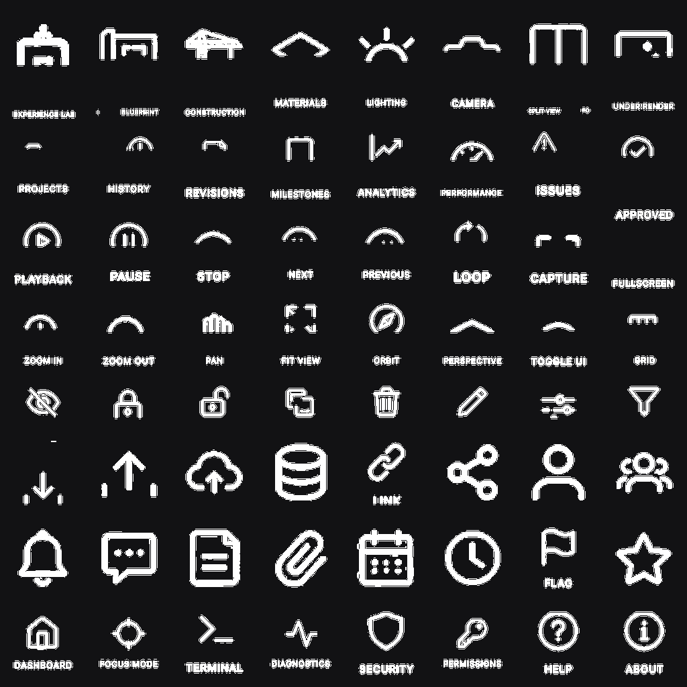

## Per-icon extraction results

| Semantic key | Source label | Row | Col | Confidence | Override | Preview |
|---|---|---:|---:|---:|---|---|
| experienceLab | EXPERIENCE LAB | 0 | 0 | 1.00 | no | 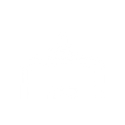 |
| blueprint | BLUEPRINT | 0 | 1 | 1.00 | no | 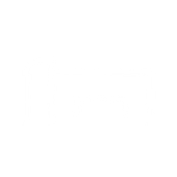 |
| construction | CONSTRUCTION | 0 | 2 | 1.00 | no | 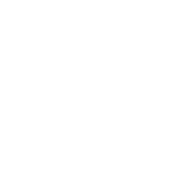 |
| materials | MATERIALS | 0 | 3 | 1.00 | no | 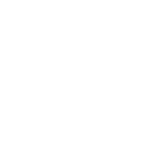 |
| lighting | LIGHTING | 0 | 4 | 1.00 | no | 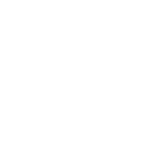 |
| camera | CAMERA | 0 | 5 | 1.00 | no | 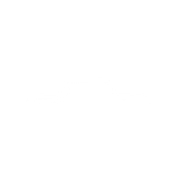 |
| splitView | SPLIT VIEW | 0 | 6 | 1.00 | no | 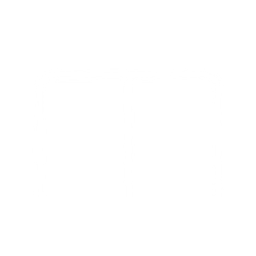 |
| founderRender | FOUNDER RENDER | 0 | 7 | 1.00 | no | 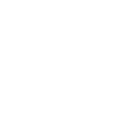 |
| projects | PROJECTS | 1 | 0 | 1.00 | no | 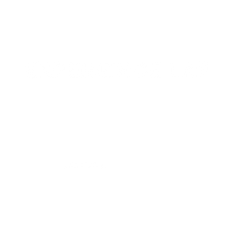 |
| history | HISTORY | 1 | 1 | 1.00 | no | 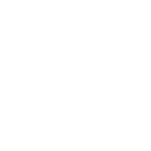 |
| revisions | REVISIONS | 1 | 2 | 1.00 | no | 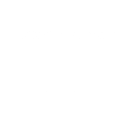 |
| milestones | MILESTONES | 1 | 3 | 1.00 | no | 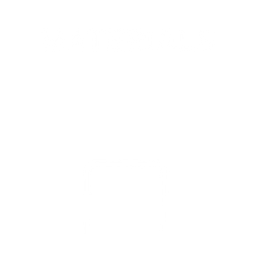 |
| analytics | ANALYTICS | 1 | 4 | 1.00 | no | 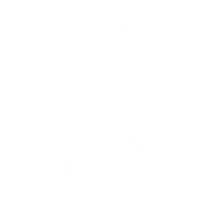 |
| performance | PERFORMANCE | 1 | 5 | 1.00 | no | 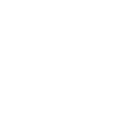 |
| issues | ISSUES | 1 | 6 | 1.00 | no | 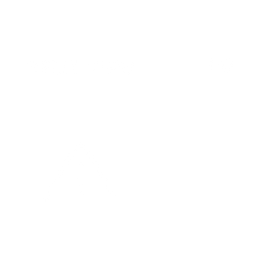 |
| approved | APPROVED | 1 | 7 | 1.00 | no | 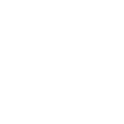 |
| playback | PLAYBACK | 2 | 0 | 1.00 | no | 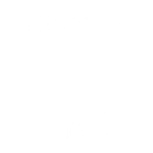 |
| pause | PAUSE | 2 | 1 | 1.00 | no |  |
| stop | STOP | 2 | 2 | 1.00 | no |  |
| next | NEXT | 2 | 3 | 1.00 | no | 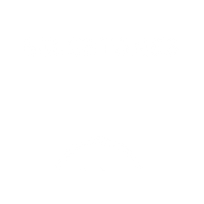 |
| previous | PREVIOUS | 2 | 4 | 1.00 | no | 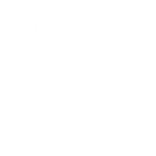 |
| loop | LOOP | 2 | 5 | 1.00 | no | 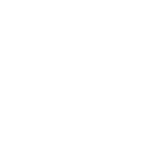 |
| capture | CAPTURE | 2 | 6 | 1.00 | no |  |
| fullscreen | FULLSCREEN | 2 | 7 | 1.00 | no |  |
| zoomIn | ZOOM IN | 3 | 0 | 1.00 | no | 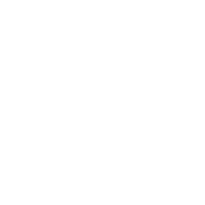 |
| zoomOut | ZOOM OUT | 3 | 1 | 1.00 | no |  |
| pan | PAN | 3 | 2 | 1.00 | no | 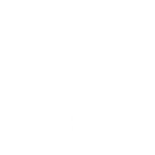 |
| fitView | FIT VIEW | 3 | 3 | 1.00 | no | 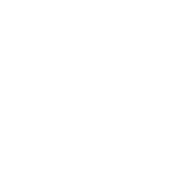 |
| orbit | ORBIT | 3 | 4 | 1.00 | no | 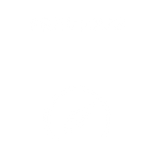 |
| perspective | PERSPECTIVE | 3 | 5 | 1.00 | no | 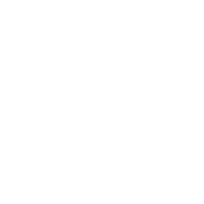 |
| toggleUi | TOGGLE UI | 3 | 6 | 1.00 | no | 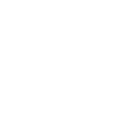 |
| grid | GRID | 3 | 7 | 1.00 | no | 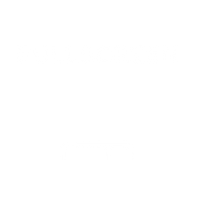 |
| hide | HIDE | 4 | 0 | 1.00 | no | 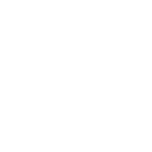 |
| lock | LOCK | 4 | 1 | 1.00 | no | 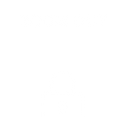 |
| unlock | UNLOCK | 4 | 2 | 1.00 | no | 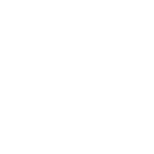 |
| duplicate | DUPLICATE | 4 | 3 | 1.00 | no | 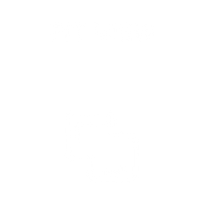 |
| delete | DELETE | 4 | 4 | 1.00 | no | 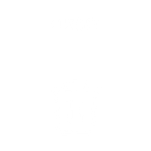 |
| edit | EDIT | 4 | 5 | 1.00 | no | 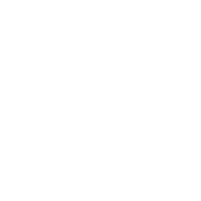 |
| settings | SETTINGS | 4 | 6 | 1.00 | no |  |
| filter | FILTER | 4 | 7 | 1.00 | no | 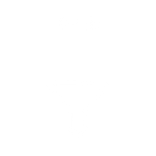 |
| export | EXPORT | 5 | 0 | 1.00 | no | 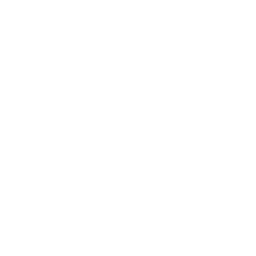 |
| import | IMPORT | 5 | 1 | 1.00 | no |  |
| cloudSync | CLOUD SYNC | 5 | 2 | 1.00 | no | 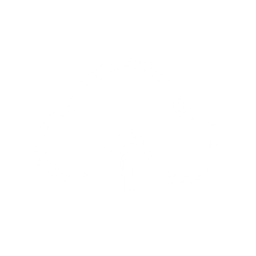 |
| database | DATABASE | 5 | 3 | 1.00 | no | 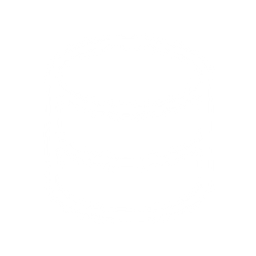 |
| link | LINK | 5 | 4 | 1.00 | no | 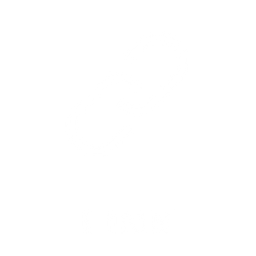 |
| share | SHARE | 5 | 5 | 1.00 | no | 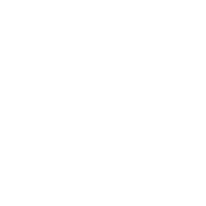 |
| users | USERS | 5 | 6 | 1.00 | no |  |
| team | TEAM | 5 | 7 | 1.00 | no | 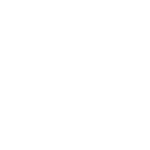 |
| notifications | NOTIFICATIONS | 6 | 0 | 1.00 | no |  |
| comments | COMMENTS | 6 | 1 | 1.00 | no |  |
| notes | NOTES | 6 | 2 | 1.00 | no |  |
| attachments | ATTACHMENTS | 6 | 3 | 1.00 | no | 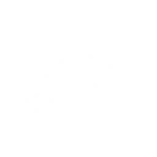 |
| schedule | SCHEDULE | 6 | 4 | 1.00 | no | 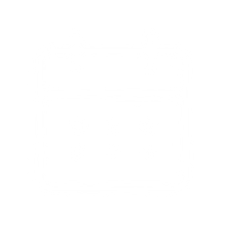 |
| timeTracking | TIME TRACKING | 6 | 5 | 1.00 | no |  |
| flag | FLAG | 6 | 6 | 1.00 | no | 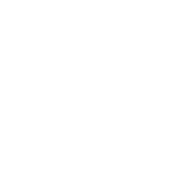 |
| favorite | FAVORITE | 6 | 7 | 1.00 | no |  |
| dashboard | DASHBOARD | 7 | 0 | 1.00 | no | 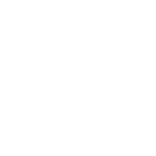 |
| focusMode | FOCUS MODE | 7 | 1 | 1.00 | no | 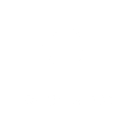 |
| terminal | TERMINAL | 7 | 2 | 1.00 | no | 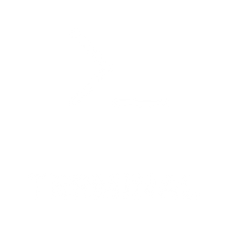 |
| diagnostics | DIAGNOSTICS | 7 | 3 | 1.00 | no | 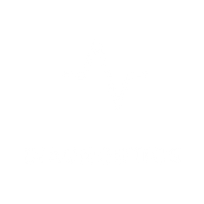 |
| security | SECURITY | 7 | 4 | 1.00 | no |  |
| permissions | PERMISSIONS | 7 | 5 | 1.00 | no |  |
| help | HELP | 7 | 6 | 1.00 | no |  |
| about | ABOUT | 7 | 7 | 1.00 | no |  |

## Dev QA route

Compare runtime icons at `/admin/studio/experience-lab-icon-qa` (admin only).

## Regenerate

```bash
npm run experience-lab:build-icons
```
