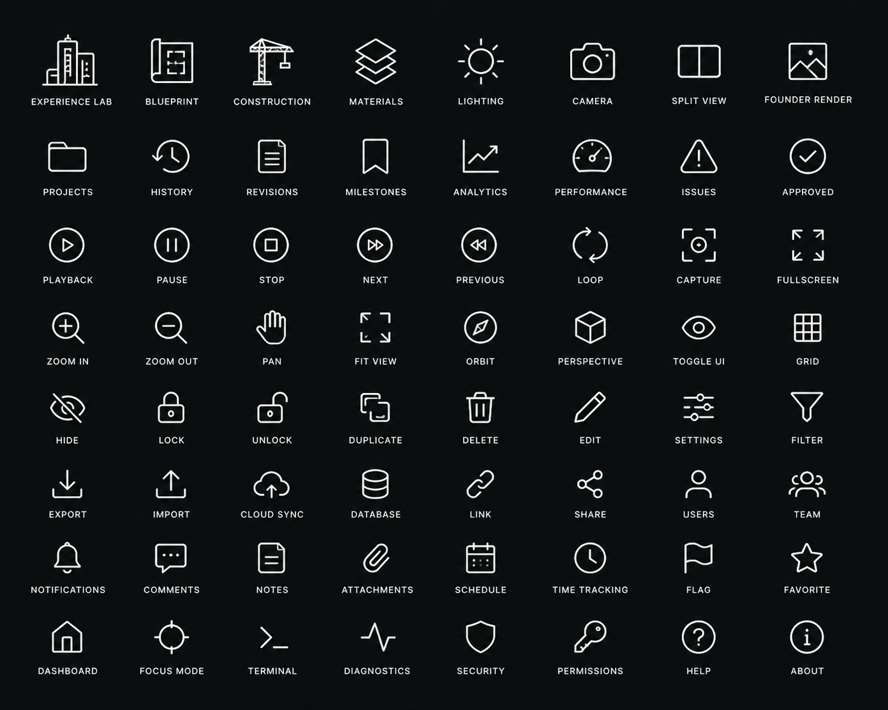
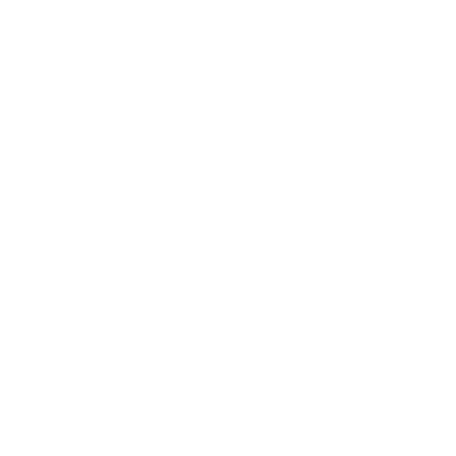

# Experience Lab Icon Catalog

Founder labeled source storage path: `live-preview/Studio World/740E9EB1-6B7B-4C5F-B745-E4621EC45EF3.png`

Resolve at runtime via `resolveExperienceLabIconSourceLabeledUrl()` (prefixes `VITE_SUPABASE_URL`).

Canonical repo copy (labels preserved):



Runtime atlas (glyphs only, transparent background):



Measured grid: **1402×1122** · 8×8 · ~175×140 px cells

## Semantic map

| Semantic key | Source label | Row | Col | Intended use | Accessible label | Status |
|---|---|---:|---:|---|---|---|
| experienceLab | EXPERIENCE LAB | 0 | 0 | Experience Lab identity · architectural workbench | Experience Lab | shipped |
| blueprint | BLUEPRINT | 0 | 1 | StudioViewport Blueprint mode | Blueprint | shipped |
| construction | CONSTRUCTION | 0 | 2 | Construction Plan inspector · viewport mode | Construction | shipped |
| materials | MATERIALS | 0 | 3 | Material Library · materials viewport mode | Materials | shipped |
| lighting | LIGHTING | 0 | 4 | Lighting Studio · lighting viewport mode | Lighting | shipped |
| camera | CAMERA | 0 | 5 | Camera Studio · camera viewport mode | Camera | shipped |
| splitView | SPLIT VIEW | 0 | 6 | Split viewport mode | Split view | shipped |
| founderRender | FOUNDER RENDER | 0 | 7 | Founder Render viewport mode | Founder render | shipped |
| projects | PROJECTS | 1 | 0 | Project browser | Projects | shipped |
| history | HISTORY | 1 | 1 | Founder review history | History | shipped |
| revisions | REVISIONS | 1 | 2 | Founder review revisions | Revisions | shipped |
| milestones | MILESTONES | 1 | 3 | Milestone tracker | Milestones | shipped |
| analytics | ANALYTICS | 1 | 4 | Analytics · budget forecast workbench | Analytics | shipped |
| performance | PERFORMANCE | 1 | 5 | Performance diagnostics | Performance | shipped |
| issues | ISSUES | 1 | 6 | Inspector issues panel | Issues | shipped |
| approved | APPROVED | 1 | 7 | Approval status · inspector approved state | Approved | shipped |
| playback | PLAYBACK | 2 | 0 | Founder review playback | Play | shipped |
| pause | PAUSE | 2 | 1 | Founder review pause | Pause | shipped |
| stop | STOP | 2 | 2 | Stop playback | Stop | shipped |
| next | NEXT | 2 | 3 | Next revision step | Next | shipped |
| previous | PREVIOUS | 2 | 4 | Previous revision step | Previous | shipped |
| loop | LOOP | 2 | 5 | Loop playback | Loop | shipped |
| capture | CAPTURE | 2 | 6 | Capture viewport frame | Capture | shipped |
| fullscreen | FULLSCREEN | 2 | 7 | Viewport fullscreen toggle | Fullscreen | shipped |
| zoomIn | ZOOM IN | 3 | 0 | Viewport zoom in | Zoom in | shipped |
| zoomOut | ZOOM OUT | 3 | 1 | Viewport zoom out | Zoom out | shipped |
| pan | PAN | 3 | 2 | Viewport pan tool | Pan | shipped |
| fitView | FIT VIEW | 3 | 3 | Fit viewport to content | Fit view | shipped |
| orbit | ORBIT | 3 | 4 | Orbit camera control | Orbit | shipped |
| perspective | PERSPECTIVE | 3 | 5 | Composition studio perspective | Perspective | shipped |
| toggleUi | TOGGLE UI | 3 | 6 | Toggle viewport UI chrome | Toggle UI | shipped |
| grid | GRID | 3 | 7 | Viewport grid overlay | Grid | shipped |
| hide | HIDE | 4 | 0 | Inspector hide layer | Hide | shipped |
| lock | LOCK | 4 | 1 | Inspector lock control | Lock | shipped |
| unlock | UNLOCK | 4 | 2 | Inspector unlock control | Unlock | shipped |
| duplicate | DUPLICATE | 4 | 3 | Duplicate artifact | Duplicate | shipped |
| delete | DELETE | 4 | 4 | Delete artifact | Delete | shipped |
| edit | EDIT | 4 | 5 | Inspector edit mode | Edit | shipped |
| settings | SETTINGS | 4 | 6 | Inspector settings | Settings | shipped |
| filter | FILTER | 4 | 7 | Inspector filter | Filter | shipped |
| export | EXPORT | 5 | 0 | Export artifact | Export | shipped |
| import | IMPORT | 5 | 1 | Import asset | Import | shipped |
| cloudSync | CLOUD SYNC | 5 | 2 | Cloud sync diagnostics | Cloud sync | shipped |
| database | DATABASE | 5 | 3 | Database diagnostics | Database | shipped |
| link | LINK | 5 | 4 | Copy link | Link | shipped |
| share | SHARE | 5 | 5 | Share artifact | Share | shipped |
| users | USERS | 5 | 6 | User profile · founder identity | User | shipped |
| team | TEAM | 5 | 7 | Workforce center | Team | shipped |
| notifications | NOTIFICATIONS | 6 | 0 | Command Dock alerts | Notifications | shipped |
| comments | COMMENTS | 6 | 1 | Founder review comments | Comments | shipped |
| notes | NOTES | 6 | 2 | Founder review notes | Notes | shipped |
| attachments | ATTACHMENTS | 6 | 3 | Founder review attachments · asset reference | Attachments | shipped |
| schedule | SCHEDULE | 6 | 4 | Schedule planner | Schedule | shipped |
| timeTracking | TIME TRACKING | 6 | 5 | Time tracking | Time tracking | shipped |
| flag | FLAG | 6 | 6 | Flag for review | Flag | shipped |
| favorite | FAVORITE | 6 | 7 | Favorite artifact | Favorite | shipped |
| dashboard | DASHBOARD | 7 | 0 | Workbench dashboard navigation | Dashboard | shipped |
| focusMode | FOCUS MODE | 7 | 1 | Viewport focus mode | Focus mode | shipped |
| terminal | TERMINAL | 7 | 2 | Diagnostics terminal | Terminal | shipped |
| diagnostics | DIAGNOSTICS | 7 | 3 | Diagnostics drawer | Diagnostics | shipped |
| security | SECURITY | 7 | 4 | Security diagnostics | Security | shipped |
| permissions | PERMISSIONS | 7 | 5 | Permit center · permissions | Permissions | shipped |
| help | HELP | 7 | 6 | Help panel | Help | shipped |
| about | ABOUT | 7 | 7 | About Experience Lab | About | shipped |

## Usage

```tsx
<ExperienceLabIcon name="blueprint" size="md" label="Blueprint" />
```

Regenerate atlas after replacing the labeled source:

```bash
npm run experience-lab:build-icons
```
