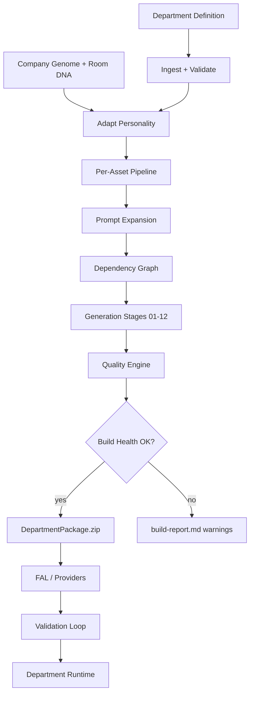

# Compiler Flow — Studio Asset Compiler™

**Engine Module:** `studio.asset-compiler.v1.flow`  
**Status:** End-to-end manufacturing flow

---

## Compile Invocation

```yaml
CompileRequest:
  schema: studio.asset-compiler.v1/compile-request
  departmentDefinitionPath: string    # e.g. departments/creative-direction-studio/
  packageId: string                   # pkg-creative-direction-golden-v1
  genomeContext:
    companyGenome: CompanyGenomeSnapshot
    projectGenome: ProjectGenomeSnapshot | null
    brandGenome: BrandGenomeSnapshot
    founderJourney: FounderJourneySnapshot
  designContext:
    designLanguage: DesignLanguageSnapshot
    designRegistry: DesignRegistrySnapshot
  compileMode: full | regen-scope | reuse-overlay
  providerProfile: fal-default | provider-agnostic
  outputName: string                  # CreativeDirectionStudio_Package.zip
```

---

## Phase 1 — Ingest

| Step | Input | Output |
|------|-------|--------|
| 1.1 | `department.json` | Resolved department identity + profiles |
| 1.2 | `room-dna.json` | Slider snapshot + prompt modifiers |
| 1.3 | `asset-manifest.json` | Asset inventory + stage hints |
| 1.4 | `interaction-manifest.json` | Verb map for runtime manifest |
| 1.5 | `environment-blueprint.md` | Spatial tasks |
| 1.6 | `scene-assembly-blueprint.md` | Placement + boot sequence |
| 1.7 | `fal-prompt-package/*.md` | Source prompt fragments |
| 1.8 | `asset-blueprint.md` | Per-object behavior contracts |
| 1.9 | Genome snapshots | Injection layers |
| 1.10 | Design Language + Registry | Compliance tokens |

**Gate:** Input validation — all required Definition files present · schema version compatible.

---

## Phase 2 — Adapt Personality

```
Room DNA™ sliders
    + Company Genome™ domains
    + Founder Journey™ maturity
    + Project Genome™ overlay
         ↓
AdaptationDirective
         ↓
Per-asset genome layer injection
Per-industry material/lighting/voice shifts
Terminology + AI voice register
```

Architecture topology **unchanged**. Personality **fully adapted**.

---

## Phase 3 — Asset Pipeline (Per Asset)

Every asset moves through:

```
Definition (asset-manifest entry + blueprint + source prompt)
    ↓
Validation (schema · naming · zone binding)
    ↓
Optimization (reuse lookup · dedupe · budget check)
    ↓
Prompt Expansion (prompt-expansion-engine)
    ↓
Dependency Resolution (graph edge assignment)
    ↓
Generation Queue (stage + provider route)
    ↓
Packaging (folder assignment 01–16)
    ↓
Ready for FAL (expanded prompt in 13_prompts/)
```

---

## Phase 4 — Package Assembly

| Step | Action |
|------|--------|
| 4.1 | Assign each asset to package folder (01–16) |
| 4.2 | Write expanded prompts to `13_prompts/` |
| 4.3 | Write metadata to `14_metadata/` |
| 4.4 | Compile `15_runtime/` from scene-assembly + interactions |
| 4.5 | Generate `16_preview/` spec plates (references, not cooked) |
| 4.6 | Write root `manifest.json` + `package-manifest.json` |
| 4.7 | Run Quality Engine → Build Health score |
| 4.8 | Write `build-report.md` |
| 4.9 | Zip → `DepartmentPackage.zip` |

---

## Phase 5 — Handoff

| Consumer | Receives |
|----------|----------|
| **FAL / providers** | `13_prompts/` + generation queue per stage |
| **Validation Loop™** | `14_metadata/validation.json` + Build Health |
| **Department Runtime™** | `15_runtime/` + cooked assets (post-generation) |
| **Cursor** | `15_runtime/cursor-handoff.json` |
| **Marketplace** | `package-manifest.json` + reuse tags |

---

## Flow Diagram



---

## Regeneration Modes

| Mode | Scope | Use |
|------|-------|-----|
| `full` | Entire package | First compile · industry switch |
| `regen-scope` | Room DNA regen scope | Surgical lighting-only · mood-wall-only |
| `reuse-overlay` | Marketplace asset swap | Replace asset ID · merge manifest |

---

## Creative Direction Studio™ Example

| Input folder | `departments/creative-direction-studio/` |
| Output zip | `CreativeDirectionStudio_Package.zip` |
| Assets | 35 |
| Expanded prompts | ~35–50 (environment tasks split) |
| Stages | 12 |
| Build Health target | ≥ 85 |
