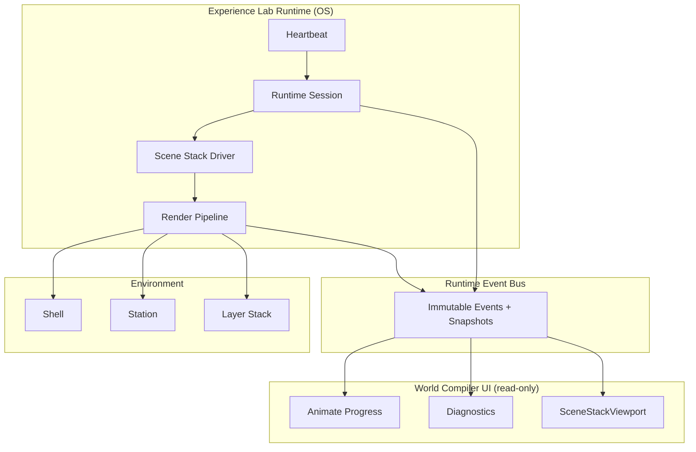
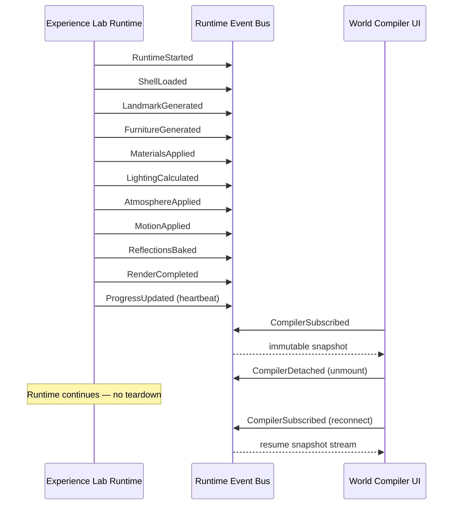

# DECOUPLE THE WORLD COMPILER™ — Architecture

Experience Lab owns execution. World Compiler™ is a passive cinematic interface.

## Updated architecture



## Event flow



## Runtime ownership

| State | Owner |
|-------|--------|
| `sessionId` | Experience Lab Runtime |
| `compileRunId` | Experience Lab Runtime |
| `heartbeat` | Experience Lab Runtime |
| `shell` / `station` / `environment` | Experience Lab Runtime (via Scene Stack driver) |
| `progress` / `currentStage` / `completedStages` | Experience Lab Runtime |
| `renderStatus` / `errors` | Experience Lab Runtime |
| World Compiler UI state | **None** — receives snapshots only |

## Root cause: prior coupling bugs

### Private-tab heartbeat failure

`useCreativeStudioRenderPreview` cleared `validationPreviewSession` and reset `validationRenderMode` on **compiler unmount**. Background tabs that suspended React trees tore down the runtime session. Heartbeat and validation mode now live in `experience-lab-runtime/` and survive compiler unmount.

### Three-second compiler restart loop

Unmount cleanup + remount re-ran `runFullPipeline()` via `useEffect`. Multiple compare-mode previews each owned lifecycle. Runtime `ensureSession` is idempotent per `previewSessionId`; compiler subscribe/unsubscribe no longer restarts execution.

## Implementation map

| Module | Role |
|--------|------|
| `src/studio-os-core/experience-lab-runtime/runtime-event-bus.ts` | Canonical pub/sub |
| `src/studio-os-core/experience-lab-runtime/runtime-heartbeat.ts` | Runtime-owned heartbeat |
| `src/studio-os-core/experience-lab-runtime/experience-lab-render-runtime.ts` | Session + pipeline execution |
| `src/studio-os-core/experience-lab-runtime/scene-stack-driver.ts` | Stack driver registry |
| `src/components/admin/studio/experience-lab/ExperienceLabRenderRuntimeProvider.tsx` | Registers drivers at shell level |
| `src/hooks/useCreativeStudioRenderPreview.ts` | Passive subscriber (World Compiler) |

## Verification

Programmatic evidence:

```ts
import { verifyRuntimeCompilerIndependence } from 'src/studio-os-core/experience-lab-runtime';

verifyRuntimeCompilerIndependence({
  companyId: 'studio-os',
  conceptId: 'a',
  departmentId: 'studio-command-center',
  stationId: 'executive-atrium',
  projectId: '…',
});
```

Manual QA (Experience Lab → Mode 2):

1. Open Creative Intelligence preview — pipeline runs once.
2. Switch company/concept — runtime session per binding; compiler animates from bus.
3. Unmount compiler (navigate away / toggle compare) — session persists; heartbeat stays active (`document.documentElement.dataset.experienceLabHeartbeat === 'active'`).
4. Remount compiler — visualization resumes without pipeline restart (unless Retry pressed).
5. Retry button calls `requestRuntimeRetry` — runtime-owned, not hook-owned.

Browsers: iOS Safari, iOS Chrome, Desktop Chrome, Desktop Safari — confirm heartbeat attribute persists across compiler unmount in each.

## World Compiler rules (enforced)

**May:** animate, display progress/stage/diagnostics/errors/percentages/layers/ETA.

**May not:** restart Experience Lab, own heartbeat, own compile session, own timers, recreate shell/environment, mutate runtime state.
