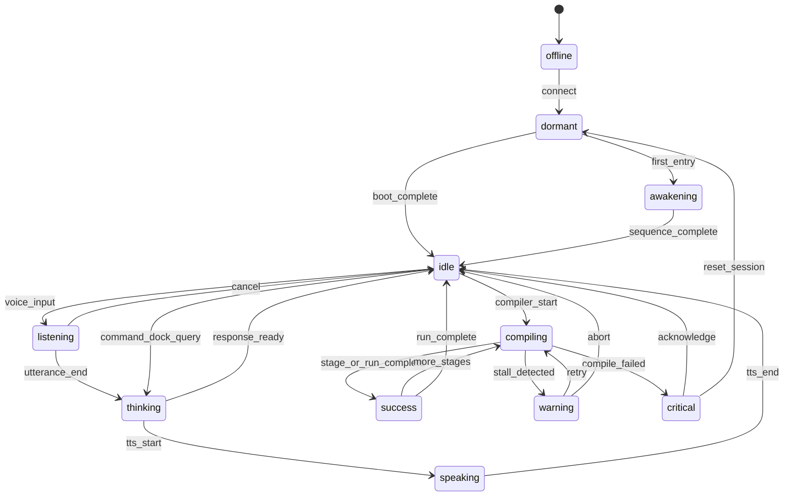

# Genesis Core™ — State Model

**Version:** 1.0.0

---

## Canonical modes

```typescript
type GenesisCoreMode =
  | 'dormant'
  | 'awakening'
  | 'idle'
  | 'listening'
  | 'thinking'
  | 'speaking'
  | 'compiling'
  | 'success'
  | 'warning'
  | 'critical'
  | 'offline';
```

### Mode definitions

| Mode | Meaning | Typical trigger |
|------|---------|-----------------|
| `dormant` | System present, minimal energy | Pre-boot, compiler never run |
| `awakening` | HQ / org first entry sequence | Inauguration, awakening overlay |
| `idle` | Healthy, breathing, available | Default active |
| `listening` | Voice or input focus | Voice Mode active |
| `thinking` | Reasoning in progress | Command Dock / LLM pending |
| `speaking` | Voice or TTS output | TTS playback |
| `compiling` | World Compiler or render pipeline active | Experience Lab compile |
| `success` | Brief completion flash | Stage complete, task done |
| `warning` | Degraded, non-fatal | Stall, retry, high latency |
| `critical` | Failure, needs attention | Compile failed, runtime error |
| `offline` | Disconnected / suspended | Network, explicit pause |

---

## Extended compiler snapshot

```typescript
type GenesisCompilerSnapshot = {
  currentStage: WorldCompilerStage | 'awakening' | null;
  completedStages: WorldCompilerStage[];
  progress: number; // 0–1 monotonic within run
  activeRunId: string | null;
  failureCode: string | null;
  energyIntensity: number; // 0–1 visual
  motionIntensity: number; // 0–1 visual
  particleIntensity: number; // 0–1 visual
  environmentLightIntensity: number; // 0–1 spill to surroundings
};
```

---

## Full store shape

```typescript
type GenesisCoreSnapshot = {
  mode: GenesisCoreMode;
  previousMode: GenesisCoreMode | null;
  compiler: GenesisCompilerSnapshot;
  runtimeHealth: 'healthy' | 'degraded' | 'failed';
  qualityTier: 'high' | 'medium' | 'low' | 'static';
  reducedMotion: boolean;
  updatedAt: number;
};
```

---

## State diagram



---

## Priority resolution (when multiple signals active)

Higher wins for **display mode**:

1. `critical`
2. `offline`
3. `compiling` (unless critical)
4. `speaking`
5. `listening`
6. `thinking`
7. `awakening`
8. `success` (transient 600ms — can overlay compiling glow)
9. `warning` (ambient undertone — can coexist as `compiler.warningTone`)
10. `idle`
11. `dormant`

**Rule:** `success` is a **pulse overlay** — does not clear `completedStages`.

---

## Transition rules

| Rule | Description |
|------|-------------|
| **No auto-reset to dormant** between compiler stages | Progress accumulates |
| **Monotonic `completedStages`** within `activeRunId` | Stages only append |
| **New run** increments `activeRunId`, may reset stages — not mid-stage |
| **Success auto-reverts** to underlying mode after 600ms |
| **Subscribers read-only** | UI never calls `setMode` directly except debug panel |

---

## Mapping from legacy `StudioOrbPresenceState`

| Legacy | Genesis Core |
|--------|----------------|
| `idle` | `idle` |
| `listening` | `listening` |
| `thinking` | `thinking` |
| `speaking` | `speaking` |
| `learning` | `thinking` + institute flag |
| `opportunity` | `idle` + recommendation halo |
| `completed` | `success` pulse |
| `discovery` | `idle` + discovery particle boost |
| `civilization-event` | `success` + event ring |
| `legendary-discovery` | `success` + legendary particle |
| `focus` | `listening` |
| `presentation` | `speaking` |
| `launch` | `compiling` |
| `emergency` | `critical` |

Legacy states become **overlay flags** on `GenesisCoreSnapshot`, not separate modes — reduces proliferation.
