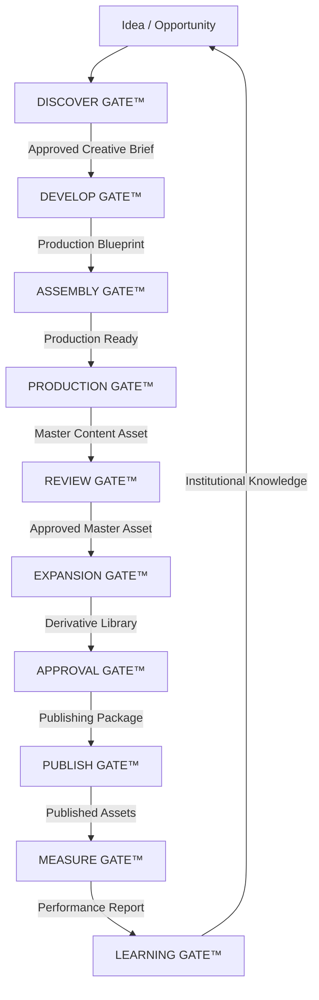
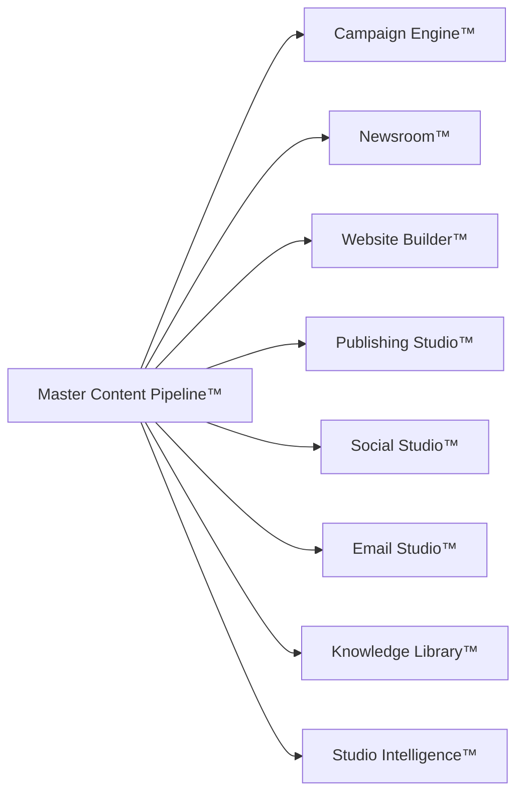

# Master Content Pipeline™

**Studio OS™ — Canonical Content Operating System**

**Type:** Product logic + UX architecture (not a Design Revision · not a new milestone)

**Status:** Permanent operating philosophy for all Studio OS content products

**System name:** **Master Content Pipeline™** remains the official name until a future architecture revision.

---

## Executive summary

Studio OS no longer treats **pages** or **posts** as the product unit.

Every campaign is a **production pipeline**, not a publishing pipeline.

The **Master Content Asset™** is the single source of truth. All platform-specific outputs are **derivatives** linked to that master asset and reviewed on their own merit.

Content products **consume** the Master Content Pipeline — they do **not** own independent lifecycles.

This document is the canonical reference for:

- Campaign Engine™
- Newsroom™
- Website Builder™
- Publishing Studio™
- Social Studio™
- Email Studio™
- Knowledge Library™
- Studio Intelligence™
- NDXBook Page 001 pipeline (Master Content Asset pilot)
- All future Studio OS content products

**Gate reference:** [master-content-pipeline-gates.md](./master-content-pipeline-gates.md)  
**Implementation registry (legacy bridge):** `src/studio-os-core/content-pipeline/`

---

## Philosophy shift

| Before (publishing pipeline) | After (content operating system) |
|-----------------------------|----------------------------------|
| Create a page → publish | DISCOVER → … → LEARNING — gates, not ad-hoc steps |
| Page is the product | Master Content Asset™ is the product |
| One approval covers everything | REVIEW GATE + APPROVAL GATE per asset class |
| Campaign = calendar of posts | Campaign = coordinated production pipeline |
| Each product invents its own workflow | Products **consume** Master Content Pipeline gates |
| Success = published | Success = **Institutional Knowledge** (LEARNING GATE exit) |

---

## Canonical lifecycle — ten gates

Studio OS content moves through **named lifecycle gates**, not generic numbered stages.

```
Idea
  ↓
DISCOVER GATE™          → Approved Creative Brief
  ↓
DEVELOP GATE™           → Production Blueprint
  ↓
ASSEMBLY GATE™          → Production Ready
  ↓
PRODUCTION GATE™        → Master Content Asset
  ↓
REVIEW GATE™            → Approved Master Asset
  ↓
EXPANSION GATE™         → Derivative Library
  ↓
APPROVAL GATE™          → Publishing Package
  ↓
PUBLISH GATE™           → Published Assets
  ↓
MEASURE GATE™           → Performance Report
  ↓
LEARNING GATE™          → Institutional Knowledge
```

### Lifecycle diagram



Each gate is fully specified in [master-content-pipeline-gates.md](./master-content-pipeline-gates.md) with purpose, owners, inputs, outputs, approvals, AI systems, concierges, entry/exit criteria, and failure conditions.

---

## Canonical terminology

Use **gate names** in navigation copy, status messages, documentation, and operating manuals.

| Prefer | Avoid (unless mapping legacy code) |
|--------|-------------------------------------|
| DISCOVER GATE™ | Stage 1 · Step 1 · "research phase" without gate name |
| DEVELOP GATE™ | Stage 4 · "script step" |
| ASSEMBLY GATE™ | Stage 5–6 · "pre-production" |
| PRODUCTION GATE™ | "Page creation" · Stage 7 |
| REVIEW GATE™ | "In review" without gate name |
| EXPANSION GATE™ | "Generate social" without gate name |
| APPROVAL GATE™ | "Ready to schedule" without gate name |
| PUBLISH GATE™ | "Go live" without gate name |
| MEASURE GATE™ | "Analytics phase" |
| LEARNING GATE™ | "Archive step" |

**Examples:**

- *"Page 001 is currently in Review Gate."*
- *"Campaign 024 passed Approval Gate."*
- *"Website Launch blocked at Assembly Gate."*

---

## Product inheritance — consumers, not owners

Every Studio OS product that creates content **references the same gate model**. Products implement gate **surfaces**; the pipeline owns the **lifecycle**.

| Product | Primary gates | Role |
|---------|---------------|------|
| **Campaign Engine™** | DISCOVER · ASSEMBLY · MEASURE · LEARNING | Campaign assignment · production planning · performance · campaign DNA |
| **Newsroom™** | DEVELOP · PRODUCTION · REVIEW | Storyboard · master asset creation · editorial review |
| **Website Builder™** | DEVELOP · PRODUCTION · EXPANSION · APPROVAL · PUBLISH | Section planning · master web experiences · page derivatives · deploy |
| **Publishing Studio™** | APPROVAL · PUBLISH | Unified publishing queue · multi-platform orchestration |
| **Social Studio™** | EXPANSION · APPROVAL · PUBLISH · MEASURE | Social derivatives · channel QA · social publish · engagement |
| **Email Studio™** | EXPANSION · APPROVAL · PUBLISH · MEASURE | Newsletter/email derivatives · send · performance |
| **Production Studio™** | PRODUCTION · REVIEW | Cinematic / media production of master assets |
| **Distribution Engine** | EXPANSION · APPROVAL · PUBLISH | Channel routing · adaptation · calendar |
| **Knowledge Library™** | LEARNING | Archival · retrieval · institutional memory |
| **Studio Intelligence™** | DISCOVER · REVIEW · MEASURE · LEARNING | Research · review dimensions · performance analysis · learning loop |
| **Concierge Approval Flow** | REVIEW · APPROVAL | Multidisciplinary board · founder brief |
| **NDXBook Page 001** | PRODUCTION · REVIEW · APPROVAL · PUBLISH · LEARNING | Master Content Asset pilot |



**Rule:** New content products declare which gates they surface — never a parallel lifecycle.

---

## Gate quick reference

| Gate | Purpose (one line) | Exit artifact |
|------|-------------------|---------------|
| **DISCOVER GATE™** | Ideas → validated opportunities | Approved Creative Brief |
| **DEVELOP GATE™** | Brief → creative plan | Production Blueprint |
| **ASSEMBLY GATE™** | Gather everything for production | Production Ready |
| **PRODUCTION GATE™** | Create master asset | Master Content Asset |
| **REVIEW GATE™** | Validate before expansion | Approved Master Asset |
| **EXPANSION GATE™** | Generate derivatives | Derivative Library |
| **APPROVAL GATE™** | Approve each derivative | Publishing Package |
| **PUBLISH GATE™** | Distribute | Published Assets |
| **MEASURE GATE™** | Measure performance | Performance Report |
| **LEARNING GATE™** | Feed intelligence back | Institutional Knowledge |

Full specifications: [master-content-pipeline-gates.md](./master-content-pipeline-gates.md)

---

## UX principles

Campaign Workspace, Newsroom, and all content product UIs must answer:

1. **Which gate** is this content in?
2. **What approvals** remain before the next gate?
3. **Which concierges** have reviewed it?
4. **Which derivatives** exist vs. still needed?
5. **Which assets** are in Approval Gate vs. Publish Gate?
6. **How did the campaign perform** (Measure Gate)?
7. **What did Studio Intelligence™ learn** (Learning Gate)?

The experience should feel like managing a **professional media production studio** — not creating isolated social posts.

**Note:** Existing UI may still show legacy stage indicators (`MasterContentLifecycleStrip`) until a future implementation pass maps display to gate names. Documentation and architecture use **gate terminology** as canonical.

---

## Legacy mapping (backward compatibility)

The prior **17-stage** model maps to gates for existing code, docs, and migration:

| Prior stage (17-stage model) | Canonical gate |
|-----------------------------|----------------|
| 1 · Concept / Opportunity | DISCOVER GATE™ |
| 2 · Campaign Assignment | DISCOVER GATE™ |
| 3 · Research & Knowledge Gathering | DISCOVER GATE™ |
| 4 · Storyboard + Script | DEVELOP GATE™ |
| 5 · Talent Selection & Availability | ASSEMBLY GATE™ |
| 6 · Production Planning | ASSEMBLY GATE™ |
| 7 · Master Content Creation™ | PRODUCTION GATE™ |
| 8 · Internal Editing | PRODUCTION GATE™ |
| 9 · Concierge Review Board™ | REVIEW GATE™ |
| 10 · Founder Approval | REVIEW GATE™ |
| 11 · Content Expansion Engine™ | EXPANSION GATE™ |
| 12 · Multi-Platform Asset Review | APPROVAL GATE™ |
| 13 · Scheduling | APPROVAL GATE™ |
| 14 · Publishing | PUBLISH GATE™ |
| 15 · Performance Evaluation | MEASURE GATE™ |
| 16 · Studio Intelligence™ Learning | LEARNING GATE™ |
| 17 · Knowledge Library™ | LEARNING GATE™ |

Bridge functions (implementation): `src/studio-os-core/content-pipeline/mapping.ts`

---

## Migration from legacy “page” model

| Legacy term | Master Content Pipeline term |
|-------------|------------------------------|
| Page | Master Content Asset™ (kind: `page`) |
| Create Page 001 | Create Master Content Asset · Page 001 (Production Gate) |
| Deliverable | Derivative asset (or master, if type is page/episode/article) |
| `workflowStatus: review` | REVIEW GATE™ |
| `workflowStatus: published` | PUBLISH GATE™ → MEASURE → LEARNING |
| Studio Intelligence review (NDXBook) | Partial REVIEW GATE™ |
| "In pipeline stage 9" | "In Review Gate" |

---

## NDXBook Page 001 gate mapping (pilot)

| Gate | Page 001 behavior |
|------|-------------------|
| DISCOVER · DEVELOP · ASSEMBLY | Implicit in pilot seed (full UI as Campaign/Newsroom expand) |
| PRODUCTION GATE™ | `createNdxbookPage()` — master asset registered |
| REVIEW GATE™ | Studio Intelligence review + **APPROVE PRODUCTION** |
| APPROVAL GATE™ | Schedule datetime validation · Instagram readiness |
| PUBLISH GATE™ | Publish Now / scheduled Instagram |
| LEARNING GATE™ | `knowledgeOutputs` + institutional-knowledge archive |

Runbook: [NDXBOOK_PAGE_001_PIPELINE.md](../NDXBOOK_PAGE_001_PIPELINE.md)

---

## Implementation status

| Layer | Status |
|-------|--------|
| Canonical gate documentation | ✅ This document + gates reference |
| Product inheritance architecture | ✅ Documented |
| Gate terminology standard | ✅ Canonical in docs |
| Legacy 17-stage code registry | ✅ Preserved (`content-pipeline/lifecycle.ts`) |
| UI gate naming | 🔜 Docs lead; UI maps on future pass |
| Full Content Expansion Engine automation | 🔜 Architecture defined |
| Full Concierge Review Board UI | 🔜 Partial via Concierge Approval Flow + SI review |

---

## Related documentation

- [Lifecycle Gates Reference](./master-content-pipeline-gates.md)
- [Studio OS Architecture](./architecture.md)
- [NDXBook Page 001 runbook](../NDXBOOK_PAGE_001_PIPELINE.md)
- [Website Builder™](./products/website-builder/README.md)
- [Founder Pilot Mode](./founder-pilot-mode.md)
- [Studio Intelligence Architecture](./studio-intelligence-architecture.md)

---

## Governance

- This is **product logic**, not a Design Revision (DR).
- Do **not** create a new milestone number for this architecture.
- Do **not** rename Master Content Pipeline™ until a future architecture revision.
- New content features **must** declare which **gate(s)** they surface.
- Do **not** introduce parallel page-centric workflows without mapping to Master Content Asset™.

**Permanent philosophy:** *Campaigns are production pipelines. The Master Content Asset™ is the single source of truth. Ten gates govern every content product.*
