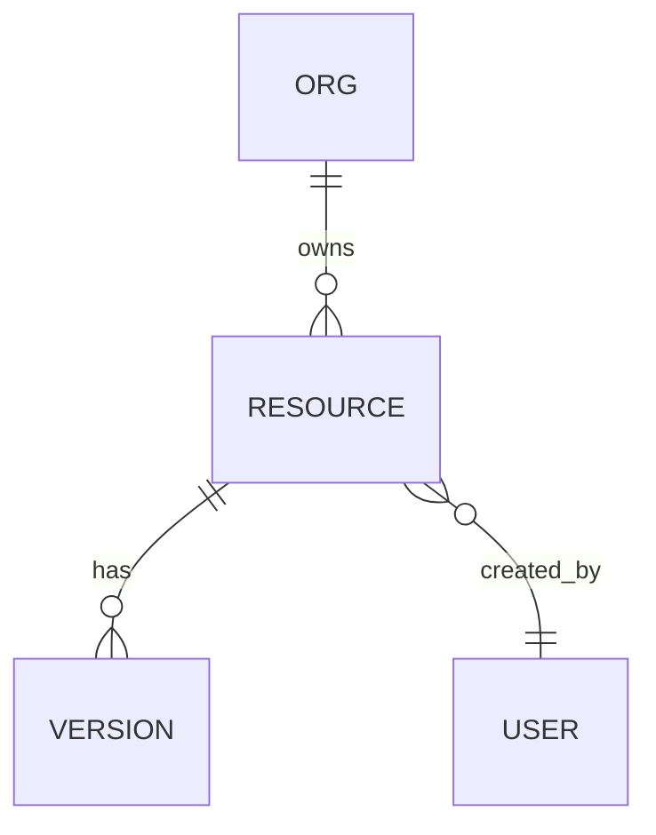

# Data Model — {Product Name}

**Product ID:** `{product-id}`  
**Version:** 0.1.0  
**Status:** Draft | Review | Approved  
**Owner:** {name}  
**Date:** {YYYY-MM-DD}

---

> Copy to `docs/studio-os/products/{product-id}/DATA_MODEL.md`  
> Required for stateful products. Mark N/A in checklist if stateless.

---

## Model Overview

{One paragraph describing the domain data model}

---

## Entities

### Entity: `{entity-name}`

| Field | Type | Required | Indexed | Notes |
|-------|------|----------|---------|-------|
| `id` | uuid | yes | PK | |
| `orgId` | uuid | yes | yes | Tenant isolation |
| `createdAt` | ISO8601 | yes | yes | |
| `updatedAt` | ISO8601 | yes | | |
| | | | | |

**Registry ID:** `{obj-id}` (System Registry™)

---

## Relationships



| From | Relation | To | Cascade |
|------|----------|-----|---------|
| Org | 1:N | Resource | soft delete |
| Resource | 1:N | Version | retain |

---

## Lifecycle

### {Entity} States

```
draft → review → published → archived
         ↓
       deleted (soft)
```

| State | Transitions | Who triggers |
|-------|-------------|--------------|
| draft | → review, deleted | editor |
| review | → published, draft | approver |
| published | → archived | owner |
| archived | → published | owner |

---

## Permissions

| Entity | Create | Read | Update | Delete |
|--------|--------|------|--------|--------|
| {entity} | role:editor | role:viewer | role:editor | role:owner |

Row-level security: `{rule}`

---

## Indexes

| Index | Fields | Purpose |
|-------|--------|---------|
| `idx_{name}` | orgId, updatedAt | List query |
| | | |

---

## Storage

| Entity | Store | Format |
|--------|-------|--------|
| | localStorage / Supabase / file | JSON |

### Storage Keys

| Key pattern | Content |
|-------------|---------|
| `studioOs_{productId}_{resourceId}_v1` | |

---

## Retention

| Data class | Retention | Deletion |
|------------|-----------|----------|
| Drafts | 90 days inactive | Soft delete |
| Published | Indefinite | Archive |
| Audit log | 7 years | Policy |
| AI transcripts | Per org policy | User request |

---

## Synchronization

| Strategy | Scope | Conflict resolution |
|----------|-------|---------------------|
| Optimistic local | Draft edits | Last-write-wins + version |
| Server authoritative | Published | Server wins |
| Real-time (future) | Collaboration | CRDT / lock |

---

## Migration

| From version | To version | Script | Rollback |
|--------------|------------|--------|----------|
| v0 | v1 | `{migration-id}` | yes |

---

## Approval

| Item | Status | Reviewer | Date |
|------|--------|----------|------|
| Entities complete | ☐ | | |
| Permissions defined | ☐ | | |
| Retention documented | ☐ | | |
| Security Review ready | ☐ | | |

---

## Cross-References

| Artifact | Path |
|----------|------|
| Information Architecture | [INFORMATION_ARCHITECTURE_TEMPLATE.md](./INFORMATION_ARCHITECTURE_TEMPLATE.md) |
| Technical Architecture | [TECHNICAL_ARCHITECTURE_TEMPLATE.md](./TECHNICAL_ARCHITECTURE_TEMPLATE.md) |
| System Registry™ | `docs/studio-os/system-registry.md` |

---

*Data Model — registry-driven objects · auditable · permissioned.*
