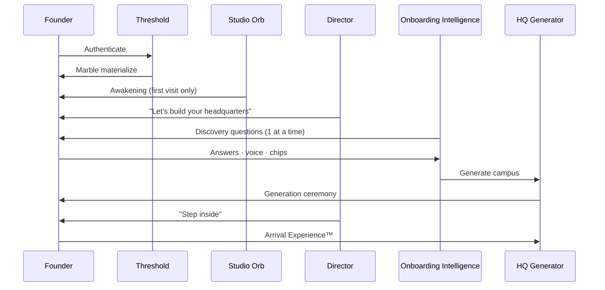

# Arrival & Onboarding Experience — Part 1

**Version:** 2.0.0  
**Parent:** [EXPERIENCE_STUDIO_2.0_SPEC.md](./EXPERIENCE_STUDIO_2.0_SPEC.md) §2  
**Inherits:** Company Onboarding Intelligence™ (M73.5) · Arrival Experience™ (M73.6) · Awakening Sequence™ (M89.4)

---

## Design Intent

First login is **Act I of a film** — not account setup.

---

## Sequence Diagram

---

## Screen States

### Threshold

| Element | Spec |
|---------|------|
| Background | Marble fade from auth — 480ms |
| Chrome | None — no app frame |
| Copy | Single line · Director voice |
| CTA | None — auto-advance or Orb tap |

### Orb Awakening™ (one-time per org)

| Element | Spec |
|---------|------|
| Orb | Scale 0→1 · breathe begins |
| Copy | "I'm Studio Intelligence™." |
| Skip | Returning orgs skip entirely |
| Storage | `org.awakening.complete` |

### Discovery Conversation

| Rule | Detail |
|------|--------|
| Format | One question per viewport |
| Input | Chips + voice + freeform |
| Progress | Dots — not "Step 3 of 12" |
| Skip | "Use industry template" always available |
| Duration | Target 3–5 minutes |

### HQ Concept Explanation

**Environmental — not slide deck:**

1. Empty plaza camera pan
2. Ghost wing outlines
3. Director narration (3 sentences max)
4. First wing builds

> "This is not a dashboard. This is where [Business Name] lives."

---

## Department Introduction (Day One)

Maximum **three** on first session:

| Order | Department | Introduced by |
|-------|------------|---------------|
| 1 | Creative Direction Studio | Creative Concierge |
| 2 | Development Department | Director |
| 3 | Publishing Control Room | Ghost preview only |

Others: locked cards with ghost preview · Director explains unlock.

---

## Concierge Introduction

| Concierge | Wing | First line |
|-----------|------|------------|
| **Chief Concierge** | Executive Lobby | "I'll help you see the whole headquarters." |
| **Creative Concierge** | Innovation | "Let's make your first production unforgettable." |
| **Production Concierge** | Production | (Introduced on first pipeline entry) |

**Tone:** Warm · precise · never sycophantic · uppercase metadata per Design Language.

---

## AI Specialist Introduction

Specialists appear **on first department entry** — not during onboarding:

> "Your Art Director AI works alongside you in Development. They propose — you approve."

---

## Living World Signals

| Signal | First session |
|--------|---------------|
| Campus map | Appears after generation |
| Wing lights | Creative Wing active · others dim |
| Environmental audio | Optional · off by default |
| Time-of-day light | Subtle · top-left source |
| Activity | Concierge at door · not busy animation |

---

## Returning User Onboarding

| Condition | Behavior |
|-----------|----------|
| Second login | Threshold 200ms → Mission Control |
| New team member | Role-based wing entry · abbreviated discovery |
| New workspace | Workspace DNA™ interview · not full HQ regen |

---

## Empty · Error · Edge States

| State | Treatment |
|-------|-----------|
| Discovery timeout | Director: "We can continue later." · save partial |
| Generation slow | Narrated progress · Director copy rotates |
| Auth error | Warm tone · retry — never red wall |
| Incomplete onboarding | Mission Control with "Complete headquarters" single CTA |

---

*Arrival & Onboarding — ceremonial entry into ownership.*
