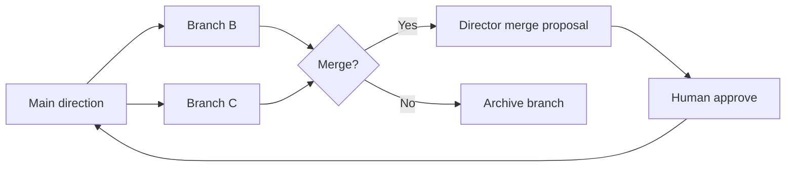

# Creative Direction Studio Experience — Part 4

**Version:** 2.0.0  
**Parent:** [EXPERIENCE_STUDIO_2.0_SPEC.md](./EXPERIENCE_STUDIO_2.0_SPEC.md) §5  
**Inherits:** Experience Studio™ v1.0 · AI Creative Director™ · Master Content Pipeline DEVELOP gate

---

## Design Intent

Creative Direction Studio is the **writers' room of Studio OS** — where Projects™ are conceived before production.

Maps to: **Innovation Wing** · Development Department (02) · Experience Studio™ canvas entry.

---

## Studio Layout

```
┌────────────────────────────────────────────────────────────────┐
│  CREATIVE DIRECTION STUDIO                    PROJECT 014 · ●    │
├────────────────────────────────────────────────────────────────┤
│                                                                │
│   INSPIRATION WALL (left · collapsible)                        │
│   · Reels · images · URLs · voice notes                        │
│                                                                │
│              MOOD BOARD CANVAS (center · dominant)               │
│              · compare · branch · merge                          │
│                                                                │
│   DIRECTOR DOCK (right · on demand)                            │
│   · proposals · why · alternatives                             │
│                                                                │
│                    [ Studio Orb ]                              │
└────────────────────────────────────────────────────────────────┘
```

---

## Create Project Flow

| Step | Experience |
|------|------------|
| 1 | "What's the production?" — voice · type card · freeform |
| 2 | Inspiration injection (encouraged · skippable) |
| 3 | Director clarifies · 1–3 questions max |
| 4 | Interview (v1.0 5-step) or skip |
| 5 | Project™ numbered · appears on campus map |
| 6 | Choose path: **Canvas first** or **Brief first** |

---

## Inspiration Injection

| Source | Drop target | AI extraction |
|--------|-------------|---------------|
| Instagram Reel URL | Inspiration wall | Palette · pace · mood · typography hints |
| Image files | Mood board rail | Color · composition · texture |
| Competitor URL | Reference panel | Positioning · gaps · opportunities |
| Voice note | Orb | Transcript → brief chips |
| Pinterest board | URL import | Grid import · auto-tag |

**Director response pattern:**
> "I extracted warm gold · editorial pacing · generous whitespace. Apply to Project 014?"

---

## Mood Board Experience

| Action | Interaction |
|--------|-------------|
| Add | Drag · paste · Orb "add this" |
| Compare | Split view · slider divider |
| Branch | "Explore B" → new board branch · main preserved |
| Merge | Director proposes · diff view · approve |
| Pin | Becomes Production Package input |

---

## Branch Creative Directions



**Rule:** Branch never destroys main. Archive preserves AI Memory lesson.

---

## Collaborative Review

| Pattern | Spec |
|---------|------|
| Director proposes | Proposal card · confidence · lenses |
| Human approves | Accept · Preview · Alternative · Why? |
| Teach | Director explains DNA implications |
| Critique | Accessibility · conversion · brand consistency |

---

## Orb in Creative Studio

| Command | Result |
|---------|--------|
| "Generate three better concepts" | 3 proposal cards · stagger 120ms |
| "Compare with branch B" | Split mood board |
| "What would luxury look like here?" | Remix preview on canvas |
| "Start production" | Handoff to Development Department |

---

## Handoff to Experience Studio™

When creative direction is sufficient:

```
Director: "Ready to compose on canvas?"
    ↓
Ceremonial transition (480ms) — studio door
    ↓
Experience Studio™ v1.0 workspace (scr-es-003)
    ↓
Production Package attached to Project passport
```

---

*Creative Direction Studio — conceive productions · don't configure software.*
