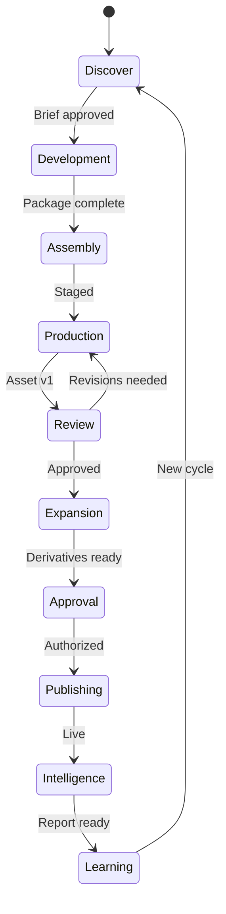

# Department Experiences — Part 6

**Version:** 2.0.0  
**Parent:** [EXPERIENCE_STUDIO_2.0_SPEC.md](./EXPERIENCE_STUDIO_2.0_SPEC.md) §7  
**Inherits:** [Studio Production Engine Departments](../../../studio-production-engine-departments.md)

---

## Design Intent

Each department is a **destination you travel to** — with identity, atmosphere, team, and exit ceremony.

---

## Department Experience Schema

Every department implements:

| Field | Experience requirement |
|-------|------------------------|
| **Arrival** | Door · concierge greet · 10s context recap |
| **Atmosphere** | Unique lighting · sound optional · material accent |
| **Hero** | One focus object (the living Master Content Asset) |
| **Tools** | Department-specific · never full platform |
| **AI specialist** | Named · visible when proposing |
| **Concierge** | Exit criteria coach |
| **Exit** | Handoff animation · asset travels |
| **Blocked** | Warm explanation · jump to fix |

---

## Department Catalog

### 01 — Discover Department
*"Find the opportunity."*

| Attribute | Experience |
|-----------|------------|
| Atmosphere | Research library · low pressure · exploratory |
| Hero | Opportunity card forming |
| Arrival copy | "Let's find what worth making." |
| Key tools | Idea capture · trend wall · brief builder |
| AI | Strategy Engine · Organizational Intelligence |
| Concierge | Chief Concierge |
| Exit ceremony | Brief seal animation → Development door opens |

---

### 02 — Development Department
*"Design the idea."*

| Attribute | Experience |
|-----------|------------|
| Atmosphere | Writers' room · mood board wall |
| Hero | Production Package assembly |
| Arrival copy | "Shape the creative direction." |
| Key tools | Storyboard · script · mood boards · hooks |
| AI | Creative Director · Art Director |
| Concierge | Creative Concierge |
| Exit ceremony | Package wrap → Assembly staging |

**Experience Studio connection:** Canvas authoring may occur here or in linked Creative Wing.

---

### 03 — Assembly Department
*"Stage the production."*

| Attribute | Experience |
|-----------|------------|
| Atmosphere | Staging floor · asset racks |
| Hero | Production-ready checklist |
| Arrival copy | "Everything in place before the stage." |
| Exit ceremony | Curtain rise → Production Stage |

---

### 04 — Production Department (Production Stage)
*"Create the work."*

| Attribute | Experience |
|-----------|------------|
| Atmosphere | Main stage · canvas dominates |
| Hero | Master Content Asset v1 |
| Arrival copy | "This is where it comes together." |
| Key tools | Experience Studio canvas · asset placement |
| Exit ceremony | Stage lights dim → Review Theater |

---

### 05 — Review Department (Review Theater)
*"See it clearly."*

| Attribute | Experience |
|-----------|------------|
| Atmosphere | Theater · preview seats · large screen |
| Hero | Full preview · Design Health™ |
| Arrival copy | "Watch as your audience will." |
| Key tools | Compare · annotate · accessibility audit |
| Exit ceremony | Approval stamp or return to Production |

---

### 06 — Expansion Department
*"Multiply the value."*

| Attribute | Experience |
|-----------|------------|
| Atmosphere | Remix gallery · derivative wall |
| Hero | Derivative asset library |
| Exit ceremony | Gallery opens → Approval |

---

### 07 — Approval Department
*"Authorize with confidence."*

| Attribute | Experience |
|-----------|------------|
| Atmosphere | Executive chamber · signature table |
| Hero | Approval queue · Founder focus |
| Arrival copy | "What needs your yes?" |
| Exit ceremony | Authorization seal → Publishing |

---

### 08 — Publishing Department (Publishing Control Room)
*"Go live."*

| Attribute | Experience |
|-----------|------------|
| Atmosphere | Control room · monitors · calm urgency |
| Hero | 3-step pipeline · live preview |
| Arrival copy | "Ready to share with the world." |
| Celebration | Bloom 600ms · URL reveal · no confetti |
| Exit ceremony | Live pulse → Intelligence Center |

*Inherits v1.0 scr-es-007 Publish Pipeline.*

---

### 09 — Intelligence Department (Intelligence Center)
*"Understand performance."*

| Attribute | Experience |
|-----------|------------|
| Atmosphere | Observatory · charts as landscape |
| Hero | Performance report · one metric focus |
| Exit ceremony | Insights scroll → Learning Garden |

---

### 10 — Learning Department
*"Improve continuously."*

| Attribute | Experience |
|-----------|------------|
| Atmosphere | Reflection garden · archives |
| Hero | Improvement actions · AI Memory update |
| Exit ceremony | Loop arrow → Discover (new cycle) |

---

## Travel Between Departments

**Motion:** 400ms corridor · concierge at each door · asset object persistent in viewport corner during travel.

---

## Locked Departments

| State | Experience |
|-------|------------|
| Not staffed | Ghost interior preview · 10s |
| Locked | Director explains unlock · Marketplace link |
| Entering first time | Concierge tutorial via doing |

---

*Department Experiences — ten rooms · one production · zero scrolling reports.*
