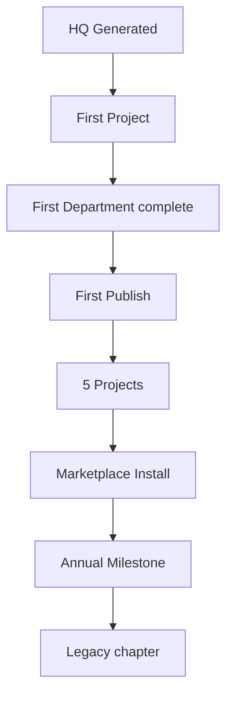

# Headquarters Evolution Model — Part 8

**Version:** 2.0.0  
**Parent:** [EXPERIENCE_STUDIO_2.0_SPEC.md](./EXPERIENCE_STUDIO_2.0_SPEC.md) §9  
**Inherits:** Living Headquarters™ (M82.5) · Environmental Storytelling™ (M106) · Legacy Wing

---

## Design Intent

Headquarters **grow with the business** — visible progression without gamification noise.

Borrow **Xbox progression philosophy** — mastery visible · celebration quiet.

---

## Maturity Tiers

| Tier | Name | Trigger | Visual evolution |
|------|------|---------|------------------|
| 0 | **Foundation** | HQ generated | Innovation Wing · Executive Lobby |
| 1 | **First Production** | Project created | Creative Wing lights · campus dot |
| 2 | **First Publish** | Project live | Publishing facade · Legacy entry |
| 3 | **Established** | 5 publishes | Production Wing upgrade · map detail |
| 4 | **Expanded** | 1+ Marketplace install | New wing solid · concierge roster |
| 5 | **Mastery** | 12 months active | Legacy Wing chapters · environmental seasons |

**No XP bars.** Tier visible on campus map plaque only.

---

## Evolution Triggers

---

## Visual Evolution Catalog

| Trigger | Campus | Interior | Team |
|---------|--------|----------|------|
| First Project | Creative dot glow | Studio door active | — |
| First Publish | Publishing wing facade | Control room permanent | Production Concierge |
| 5 Projects | Wing detail upgrade | Department refinements | +AI specialist |
| Expansion install | New building | New department atmosphere | +Concierge |
| Achievement | Legacy plaque | — | Director acknowledgment |

**Rule:** Evolution is **additive** — never destructive redesign.

---

## Achievement System (Quiet)

| Element | Spec |
|---------|------|
| Notification | Single line toast · 3s · no sound default |
| Record | Marble plaque in Legacy Wing |
| Copy | "First publish — Project 014" — not "Achievement Unlocked!" |
| Share | Optional · off by default |
| Gamification | ❌ No points · badges · leaderboards |

---

## Locked Content Preview

| State | Experience |
|-------|------------|
| Locked wing | Ghost building · walk preview 10s |
| Locked department | Card shows silhouette · Director explains |
| Near unlock | Orb opportunity pulse · once |

---

## Concierge & AI Growth

| Tier | Team size |
|------|-------------|
| 0 | Chief + Creative Concierge |
| 1 | + Production Concierge |
| 2 | + Review Host |
| 3 | + Intelligence Guide |
| 4+ | Per expansion |

Introduction: personal line · not roster table.

---

## Seasonal Evolution (Optional · M106)

| Season | Environmental |
|--------|---------------|
| Spring | Lighter marble warmth |
| Milestone anniversary | Legacy Wing chapter unlock |
| Founder birthday | Optional · off · respectful |

**Never:** Holiday gamification · assumption of culture.

---

## Regression (Business contraction)

If departments unused 90+ days:

- Lights dim — not removed
- Director: "This wing is quiet. Archive or revive?"
- Never punitive tone

---

*Headquarters Evolution — the campus remembers how far you've come.*
