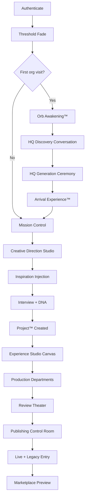
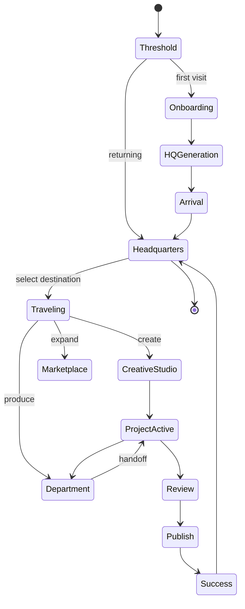
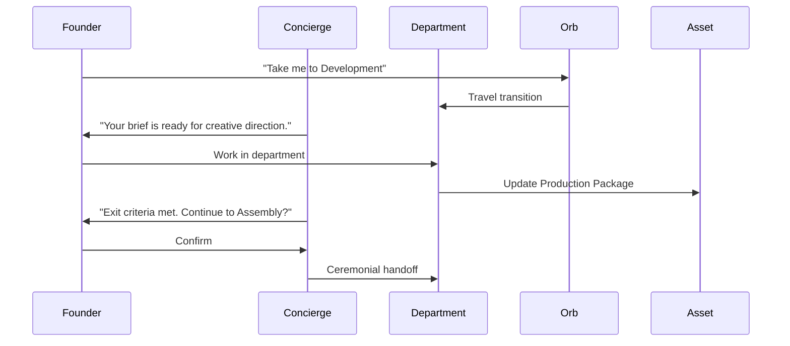

# User Journey Maps — Experience Studio™ 2.0

**Version:** 2.0.0  
**Parent:** [Experience v2 Package](./README.md)

---

## Master Journey — Login to First Success



---

## State Machine — User Session



---

## Journey 1 — First-Time Onboarding

| Step | Screen / Destination | User action | System response | Emotion |
|------|------------------------|-------------|-----------------|---------|
| 1 | Threshold | Lands post-auth | Marble fade-in | Wonder |
| 2 | Orb Awakening | Watches | Orb breathes · Director speaks | Trust |
| 3 | Discovery | Answers 6 questions | Chips · voice · skip path | Ease |
| 4 | HQ Generation | Waits 4–8s | Campus materializes | Magic |
| 5 | Arrival | Taps Enter | Wing door opens | Ownership |
| 6 | Mission Control | Orients | One hero · three destinations | Clarity |

---

## Journey 2 — Project Creation

| Step | Destination | Action | Outcome |
|------|-------------|--------|---------|
| 1 | Creative Direction Studio | "New production" | Project shell |
| 2 | Inspiration Wall | Drop Reel / images | Mood extracted |
| 3 | Interview | 5 steps or skip | DNA blend |
| 4 | Experience Studio | Canvas generates | Project 014 active |
| 5 | Campus Map | — | Creative Wing light on |

---

## Journey 3 — Department Travel



---

## Journey 4 — Publish

| Step | Destination | Gate | Celebration |
|------|-------------|------|-------------|
| 1 | Review Theater | Design Health™ ≥70 | — |
| 2 | Approval Department | Founder sign-off | — |
| 3 | Publishing Control Room | 3-step pipeline | Bloom 600ms |
| 4 | Legacy Wing | Auto-entry | Plaque · no confetti |

---

## Journey 5 — Marketplace Expansion

| Step | Action | Result |
|------|--------|--------|
| 1 | Enter Marketplace Plaza | See ghost buildings |
| 2 | Preview expansion | 30s inhabitation |
| 3 | Director fit explanation | Confidence |
| 4 | Confirm install | Building materializes |
| 5 | First visit | Concierge introduces |

---

## Journey 6 — Orb Navigation

| Intent | Example utterance | Destination |
|--------|-------------------|---------------|
| Travel | "Take me to Production" | Production Department |
| Priority | "Today's priorities" | Executive Lobby focus |
| Project | "Review Project 014" | Project dashboard |
| Create | "Generate three concepts" | Creative Studio proposals |
| Queue | "Waiting for approval" | Approval Department |
| Teach | "What is Discover?" | Teach overlay · offer visit |

---

## Returning User — Compressed Path

```
Authenticate → Mission Control (no ceremony)
    ↓
Orb: "Resume Project 014?" OR Executive Lobby priorities
    ↓
One tap → last department or canvas
```

**Rule:** Ceremony is for firsts — never block returning founders.

---

## Failure & Recovery Journeys

| Failure | Experience | Recovery |
|---------|------------|----------|
| Design Health™ block | Director explains · jump to fix | Never red alarm |
| Department exit fail | Concierge lists blockers | Inline fix · retry |
| Inspiration parse fail | Warm message · manual mood board | Never error wall |
| Offline | Banner · local edit | Sync on reconnect |

---

*User Journey Maps — every transition documented before engineering.*
