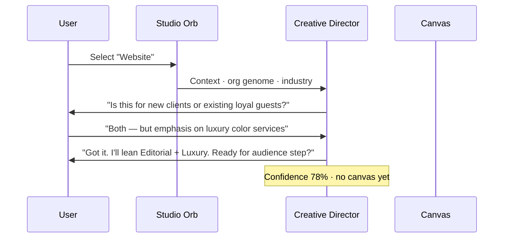
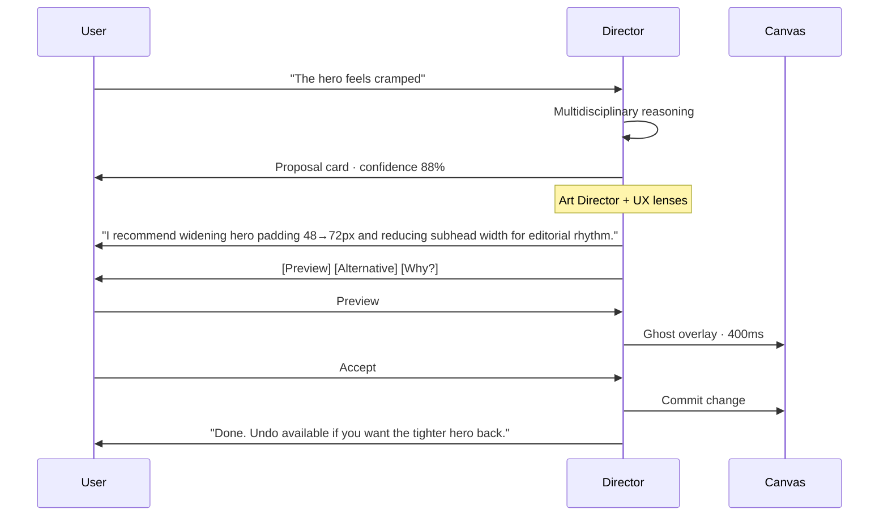
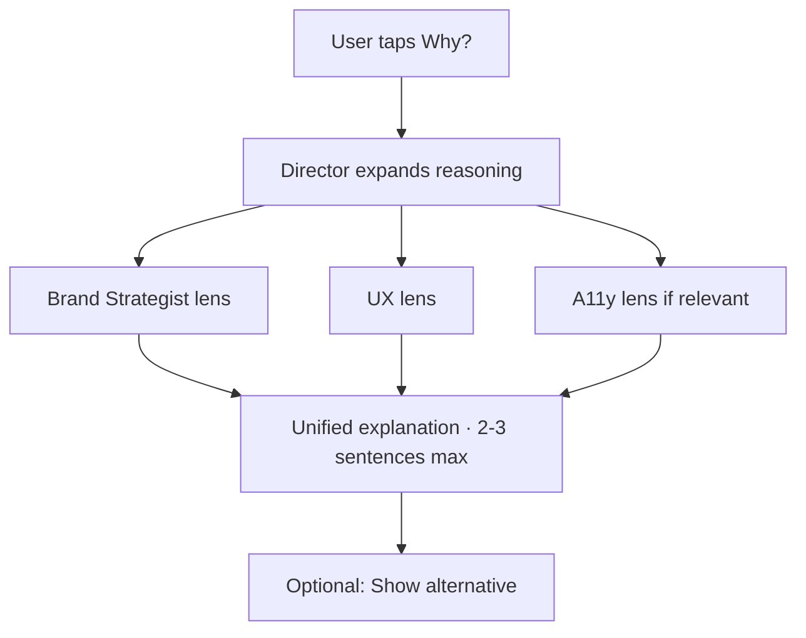
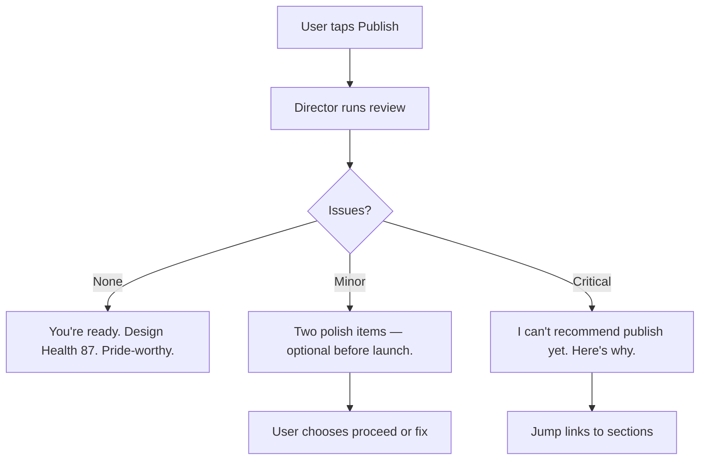
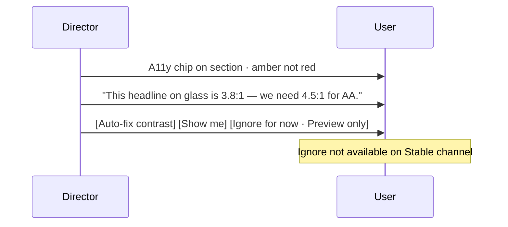
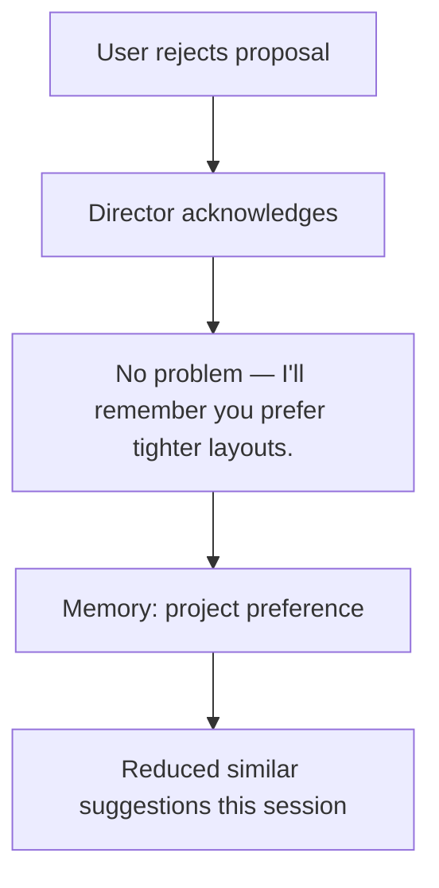

# AI Collaboration Flows — Experience Studio™ Prototype

**Version:** 1.0.0  
**Parent:** [Prototype Package](./README.md)

---

> The AI behaves like an **experienced Creative Director** — not a chatbot.

---

## Director Presence Model

| Surface | Component | When |
|---------|-----------|------|
| Ambient | `comp-studio-orb` | Always · suggestions · entry |
| Conversational | `comp-ai-chat` in floating dock | Active collaboration |
| Inline chips | Ephemeral on canvas | Quick accepts |
| Audit | `comp-conversation-timeline` | History · "why?" review |

**Tone:** Warm · precise · editorial · never robotic · never sycophantic.

---

## Flow 1 — Clarifying Questions (Interview)

**Prototype copy examples:**
- "Before I shape the atmosphere — who should feel at home here?"
- "You mentioned luxury. Should we whisper it or declare it?"
- "I can infer from your Design Genome™ — use 70% Luxury like last project?"

---

## Flow 2 — Layout Suggestion (Structural Proposal)

**Approval:** Required · never silent apply.

---

## Flow 3 — Explaining Recommendations ("Why?")

**Example:**
> "Wider hero padding signals luxury restraint — your Design DNA is 70% Luxury. Narrower subhead improves scan path for busy executives. Contrast ratio on glass overlay passes AA at this setting."

---

## Flow 4 — Offering Alternatives

| Proposal | Alternative A | Alternative B |
|----------|---------------|---------------|
| Editorial hero | Immersive full-bleed image hero | Minimal text-only hero |
| 3-column features | 2-column + testimonial | Scroll narrative chapters |
| CTA bottom-right | Centered ceremonial CTA | Sticky subtle CTA |

**UI:** Three cards side-by-side in Director dock · preview each · select one.

---

## Flow 5 — Teaching Users

Triggered: first-time actions · complexity detected · user asks "how?"

| Moment | Teaching |
|--------|----------|
| First Remix | "Remix previews a direction — nothing commits until you accept." |
| First DNA slider | "Design DNA is personality — Experience DNA is how it moves and breathes." |
| Publish block | "Design Health checks what your visitors will feel — let's fix contrast together." |

**Component:** `comp-modal` teach variant · dismissible · "Don't show again"

---

## Flow 6 — Reviewing Work (Pre-Publish)

**Roles engaged:** Creative Director · A11y Consultant · SEO Specialist · Performance Engineer (copy only in prototype).

---

## Flow 7 — Accessibility Concerns

---

## Flow 8 — Brand Consistency

Director monitors Design DNA™ + Design Genome™:

- "This CTA red drifts from your org accent — align to brand?"
- "Typography here switched to system sans — revert to display canon?"
- Confidence high when genome match · asks when drift detected.

---

## Flow 9 — Conversion Opportunities

Non-intrusive · max 1 suggestion per session unless asked:

> "Your hero CTA is below the fold on mobile — want me to propose a sticky invitation bar? Confidence 72%."

Chip appears near section · dismiss · "Ask later"

---

## Flow 10 — Rejection & Learning

**Never:** Guilt · "Are you sure?" loops · resubmit same proposal.

---

## Flow 11 — Timeout & Degradation

| Condition | Behavior |
|-----------|----------|
| 8s timeout | "Director needs a moment — edit manually anytime." |
| AI unavailable | Orb static · manual tools fully enabled |
| Offline | "I'll sync suggestions when you're back online." |

---

## Conversation Timeline

Every turn logged in `comp-conversation-timeline`:

| Turn | Content |
|------|---------|
| User intent | Text · voice transcript · action |
| Director response | Proposal · question · teaching |
| Outcome | accepted · rejected · pending |
| Metadata | confidence · lenses used · timestamp |

Accessible from dock tab · export for audit (future).

---

## Prototype Dialogue Samples

### Website · Salon · First Generation

**Director (post-generate):**
> "I've composed a flagship website for Salon Lumière — 70% Luxury, 20% Editorial, 10% Interactive. Your hero uses editorial headline rhythm with generous marble breathing room. Tap any section to refine, or ask me anything."

### Remix

**User:** Taps "More Editorial"  
**Director:**
> "Preview active. I've tightened the type scale, increased subhead tracking, and shifted imagery to documentary crop. Accept to commit, or try 'More Minimal' for comparison."

### Publish

**Director:**
> "Design Health 87 — PASS. Accessibility clear. SEO title present. Ready to share with the world?"

---

## Cross-References

| Document | Path |
|----------|------|
| Product Spec §11 | `../EXPERIENCE_STUDIO_PRODUCT_SPEC.md` |
| AI Guide | `developer-handbook/AI_COLLABORATION_GUIDE.md` |
| Interactions | [INTERACTION_DIAGRAMS.md](./INTERACTION_DIAGRAMS.md) |

---

*AI Collaboration Flows — direct with intelligence · own your work.*
