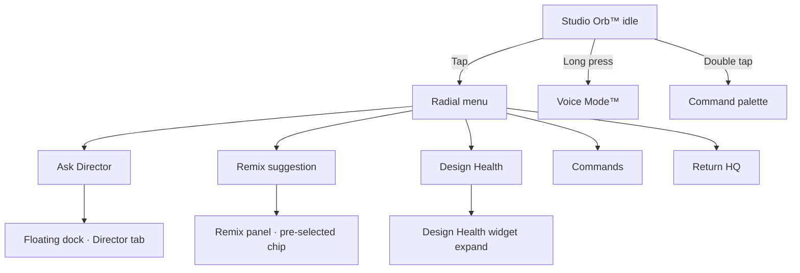
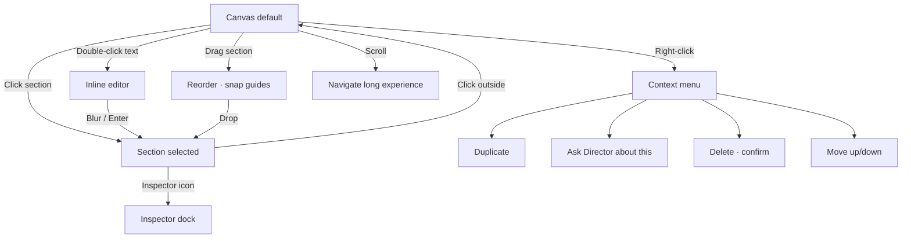
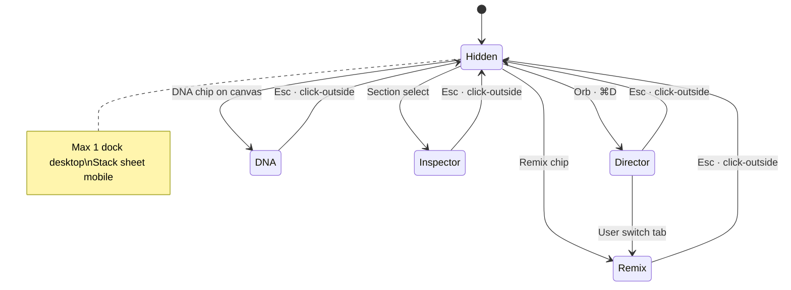
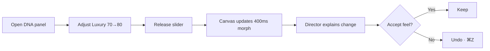
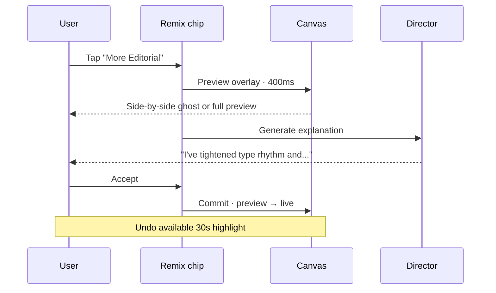
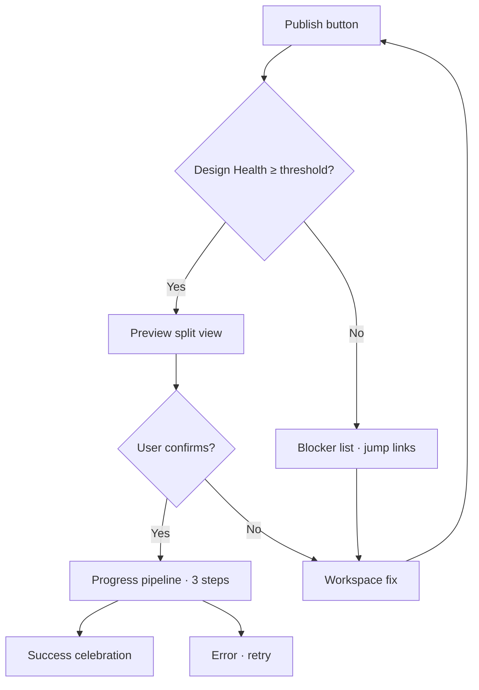

# Interaction Diagrams — Experience Studio™

**Version:** 1.0.0  
**Parent:** [Prototype Package](./README.md)

---

## Interaction Hierarchy

```
Priority 1 — Studio Orb™ (always)
Priority 2 — Canvas direct manipulation
Priority 3 — Floating dock panels (on demand)
Priority 4 — Command palette (power users)
Priority 5 — Context menu (precision)
```

---

## Studio Orb™ Interaction Map



### Orb Positioning Rules

| Viewport | Position | Safe area |
|----------|----------|-----------|
| Desktop | Bottom center · 24px margin | Never over primary CTA |
| Tablet | Bottom center · 20px | Above home indicator |
| Mobile | Bottom center · 16px + safe-area | 44px touch target |

### Orb + Canvas Coordination

- Orb dims 20% when canvas text editing active (focus on content)
- Orb pulses when Director has unprompted suggestion (max 1 per 5 min)
- Orb never opens modal over active inline editor

---

## Canvas Interaction Map



### Canvas Gestures

| Gesture | Desktop | Tablet | Mobile |
|---------|---------|--------|--------|
| Select | Click | Tap | Tap |
| Edit text | Double-click | Double-tap | Tap "Edit" chip |
| Reorder | Drag handle | Long-press drag | Reorder via menu |
| Pan | Scroll | Scroll · two-finger | Scroll |
| Zoom preview | ⌘+ / ⌘- | Pinch (preview mode only) | Pinch |

---

## Floating Dock Interaction



### Dock Behavior Rules

| Rule | Detail |
|------|--------|
| Max width | 380px desktop · 100% - 32px mobile sheet |
| Collision | Dock never covers selected section — auto-reposition left if needed |
| Persistence | Last tab remembered per session |
| Animation | Slide + fade · 280ms ease-out |
| Focus trap | Yes when open · Esc dismisses |

---

## Design DNA™ Interaction



**Blend constraint:** Sum must equal 100 — auto-adjust others proportionally unless user pins a personality.

---

## Remix™ Interaction



---

## Command Palette Interaction

| Command | Action |
|---------|--------|
| `publish` | → Publish pipeline |
| `remix` | → Remix panel |
| `dna` | → Design DNA panel |
| `versions` | → Version history |
| `director` | → Director dock |
| `health` | → Design Health expand |
| `hq` | → Return Headquarters |

**Component:** `comp-command-palette` · fuzzy search · recents at top.

---

## Publish Interaction Flow



---

## Keyboard Map (Desktop)

| Key | Action |
|-----|--------|
| ⌘K | Command palette |
| ⌘D | Director dock |
| ⌘I | Inspector |
| ⌘Z / ⌘⇧Z | Undo / redo |
| Esc | Dismiss dock / modal |
| Tab | Section navigation |
| Enter | Edit selected text |

---

## Touch Targets (Mobile)

| Element | Min size |
|---------|----------|
| Orb | 56px |
| Section tap | Full section width |
| Chips | 44px height |
| Dock tabs | 48px |
| Publish CTA | 48px · bottom safe area |

---

## Cross-References

| Document | Path |
|----------|------|
| Motion | [MOTION_SPECIFICATION.md](./MOTION_SPECIFICATION.md) |
| AI Flows | [AI_COLLABORATION_FLOWS.md](./AI_COLLABORATION_FLOWS.md) |
| Screen Walkthrough | [SCREEN_WALKTHROUGH.md](./SCREEN_WALKTHROUGH.md) |

---

*Interaction Diagrams — direct the creation · don't fight the software.*
