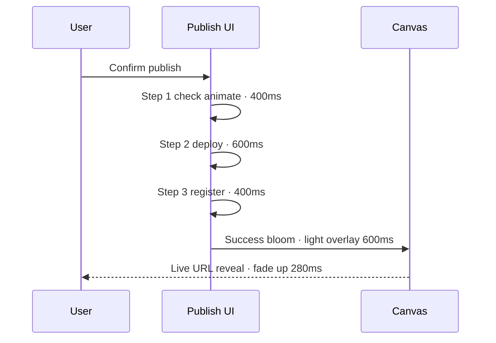

# Motion Specification — Experience Studio™

**Version:** 1.0.0  
**Parent:** [Prototype Package](./README.md)  
**Inherits:** [Design Language System™](../../../design/DESIGN_LANGUAGE_SYSTEM.md) · `token-motion`

---

> Motion communicates **confidence and quality** — never distracts · never bounces.

---

## Motion Principles

| Principle | Rule |
|-----------|------|
| **Confident** | Ease-out entrances · ease-in exits |
| **Calm** | Durations 280–600ms · no sub-100ms flashes |
| **Meaningful** | Motion explains state change |
| **Restrained** | One moving focal point per moment |
| **Accessible** | `prefers-reduced-motion: reduce` → instant |

---

## Token Reference (Prototype)

| Token | Duration | Easing | Use |
|-------|----------|--------|-----|
| `motion-instant` | 0ms | — | Reduced motion fallback |
| `motion-fast` | 180ms | ease-out | Micro-feedback · chip select |
| `motion-standard` | 280ms | cubic-bezier(0.22, 1, 0.36, 1) | Panel slide · dock |
| `motion-emphasis` | 400ms | cubic-bezier(0.22, 1, 0.36, 1) | Remix preview · DNA morph |
| `motion-ceremonial` | 480–600ms | cubic-bezier(0.16, 1, 0.3, 1) | Canvas reveal · publish success |
| `motion-orb-breathe` | 2400ms | ease-in-out | Orb idle · loop |
| `motion-orb-think` | 1200ms | ease-in-out | Orb processing · loop |

---

## Workspace Transitions

| Transition | From → To | Duration | Easing | Description |
|------------|-----------|----------|--------|-------------|
| **Arrival** | HQ → Creative Wing | 480ms | ceremonial | Marble crossfade · subtle zoom 98%→100% |
| **Project open** | List → Workspace | 320ms | standard | Card expands into canvas frame |
| **Project close** | Workspace → List | 280ms | standard | Canvas contracts · list fades in |
| **Interview step** | Step n → n+1 | 280ms | standard | Horizontal slide · progress dot fill |
| **Generate** | Interview → Canvas | 600ms | ceremonial | Marble dissolves · canvas materializes top-down |

---

## Orb Behavior

| State | Motion |
|-------|--------|
| **Idle** | Breathe scale 1.0→1.04→1.0 · opacity pulse · 2.4s loop |
| **Thinking** | Amber core glow · faster breathe 1.2s · canvas dims 5% |
| **Opportunity** | Single gold ring expand · 400ms · once |
| **Radial open** | 5 items fan 72° arc · stagger 40ms each · 280ms |
| **Radial close** | Reverse · 180ms |
| **Voice active** | Concentric ripples · 800ms loop |

---

## Panel & Dock Motion

| Element | Enter | Exit |
|---------|-------|------|
| **Floating dock** | Slide from right 24px + fade 0→1 · 280ms | Reverse · 220ms |
| **Inspector** | Same dock · tab crossfade 180ms | — |
| **Interview panel** | Scale 0.96→1 + fade · 320ms center | Scale down · 240ms |
| **Modal confirm** | Scale 0.94→1 · backdrop blur 0→12px · 280ms | Fade · 200ms |
| **Mobile bottom sheet** | Slide up · spring-soft · 320ms | Slide down · 280ms |
| **Drawer** | Slide from bottom 85% height | Slide down |

---

## Canvas Motion

| Action | Motion |
|--------|--------|
| **Section add** | Fade up 16px · 320ms · ease-out |
| **Section delete** | Collapse height · 280ms · ease-in |
| **Reorder** | Lift shadow · move · settle · 400ms |
| **Inline edit** | Text cursor · no container animation |
| **Remix preview** | Overlay ghost · crossfade 400ms |
| **Remix commit** | Ghost merges · 320ms |
| **DNA update** | Global token morph · 400ms · stagger sections 30ms |

---

## AI Thinking States

| Phase | Visual | Duration |
|-------|--------|----------|
| **Intent received** | Orb → thinking · dock shows "…" | Immediate |
| **Reasoning** | Director dock · subtle typing indicator | Until response |
| **Proposal ready** | Proposal card slides up 12px · 280ms | — |
| **Timeout** | Thinking fades · message fades in · 280ms | At 8s |

**Proposal card:** Glass · confidence badge · Accept / Alternative / Why?

---

## Loading Sequences

| Context | Treatment | Never |
|---------|-----------|-------|
| **Canvas generate** | Progress ring · Director copy rotates | Blank spinner |
| **Save** | Status dot pulse · "Saving…" | Blocking overlay |
| **Publish** | 3-step pipeline · checkmarks animate | Indeterminate only |
| **Asset upload** | Inline bar · thumbnail fade-in | Modal blocker |
| **Project list** | Skeleton shimmer on glass cards | Spinning logo |

---

## Publishing Flow Motion

---

## Success Celebrations

| Success | Motion | Sound (optional) |
|---------|--------|------------------|
| First section added | Section edge glow 400ms once | None |
| Interview complete | Progress completion · subtle haptic mobile | Soft chime optional |
| Design Health PASS | Score ring fill · 600ms | None |
| Publish live | Bloom + URL · 600ms | Ceremonial optional · off by default |

**Rule:** No confetti · no badges · no gamification particles.

---

## Context Menu Motion

- Right-click: menu scale 0.95→1 · 180ms · origin at cursor
- Items stagger 20ms
- Dismiss: fade 120ms

---

## Error Motion

- Error banner: slide down from top · 280ms · warm tone (not red flash)
- Shake: **never** on inputs
- Retry button: subtle pulse once

---

## Reduced Motion

When `prefers-reduced-motion: reduce`:

| Normal | Reduced |
|--------|---------|
| All transitions | Instant · opacity only where needed |
| Orb breathe | Static · state via color only |
| Remix preview | Instant swap |
| Ceremonial | Skip bloom · instant reveal |
| Parallax | Disabled |

---

## Scalability Notes

- Stagger max 8 items — then instant batch
- Canvas morph batches sections in groups of 5
- Mobile reduces simultaneous animations to 1

---

## Cross-References

| Document | Path |
|----------|------|
| Design Language § Motion | `design/DESIGN_LANGUAGE_SYSTEM.md` |
| Interactions | [INTERACTION_DIAGRAMS.md](./INTERACTION_DIAGRAMS.md) |
| Recommended VDR | [RECOMMENDED_VDRs.md](./RECOMMENDED_VDRs.md) — VDR-301 motion tokens |

---

*Motion Specification — confident · calm · cinematic restraint.*
