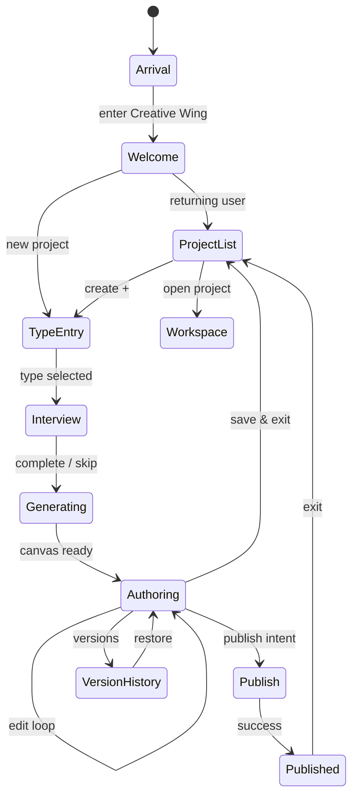

# Prototype Overview — Experience Studio™

**Version:** 1.0.0  
**Parent:** [Prototype Package](./README.md)

---

## Prototype Intent

This package specifies a **high-fidelity experience prototype** — every screen, state, transition, and motion — so engineering can build what users *feel*, not what a page builder looks like.

**Medium:** Design specification (Figma-ready · HTML static optional in engineering phase)  
**Not included:** Production code · React · backend

---

## Master Experience Flow

```
┌─────────────────────────────────────────────────────────────────────────┐
│  ARRIVAL — HQ Creative Wing · marble environment · Orb presence          │
└───────────────────────────────┬─────────────────────────────────────────┘
                                ↓
┌─────────────────────────────────────────────────────────────────────────┐
│  WELCOME — First visit ceremony OR returning project list               │
│  scr-es-004 Projects · scr-es-001 Entry                                 │
└───────────────────────────────┬─────────────────────────────────────────┘
                                ↓
┌─────────────────────────────────────────────────────────────────────────┐
│  CONVERSATION — Interview + Director clarifications                     │
│  scr-es-002 Interview                                                   │
└───────────────────────────────┬─────────────────────────────────────────┘
                                ↓
┌─────────────────────────────────────────────────────────────────────────┐
│  GENERATION — Canvas materializes · Director narrates choices           │
│  scr-es-003 Workspace (generating state)                                │
└───────────────────────────────┬─────────────────────────────────────────┘
                                ↓
┌─────────────────────────────────────────────────────────────────────────┐
│  CREATION LOOP — Edit · DNA · Remix · Director collaboration            │
│  scr-es-003 Workspace (authoring state)                                 │
└───────────────────────────────┬─────────────────────────────────────────┘
                                ↓
┌─────────────────────────────────────────────────────────────────────────┐
│  REVIEW — Design Health™ · Director pre-publish checklist               │
│  scr-es-003 + scr-es-007                                                │
└───────────────────────────────┬─────────────────────────────────────────┘
                                ↓
┌─────────────────────────────────────────────────────────────────────────┐
│  PUBLISH — Preview · approve · celebration · live URL                   │
│  scr-es-007 Publish Pipeline                                            │
└───────────────────────────────┬─────────────────────────────────────────┘
                                ↓
┌─────────────────────────────────────────────────────────────────────────┐
│  EXIT — Return HQ · project saved · optional analytics                  │
└─────────────────────────────────────────────────────────────────────────┘
```

---

## Workflow Coverage Matrix

| Workflow | Screens | States | Desktop | Tablet | Mobile |
|----------|---------|--------|---------|--------|--------|
| Welcome experience | 004, 001 | first · returning | ✓ | ✓ | ✓ |
| Project creation | 001, 002 | entry · interview | ✓ | ✓ | ✓ |
| AI conversation | 002, 003 | clarify · propose | ✓ | ✓ | ✓ |
| Canvas editing | 003 | select · edit · drag | ✓ | ✓ | ✓ |
| Contextual editing | 003 | inspector dock | ✓ | ✓ | drawer |
| Design DNA™ | 003 | blend · live preview | ✓ | ✓ | sheet |
| Experience DNA™ | 003 | sliders · live preview | ✓ | ✓ | sheet |
| Workspace navigation | 003, 004 | tabs · palette | ✓ | ✓ | ✓ |
| Studio Orb™ | all | idle · thinking · menu | ✓ | ✓ | ✓ |
| AI suggestions | 003 | chips · proposals | ✓ | ✓ | ✓ |
| Creative Director | 003 | dock · thread | ✓ | ✓ | sheet |
| Version history | 008 | compare · restore | ✓ | ✓ | list |
| Remix™ | 003 | preview · accept | ✓ | ✓ | ✓ |
| Publishing | 007 | preview · gate · live | ✓ | ✓ | ✓ |
| Project dashboard | 004 | list · filter · search | ✓ | ✓ | ✓ |
| Collaboration | 003 | comments (v1.1 spec) | preview | preview | preview |
| Settings | 009 | prefs · memory | ✓ | ✓ | ✓ |
| Assets | 005 | upload · select | ✓ | ✓ | ✓ |
| Templates | 006 | browse · apply | ✓ | ✓ | ✓ |
| Empty states | all | per screen | ✓ | ✓ | ✓ |
| Error states | all | recoverable | ✓ | ✓ | ✓ |
| Success states | 003, 007 | micro · publish | ✓ | ✓ | ✓ |

---

## Environment Design (Inherited)

| Layer | Material | Token reference |
|-------|----------|-----------------|
| Background | White marble · subtle veining | `--es-marble` · HQ continuity |
| Canvas frame | Crystal acrylic edge | `token-glass` edge |
| Panels | Frosted glass 40–55% | `comp-floating-dock` |
| Chrome | Soft white metadata bar | ≤15% viewport |
| Accent | Org brand + Studio red | Design DNA™ · `--es-studio-red` |
| Typography | Editorial display + metadata caps | Design Language roles |
| Lighting | Soft top-left · gentle shadow | `token-elevation` |

**Rule:** No dark SaaS chrome · no dense data walls.

---

## Workspace Composition (Desktop)

```
┌──────────────────────────────────────────────────────────────────────────┐
│  Metadata strip (8px) — project name · save indicator · comp-status     │ 8%
├──────────────────────────────────────────────────────────────────────────┤
│                                                                          │
│                                                                          │
│                         CANVAS (comp-canvas)                             │
│                         Experience preview · 85%+ focus                    │
│                         Inline edit · section selection                  │
│                                                                          │
│                                                                          │
│                              ┌─────────────┐                             │
│                              │ Studio Orb™ │                             │
│                              └─────────────┘                             │
├──────────────────────────────────────────────────────────────────────────┤
│  [Optional minimal toolbar — comp-toolbar]                               │ ≤7%
└──────────────────────────────────────────────────────────────────────────┘

Ephemeral (on demand):
  → Floating dock right-lower: Director · DNA · Remix · Inspector
  → Command palette: ⌘K
  → Context menu: right-click canvas
```

---

## Orb-Centric Interaction Model

The **Studio Orb™** is the primary hub — not a corner widget.

| Orb state | Visual | Action |
|-----------|--------|--------|
| **Idle** | Soft pulse · bottom-center | Tap → radial menu |
| **Thinking** | Amber glow · slow breathe | AI processing |
| **Opportunity** | Subtle gold ring | Suggestion available |
| **Listening** | Voice ripple (if voice) | Voice Mode™ |

**Radial menu (prototype):**
- Ask Director
- Remix suggestion
- Design Health check
- Command palette
- Return to HQ

---

## State Machine (Global Session)



---

## Breakpoints

| Device | Width | Layout paradigm |
|--------|-------|-----------------|
| **Desktop** | ≥1280px | Canvas-first · floating docks |
| **Tablet** | 768–1279px | Canvas + stacked sheets |
| **Mobile** | <768px | Full canvas · bottom sheets |

**Detail:** [RESPONSIVE_SPECIFICATION.md](./RESPONSIVE_SPECIFICATION.md)

---

## Component Mapping (Prototype)

Every UI element in prototype spec maps to [COMPONENT_USAGE_MAP.md](../COMPONENT_USAGE_MAP.md). Proposed compositions requiring VDR noted in [RECOMMENDED_VDRs.md](./RECOMMENDED_VDRs.md).

---

## Prototype Artifacts for Design Tools

When translating to Figma (recommended next step):

| Artifact | Frames |
|----------|--------|
| Design system link | Studio OS component library (comp-*) |
| Screen frames | 9 screens × 3 breakpoints = 27 primary frames |
| State frames | +40 overlay/empty/error/success variants |
| Motion | Prototype connections per MOTION_SPECIFICATION |
| Flows | FigJam links to USER_JOURNEY_DIAGRAMS |

---

## Cross-References

| Document | Path |
|----------|------|
| Screen Walkthrough | [SCREEN_WALKTHROUGH.md](./SCREEN_WALKTHROUGH.md) |
| Motion | [MOTION_SPECIFICATION.md](./MOTION_SPECIFICATION.md) |
| AI Flows | [AI_COLLABORATION_FLOWS.md](./AI_COLLABORATION_FLOWS.md) |

---

*Prototype Overview — the complete experience before a single production component.*
