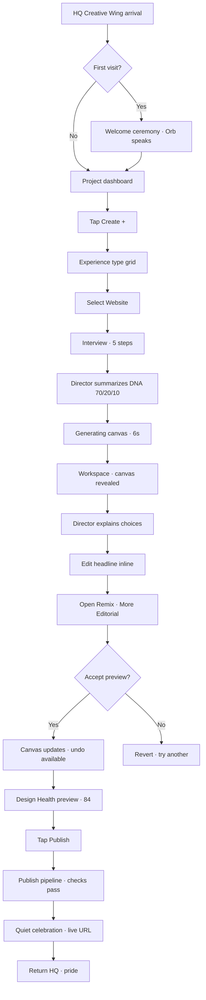
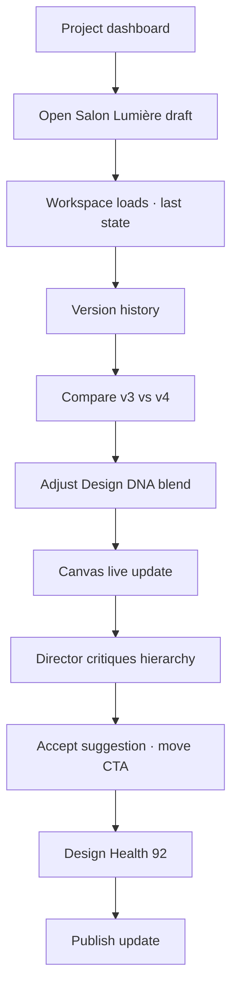
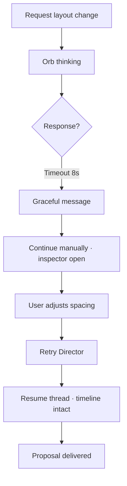
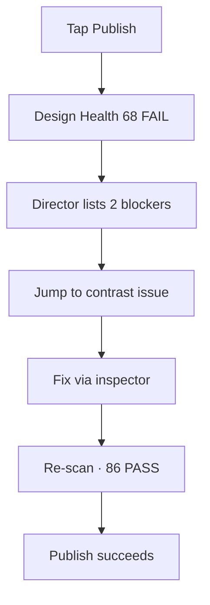
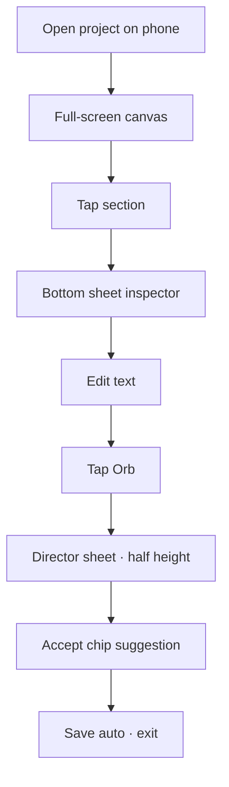
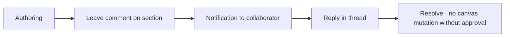

# User Journey Diagrams — Experience Studio™

**Version:** 1.0.0  
**Parent:** [Prototype Package](./README.md)

---

## Journey 1 — New Project (Primary Happy Path)

**Persona:** Alexandra · Executive Founder · first website

### Emotional Arc

| Stage | Emotion | Design lever |
|-------|---------|--------------|
| Arrival | Wonder | Marble · ceremony |
| Type select | Curiosity | 13 worlds · hints |
| Interview | Guided confidence | Director questions |
| Generate | Anticipation | Narration · progress |
| First edit | Agency | Inline · instant |
| Remix | Playfulness | Preview · safe |
| Publish | Pride | PASS score · live |
| Exit | Satisfaction | HQ transition |

---

## Journey 2 — Returning Creative Director

**Persona:** Marcus · refine existing project

---

## Journey 3 — Director-Led Recovery

**Persona:** Any · AI timeout mid-proposal

---

## Journey 4 — Publish Blocked → Fixed

---

## Journey 5 — Mobile Authoring

---

## State Transition Table

| From state | User action | To state | Transition motion |
|------------|-------------|----------|-------------------|
| Project list | Create + | Type entry | Fade up · 320ms |
| Type entry | Select type | Interview | Panel scale-in |
| Interview | Complete | Generating | Crossfade · marble |
| Generating | Ready | Authoring | Canvas reveal · 480ms |
| Authoring | Select section | Inspector open | Dock slide · 280ms |
| Authoring | Remix chip | Preview overlay | Morph · 400ms |
| Authoring | Publish | Publish pipeline | Slide left |
| Publish | Confirm | Published | Bloom · 600ms |
| Any | Orb → HQ | Exit | Ceremonial fade |

**Detail:** [MOTION_SPECIFICATION.md](./MOTION_SPECIFICATION.md)

---

## Journey 6 — Collaboration (v1.1 Preview in Prototype)

Documented for scalability — UI shown as "Coming soon" badge on comment icon.

---

## Cross-References

| Document | Path |
|----------|------|
| AI Flows | [AI_COLLABORATION_FLOWS.md](./AI_COLLABORATION_FLOWS.md) |
| Interactions | [INTERACTION_DIAGRAMS.md](./INTERACTION_DIAGRAMS.md) |
| Product Spec §4 | `../EXPERIENCE_STUDIO_PRODUCT_SPEC.md` |

---

*User Journey Diagrams — every path · every emotion · every transition.*
