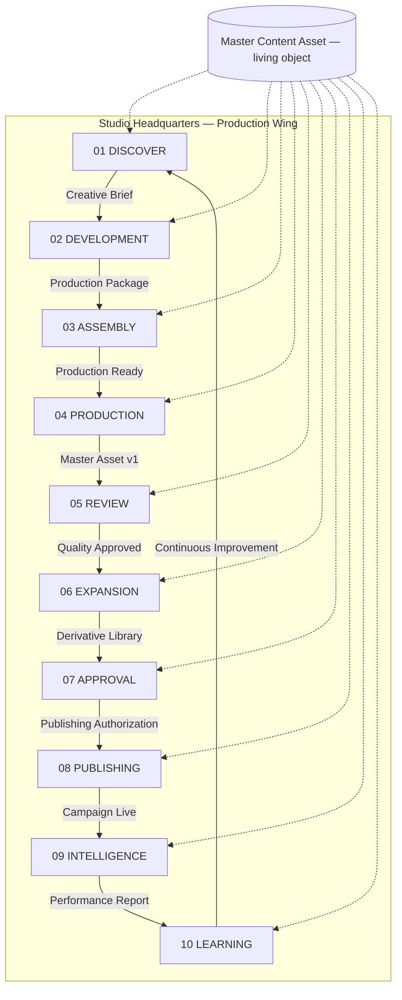
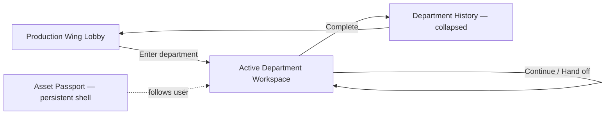

# Studio Production Engine™

**Studio OS™ — Department-Based Content Operating Model**

**Type:** Workflow + information architecture (not a Design Revision · not a new milestone · not implementation)

**Status:** Governing standard before engineering begins

**Relationship:** Implements [Master Content Pipeline™](./master-content-pipeline.md) as **physical departments** inside Studio Headquarters — not stacked sections on one page.

---

## Executive summary

The Master Content Pipeline™ is **functionally correct** but must not feel like a **long report** with sections stacked on a single scrolling page.

Studio OS is an **operating system**, not documentation.

Every phase of the production lifecycle must feel like **traveling to a different department** inside Studio Headquarters. The user walks a **living Master Content Asset** through ten departments. Each department owns the asset until handoff.

**System names (unchanged):**

| Name | Role |
|------|------|
| **Master Content Pipeline™** | Canonical lifecycle · gates · entry/exit criteria |
| **Studio Production Engine™** | Department-based UX · IA · navigation · workspaces |

**Department reference:** [studio-production-engine-departments.md](./studio-production-engine-departments.md)

---

## Philosophy shift

| Anti-pattern (rejected) | Studio Production Engine (canonical) |
|---------------------------|--------------------------------------|
| One long scrolling production page | Ten **department workspaces** — one room at a time |
| Stacked sections like a report | **Ceremonial travel** between departments |
| Static preview card for Page 001 | **Living Master Content Asset** that follows the user |
| "Production → Review → Approve" on one screen | Each department owns tools · approvals · exit |
| Switching feels like browser tabs | **Continue** travels to the next department |
| Duplicate context per step | **One asset object** — everything attached, nothing duplicated |

**Design language:** Unchanged. Departments inherit [Studio Design Constitution™](./design/STUDIO_DESIGN_CONSTITUTION.md) · **Places over panels** · Executive IA rhythm. Departments differ in **atmosphere, tools, and responsibilities** — not in global visual canon.

**Executive IA alignment:** [Executive Information Architecture](./executive-information-architecture.md) — *"Scrolling should feel like walking through Headquarters."* The Production Engine extends that principle to **content production**.

---

## Canonical engine — ten departments

```
01  DISCOVER DEPARTMENT        →  Approved Creative Brief
         ↓
02  DEVELOPMENT DEPARTMENT     →  Production Package
         ↓
03  ASSEMBLY DEPARTMENT         →  Production Ready
         ↓
04  PRODUCTION DEPARTMENT       →  Master Content Asset v1
         ↓
05  REVIEW DEPARTMENT           →  Quality Approved
         ↓
06  EXPANSION DEPARTMENT        →  Derivative Asset Library
         ↓
07  APPROVAL DEPARTMENT         →  Publishing Authorization
         ↓
08  PUBLISHING DEPARTMENT       →  Campaign Live
         ↓
09  INTELLIGENCE DEPARTMENT     →  Performance Report
         ↓
10  LEARNING DEPARTMENT         →  Continuous Improvement
         ↓
    (loops back to DISCOVER DEPARTMENT)
```

### Engine diagram



### Gate ↔ department map

Each [lifecycle gate](./master-content-pipeline-gates.md) maps 1:1 to a department workspace:

| # | Department | Pipeline gate | Exit artifact |
|---|------------|---------------|---------------|
| 01 | DISCOVER DEPARTMENT | DISCOVER GATE™ | Approved Creative Brief |
| 02 | DEVELOPMENT DEPARTMENT | DEVELOP GATE™ | Production Package |
| 03 | ASSEMBLY DEPARTMENT | ASSEMBLY GATE™ | Production Ready |
| 04 | PRODUCTION DEPARTMENT | PRODUCTION GATE™ | Master Content Asset v1 |
| 05 | REVIEW DEPARTMENT | REVIEW GATE™ | Quality Approved |
| 06 | EXPANSION DEPARTMENT | EXPANSION GATE™ | Derivative Asset Library |
| 07 | APPROVAL DEPARTMENT | APPROVAL GATE™ | Publishing Authorization |
| 08 | PUBLISHING DEPARTMENT | PUBLISH GATE™ | Campaign Live |
| 09 | INTELLIGENCE DEPARTMENT | MEASURE GATE™ | Performance Report |
| 10 | LEARNING DEPARTMENT | LEARNING GATE™ | Continuous Improvement |

---

## Navigation philosophy

### Core rules

1. **One department at a time** — primary workspace fills the Production Wing; no infinite vertical stack of all phases.
2. **Ceremonial travel** — **Continue** / **Hand off to [Next Department]** transitions feel like entering another room, not switching tabs.
3. **Breadcrumbs** — always show: `Campaign · Page 001 · REVIEW DEPARTMENT · Quality Approved pending`
4. **Completed departments** — collapse into **history** (read-only summary · re-entry only with governance).
5. **Future departments** — **locked** until prerequisites and exit criteria met.
6. **No trap** — user never feels stuck inside one long page; back navigation returns to department lobby or asset passport, not a scroll position.

### Navigation model



### User journey (example — Page 001)

| Step | User thought | System behavior |
|------|--------------|-----------------|
| 1 | "I'm in Discover — finding the opportunity." | Discover Department workspace |
| 2 | "Development — designing the idea." | Travel on brief approval |
| 3 | "Assembly — preparing production." | Locked until Production Package exists |
| 4 | "Production — creating the master asset." | Full studio tools · not a report |
| 5 | "Review — Marketing Concierge hasn't approved yet." | Independent concierge rooms |
| 6 | "Expansion — multiplying content." | Each derivative opens own workspace |
| 7 | "Approval — authorizing launch." | Campaign-level derivative grid |
| 8 | "Publishing — releasing to the world." | Mission Control queue |
| 9 | "Intelligence — measuring impact." | Live analytics department |
| 10 | "Learning — improving the next campaign." | Feeds back to Discover |

---

## Master Content Asset behavior

A **Page** (Page 001, Page 002, …) is a **living Master Content Asset** — not a static preview card.

The **same object** follows the user through every department. Each department exposes different tools against the same asset record.

### Permanent asset payload (single source — never duplicated)

| Domain | Carried fields |
|--------|----------------|
| Discovery | Creative Brief · research · Knowledge Graph links · competitive notes |
| Development | Storyboard · scripts · messaging · hooks · moodboards · Production Package |
| Assembly | Talent · schedule · props · products · dependencies |
| Production | Versions · prompts · references · director notes · media · Master Asset v1 |
| Review | Concierge reviews · scores · revision requests · Quality Approved state |
| Expansion | Derivative library · per-channel workspaces |
| Approval | Per-asset status · Publishing Authorization |
| Publishing | Queue · schedule · channel status · deployment timeline |
| Intelligence | Analytics · performance report |
| Learning | AI learnings · recommendations · graph updates |

**Rule:** Departments **read and append** to the asset passport. They do not fork duplicate copies.

### Asset passport (IA concept)

Persistent shell visible (or summonable) in every department:

- Asset identity (Page 001 · title · campaign)
- Current department + status
- Quick jump to history (completed departments)
- Locked preview of next department

---

## Department identity (atmosphere · language)

Each department communicates **where the user is** immediately. Taglines are canonical copy — not placeholder marketing.

| Department | Tagline |
|------------|---------|
| **DISCOVER** | "Find the opportunity." |
| **DEVELOPMENT** | "Design the idea." |
| **ASSEMBLY** | "Prepare production." |
| **PRODUCTION** | "Create the master asset." |
| **REVIEW** | "Perfect the experience." |
| **EXPANSION** | "Multiply the content." |
| **APPROVAL** | "Authorize launch." |
| **PUBLISHING** | "Release to the world." |
| **INTELLIGENCE** | "Measure impact." |
| **LEARNING** | "Improve the next campaign." |

Atmosphere varies by department **within** unified Design Language — lighting emphasis · tool density · motion cadence · concierge presence — never a separate visual system.

Full workspace definitions: [studio-production-engine-departments.md](./studio-production-engine-departments.md)

---

## Product inheritance

Every Studio OS product that creates content **routes through the Studio Production Engine** — not independent production UIs.

| Product | Primary departments |
|---------|---------------------|
| **Campaign Engine™** | Discover · Assembly · Approval · Intelligence · Learning |
| **Newsroom™** | Development · Production · Review |
| **Website Builder™** | Development · Production · Expansion · Approval · Publishing |
| **Publishing Studio™** | Publishing · Intelligence |
| **Social Studio™** | Expansion · Approval · Publishing · Intelligence |
| **Email Studio™** | Expansion · Approval · Publishing · Intelligence |
| **Production Studio™** | Production · Review |
| **NDXBook Page 001 pilot** | Production · Review · Approval · Publishing · Learning (partial — other departments implicit in seed) |

**Rule:** Products **surface department workspaces**; they do not embed full lifecycle as one scrollable page.

---

## Prototype gap (documented — not implementation)

Current prototype (`NdxbookPagePipelinePanel`, `MasterContentLifecycleStrip`) stacks pipeline actions on **one panel** — acceptable for pilot persistence testing; **not** the target Production Engine UX.

Target state: department workspaces with ceremonial navigation. Implementation deferred until this architecture is ratified.

---

## Design governance references

| Document | Relevance |
|----------|-----------|
| [STUDIO_DESIGN_CONSTITUTION.md](./design/STUDIO_DESIGN_CONSTITUTION.md) | Places over panels · products never own design language |
| [DESIGN_LANGUAGE_SYSTEM.md](./design/DESIGN_LANGUAGE_SYSTEM.md) | Department atmosphere within canon |
| [executive-information-architecture.md](./executive-information-architecture.md) | HQ walking metaphor · department cards · focus panel |
| [COMPONENT_CATALOG.md](./design/COMPONENT_CATALOG.md) | Shared components · department-specific composition only |
| [DESIGN_REVISION_FRAMEWORK.md](./design/DESIGN_REVISION_FRAMEWORK.md) | Visual changes via VDR only — this doc is IA, not VDR |

---

## Master Spec registration

Registered as **Product Architecture — Studio Production Engine™** (governed documentation · not a new milestone):

- Index: [MASTER_SPEC_INDEX.md](./master-spec/MASTER_SPEC_INDEX.md)
- Artifact: [studio-production-engine.yaml](./master-spec/studio-production-engine.yaml)

---

## Related documentation

- [Master Content Pipeline™](./master-content-pipeline.md)
- [Lifecycle Gates Reference](./master-content-pipeline-gates.md)
- [Department workspaces](./studio-production-engine-departments.md)
- [NDXBook Page 001 runbook](../NDXBOOK_PAGE_001_PIPELINE.md)
- [Studio OS Architecture](./architecture.md)

---

## Governance

- **Do not** implement until product/engineering explicitly schedules department workspace build.
- **Do not** rename Master Content Pipeline™.
- **Do not** treat this as a Visual Design Revision (VDR).
- **Do not** create a new milestone number — register as product architecture only.
- New content features **must** declare which **department(s)** they surface.

**Canonical user mindset:** *"I just entered the Review Department."* — not *"I'm on a production page."*
