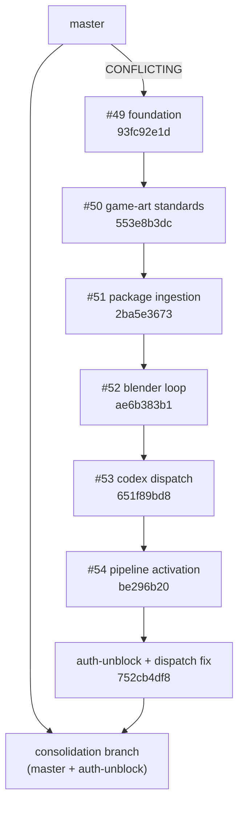

# WFE PR dependency map — consolidation sprint (2026-10-09)

**Repository:** yoteenz/fsbw  
**Master (pre-consolidation):** `b488a7eeeacb18e0f154c0c1fac1757dc6088e24`

## Dependency graph

## PR status (live GitHub)

| PR | Title (short) | Base | Head branch | Mergeable | Notes |
|----|---------------|------|-------------|-----------|--------|
| #49 | WFE foundation | master | `…foundation1-21dc` | **CONFLICTING** | DIRTY vs current master |
| #50 | Game-art standards | #49 branch | `…game-art-standards1-21dc` | MERGEABLE | |
| #51 | Real package ingestion | #50 branch | `…codex-blender-benchmark1-21dc` | MERGEABLE | |
| #52 | Blender execution loop | #51 branch | `…full-validation-blender-loop1-21dc` | MERGEABLE | |
| #53 | Codex dispatch integration | #52 branch | `…codex-dispatch-integration1-21dc` | MERGEABLE | |
| #54 | Pipeline activation | #53 branch | `…codex-pipeline-activation1-21dc` | MERGEABLE | **Lacks** verified dispatch fix |

## Verified execution tip (not a separate PR)

| Branch | SHA | Contains |
|--------|-----|----------|
| `cursor/studioos-wfe-v1-codex-auth-unblock1-21dc` | `752cb4df8` | Full stack #49→#54 + Codex stdin/maxBuffer/CLI fix + historic full-loop JSON evidence |

## Reconciliation path chosen

**Single merge:** `origin/master` + `origin/cursor/studioos-wfe-v1-codex-auth-unblock1-21dc` → `cursor/studioos-wfe-v1-pr-stack-consolidation1-8c25`

- Avoids sequential merge of #49 into stale master without resolving #49 conflicts first on GitHub UI.
- Preserves all WFE files and verified adapter fixes in one diff reviewable against master.

## Additional dependencies

**NONE** beyond auth-unblock tip (supersedes #54 for dispatch correctness).

## Merge blockers (GitHub)

- All PRs **draft**, no review approval recorded.
- Branch protection details not readable by agent token (403).
- **No GitHub merges performed** in this sprint (founder / review gate).
