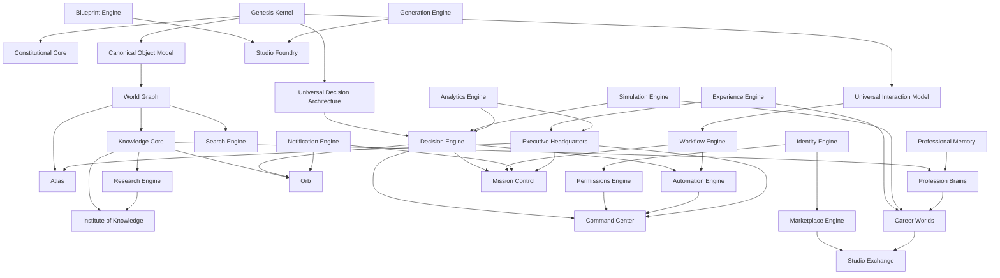

# Core Systems Blueprint™

**Project:** Genesis.md  
**Phase:** Core Systems Blueprint™  
**Status:** Canonical platform systems architecture draft for Genesis review  
**Version:** 1.0.0  
**Authority:** Genesis.md  
**Depends on:** Constitutional Core™, Canonical Object Model™, Universal Interaction Model™, Universal Decision Architecture™  
**Constitutional posture:** Studio World is a civilization-scale platform. Every implementation should trace to a canonical system blueprint rather than inventing isolated product logic.

---

## 0. Doctrine

The Genesis Kernel defines the laws, objects, interactions, and decisions of Studio World. The Core Systems Blueprint™ defines the major platform systems that run on that kernel.

These systems are not implementation details. They are canonical architectural blueprints: durable responsibilities, boundaries, dependencies, inputs, outputs, events, relationships, failure modes, and expansion paths.

### 0.1 Core systems rules

1. Every future implementation sprint should trace to one or more core systems.
2. Systems own responsibilities; implementations express responsibilities.
3. Duplicates should be merged or clarified before implementation begins.
4. A system boundary is valid only when its data ownership, decisions, interactions, and dependencies are clear.
5. Cross-system behavior must use the Universal Interaction Model™.
6. Cross-system reasoning must use the Universal Decision Architecture™.
7. Canonical objects remain the source of system identity.
8. Platform systems should be reusable across companies, departments, eras, and future Studio World products.

---

## 1. Domain Organization

| Domain | Systems |
|--------|---------|
| Executive Command | Orb™, Executive Headquarters™, Mission Control™, Command Center™, Atlas™, Blueprint Engine™ |
| Knowledge and Intelligence | Institute of Knowledge™, Knowledge Core™, World Graph™, Research Engine™, Profession Brains™, Professional Memory™ |
| Creation and Experience | Studio Foundry™, Generation Engine™, Experience Engine™, Simulation Engine™ |
| Education and Career | Career Worlds™ |
| Marketplace and Economy | Studio Exchange™, Marketplace Engine™ |
| Operations and Automation | Workflow Engine™, Automation Engine™, Notification Engine™ |
| Identity and Trust | Identity Engine™, Permissions Engine™ |
| Discovery and Insight | Search Engine™, Analytics Engine™ |

### 1.1 Boundary clarifications

- **Studio Exchange™** is the product/economy surface where value is packaged, listed, sold, licensed, fulfilled, and learned from.
- **Marketplace Engine™** is the supporting commerce infrastructure underneath Studio Exchange™.
- **Workflow Engine™** sequences approved work.
- **Automation Engine™** executes delegated decisions inside approved guardrails.
- **Orb™** is the primary intelligent interface.
- **Command Center™** is the operational command surface where human/AI/system commands are issued and monitored.
- **Mission Control™** governs mission state, progress, routing, and accountability.
- **Executive Headquarters™** is the founder/company operating environment that contains executive rooms, dashboards, councils, and strategic surfaces.

---

## 2. System Definition Template

Every system below uses this blueprint envelope:

- **Official Name™**
- **Purpose**
- **Responsibilities**
- **Core Philosophy**
- **Primary Users**
- **Canonical Objects Used**
- **Interactions**
- **Decision Dependencies**
- **Knowledge Dependencies**
- **Data Ownership**
- **Inputs**
- **Outputs**
- **Events**
- **Relationships**
- **Expansion Strategy**
- **Success Metrics**
- **Failure Modes**
- **Anti-patterns**
- **Future Evolution**

---

## 3. Executive Command Domain

### 3.1 Orb™

- **Official Name™:** Orb™
- **Purpose:** Primary intelligent companion and command interface for Studio World.
- **Responsibilities:** Interpret intent, gather context, coordinate systems, explain recommendations, request approvals, preserve memory, route commands, protect founder attention.
- **Core Philosophy:** The founder should feel accompanied by an executive intelligence, not confronted by software.
- **Primary Users:** Founder, executives, AI workers, mentors, system stewards.
- **Canonical Objects Used:** Founder™, Citizen™, AI Worker™, Mission™, Decision™, Interaction™, Memory™, Workflow™, Company™, Headquarters™.
- **Interactions:** Conversation™, Request™, Recommendation™, Executive Advisory™, Briefing™, Command™, Approval™, Memory Update™.
- **Decision Dependencies:** Intent™, Context™, Confidence™, Evidence™, Recommendation™, Escalation™, Human Override.
- **Knowledge Dependencies:** Knowledge Core™, Professional Memory™, Institute of Knowledge™, World Graph™, Company Genome™.
- **Data Ownership:** Conversational context, intent interpretations, advisory state, routing metadata, memory candidates.
- **Inputs:** User requests, events, company context, mission state, knowledge references, memory signals.
- **Outputs:** Answers, recommendations, commands, escalations, summaries, memory updates, workflow triggers.
- **Events:** Orb Request Created™, Recommendation Delivered™, Approval Requested™, Memory Candidate Created™, Escalation Triggered™.
- **Relationships:** `guides` Founder™, `routes_to` systems, `references` Knowledge Core™, `creates` Recommendations™, `updates` Memory™.
- **Expansion Strategy:** Multi-modal Orb, spatial Orb, council orchestration, proactive executive assistance.
- **Success Metrics:** Reduced founder cognitive load, high recommendation acceptance, clear explanations, low unwanted interruptions.
- **Failure Modes:** Hallucinated context, overconfident advice, intrusive timing, unauthorized action.
- **Anti-patterns:** Chatbot as product center, hidden decisions, generic answers, untraceable advice.
- **Future Evolution:** Orb becomes the personal executive operating layer across every Studio World environment.

### 3.2 Executive Headquarters™

- **Official Name™:** Executive Headquarters™
- **Purpose:** The founder/company command environment where strategic work, decisions, councils, missions, and company state converge.
- **Responsibilities:** Present executive state, host command rooms, coordinate councils, surface strategic priorities, contain founder workflows, connect departments.
- **Core Philosophy:** A company should be operated from a living headquarters, not a disconnected dashboard.
- **Primary Users:** Founder, executive team, AI council, department leads.
- **Canonical Objects Used:** Headquarters™, Company™, Department™, Council™, Mission™, Strategy™, Goal™, Decision™, Room™, Interface™.
- **Interactions:** Briefing™, Decision™, Review™, Command™, Status Change™, Workflow™, Notification™.
- **Decision Dependencies:** Strategy™, Priority™, Risk™, Opportunity™, Approval™, Escalation™.
- **Knowledge Dependencies:** Company Genome™, Analytics Engine™, Knowledge Core™, Professional Memory™.
- **Data Ownership:** Executive layout state, strategic summaries, command-room composition, council context.
- **Inputs:** Company metrics, missions, decisions, risks, opportunities, department state.
- **Outputs:** Executive briefings, command actions, priority views, council recommendations, strategic approvals.
- **Events:** Headquarters Opened™, Executive Briefing Generated™, Council Convened™, Strategic Decision Logged™.
- **Relationships:** `contains` Command Center™, `contains` Mission Control™, `hosts` Councils™, `operates` Company™.
- **Expansion Strategy:** Industry-specific headquarters, era-specific rooms, advanced council chambers.
- **Success Metrics:** Founder clarity, decision speed with audit, fewer missed risks, higher strategic alignment.
- **Failure Modes:** Dashboard sprawl, stale state, unclear authority, over-centralization.
- **Anti-patterns:** Treating HQ as admin page, burying decisions, duplicating department responsibilities.
- **Future Evolution:** Becomes the executive operating place for every company in Studio World.

### 3.3 Mission Control™

- **Official Name™:** Mission Control™
- **Purpose:** System of record for missions, progress, assignments, blockers, and outcomes.
- **Responsibilities:** Create mission state, track progress, route work, expose blockers, connect workflows, preserve mission memory.
- **Core Philosophy:** Work should be mission-driven, observable, and connected to purpose.
- **Primary Users:** Founder, teams, AI workers, mentors, operations stewards.
- **Canonical Objects Used:** Mission™, Workflow™, Goal™, Strategy™, Decision™, Citizen™, Department™, Event™.
- **Interactions:** Mission™, Workflow™, Status Change™, Request™, Command™, Review™, Completion Event™.
- **Decision Dependencies:** Priority™, Delegation™, Approval™, Risk™, Constraint™, Learning Feedback™.
- **Knowledge Dependencies:** Knowledge Core™, Professional Memory™, Workflow Engine™, Analytics Engine™.
- **Data Ownership:** Mission records, status, assignments, blockers, outcomes, lessons.
- **Inputs:** Goals, commands, decisions, workflow state, resources, blockers.
- **Outputs:** Mission plans, status updates, escalations, completion records, learning records.
- **Events:** Mission Created™, Mission Advanced™, Blocker Raised™, Mission Completed™, Lesson Captured™.
- **Relationships:** `contains` Workflows™, `depends_on` Goals™, `creates` Learning™, `updates` Memory™.
- **Expansion Strategy:** Mission templates, department missions, marketplace mission packs, AI-assisted planning.
- **Success Metrics:** Mission completion rate, blocker resolution time, traceability, outcome quality.
- **Failure Modes:** Task-list drift, missing owners, stale progress, disconnected outcomes.
- **Anti-patterns:** Treating missions as generic todos, status without learning, work without strategy.
- **Future Evolution:** Missions become the work grammar for companies, careers, and marketplaces.

### 3.4 Command Center™

- **Official Name™:** Command Center™
- **Purpose:** Operational surface for issuing, reviewing, monitoring, and auditing commands across Studio World.
- **Responsibilities:** Accept commands, validate authority, route to systems, monitor execution, expose rollback/escalation, preserve command audit.
- **Core Philosophy:** Commands should be powerful, safe, explainable, and reversible where possible.
- **Primary Users:** Founder, operators, AI workers, system stewards.
- **Canonical Objects Used:** Command™, Decision™, Permission™, Workflow™, Automation™, Event™, Audit Record™.
- **Interactions:** Command™, Approval™, Escalation™, Status Change™, Notification™, Audit Event™.
- **Decision Dependencies:** Intent™, Permission™, Confidence™, Risk™, Human Override™, Approval™.
- **Knowledge Dependencies:** Permissions Engine™, Decision Engine™, Workflow Engine™, Automation Engine™.
- **Data Ownership:** Command history, execution state, rollback metadata, command permissions.
- **Inputs:** Human commands, AI commands, system commands, permissions, context.
- **Outputs:** Executed commands, rejected commands, approvals, rollback actions, audit records.
- **Events:** Command Issued™, Command Approved™, Command Executed™, Command Failed™, Rollback Requested™.
- **Relationships:** `routes_to` Workflow Engine™, `requires` Permissions Engine™, `emits` Audit Events™.
- **Expansion Strategy:** Natural-language commands, spatial commands, multi-step command plans, command simulation.
- **Success Metrics:** Safe execution rate, low unauthorized attempts, fast rollback, clear audit.
- **Failure Modes:** Over-permissioning, hidden side effects, command ambiguity, irreversible mistakes.
- **Anti-patterns:** Commands as shortcuts around governance, silent execution, no rollback path.
- **Future Evolution:** Becomes the universal command layer for human, AI, and automated operations.

### 3.5 Atlas™

- **Official Name™:** Atlas™
- **Purpose:** Navigational and structural map of Studio World: companies, systems, departments, worlds, rooms, and relationships.
- **Responsibilities:** Visualize structure, reveal dependencies, guide navigation, support exploration, connect places to systems.
- **Core Philosophy:** A living world needs a map that explains where things are and how they connect.
- **Primary Users:** Founder, learners, operators, AI guides, architects.
- **Canonical Objects Used:** World Entity™, System™, Company™, Department™, Room™, Relationship™, Interface™, Event™.
- **Interactions:** Navigation™, Request™, Briefing™, Relationship Update™, Search™, Recommendation™.
- **Decision Dependencies:** Context™, Priority™, Intent™, Recommendation™.
- **Knowledge Dependencies:** World Graph™, Search Engine™, Knowledge Core™, Experience Engine™.
- **Data Ownership:** Navigation maps, location metadata, structural overlays, dependency visualization state.
- **Inputs:** World Graph nodes, system registry, room data, user intent, search queries.
- **Outputs:** Maps, routes, overlays, structural explanations, navigation events.
- **Events:** Route Requested™, Map Layer Opened™, Dependency Viewed™, Navigation Completed™.
- **Relationships:** `renders` World Graph™, `guides` Citizen™, `connects` Rooms™, `references` Systems™.
- **Expansion Strategy:** 3D maps, role-specific maps, dependency heat maps, marketplace world maps.
- **Success Metrics:** Findability, reduced disorientation, dependency comprehension, navigation completion.
- **Failure Modes:** Outdated maps, visual clutter, hidden dependencies, poor orientation.
- **Anti-patterns:** Static sitemap, decorative map, navigation disconnected from graph truth.
- **Future Evolution:** Atlas becomes the spatial intelligence layer for Studio World.

### 3.6 Blueprint Engine™

- **Official Name™:** Blueprint Engine™
- **Purpose:** Converts discovery, goals, knowledge, and decisions into structured architecture blueprints.
- **Responsibilities:** Capture blueprint inputs, assemble system plans, define objects/relationships, produce implementation-ready specs, preserve rationale.
- **Core Philosophy:** Serious work should begin as architecture before implementation.
- **Primary Users:** Founder, architects, AI workers, Studio Foundry, department creators.
- **Canonical Objects Used:** Blueprint™, Specification™, Decision™, System™, Workflow™, Relationship™, Implementation™.
- **Interactions:** Request™, Recommendation™, Draft™, Review™, Approval™, Publication™.
- **Decision Dependencies:** Strategy™, Goal™, Tradeoff™, Risk™, Approval™, Review™.
- **Knowledge Dependencies:** Knowledge Core™, Research Engine™, World Graph™, Professional Memory™.
- **Data Ownership:** Blueprint drafts, version history, architectural assumptions, implementation requirements.
- **Inputs:** Discovery outputs, goals, constraints, research, object graphs, decisions.
- **Outputs:** Blueprints, specs, object maps, dependency maps, implementation briefs.
- **Events:** Blueprint Drafted™, Blueprint Reviewed™, Blueprint Approved™, Blueprint Superseded™.
- **Relationships:** `creates` Specifications™, `implements` Decisions™, `references` Knowledge™, `compiles_into` Implementation Plans™.
- **Expansion Strategy:** Company blueprints, department blueprints, marketplace blueprint packs, simulation-backed planning.
- **Success Metrics:** Implementation traceability, reduced rework, architectural completeness, review pass rate.
- **Failure Modes:** Blueprint bloat, stale assumptions, missing dependencies, vague specs.
- **Anti-patterns:** Jumping to UI/code before blueprint, blueprints without decisions, unreviewed architecture.
- **Future Evolution:** Becomes Studio World's architectural compiler for systems and companies.

---

## 4. Knowledge and Intelligence Domain

### 4.1 Institute of Knowledge™

- **Official Name™:** Institute of Knowledge™
- **Purpose:** Governs knowledge quality, publication, review, canon, standards, archives, and institutional wisdom.
- **Responsibilities:** Review knowledge, publish canon, certify learning, govern research standards, preserve archives, resolve contradictions.
- **Core Philosophy:** Knowledge becomes power only when it becomes reviewed, teachable, and preserved.
- **Primary Users:** Mentors, AI workers, founders, learners, researchers, canon stewards.
- **Canonical Objects Used:** Institution™, Knowledge Artifact™, Codex Article™, Research Paper™, Review™, Certification™, Policy™.
- **Interactions:** Review™, Validation™, Publication™, Teaching™, Certification™, Knowledge Update™.
- **Decision Dependencies:** Approval™, Review™, Evidence™, Confidence™, Constitutional Alignment™.
- **Knowledge Dependencies:** Knowledge Core™, Research Engine™, Professional Memory™, World Graph™.
- **Data Ownership:** Canonical knowledge status, review records, publication history, certification standards.
- **Inputs:** Research, knowledge candidates, profession standards, evidence, review requests.
- **Outputs:** Published canon, review decisions, certifications, archive records, standards.
- **Events:** Knowledge Submitted™, Review Passed™, Article Published™, Certification Issued™, Contradiction Found™.
- **Relationships:** `governs` Knowledge Core™, `publishes` Codex™, `validates` Research™, `certifies` Career Worlds™.
- **Expansion Strategy:** Discipline institutes, peer review councils, public knowledge editions.
- **Success Metrics:** Knowledge quality, contradiction resolution time, publication traceability, certification trust.
- **Failure Modes:** Unreviewed canon, stale standards, authority confusion, archive loss.
- **Anti-patterns:** Treating generated text as canon, publication without review, knowledge without provenance.
- **Future Evolution:** Becomes Studio World's permanent academic and standards institution.

### 4.2 Knowledge Core™

- **Official Name™:** Knowledge Core™
- **Purpose:** Operational knowledge base that supplies source-backed context, references, patterns, and lessons to systems.
- **Responsibilities:** Store knowledge objects, retrieve relevant context, connect evidence, expose contradictions, support reasoning.
- **Core Philosophy:** Intelligence needs accessible, structured, source-backed knowledge.
- **Primary Users:** Orb, Profession Brains™, Research Engine™, Decision Engine™, AI workers.
- **Canonical Objects Used:** Knowledge Artifact™, Article™, Evidence™, Memory™, Rule™, Policy™, Relationship™.
- **Interactions:** Knowledge Update™, Request™, Response™, Validation™, Teaching™.
- **Decision Dependencies:** Evidence™, Confidence™, Context™, Recommendation™.
- **Knowledge Dependencies:** Institute of Knowledge™, World Graph™, Research Engine™, Professional Memory™.
- **Data Ownership:** Operational knowledge records, embeddings/search indexes, source links, contradiction markers.
- **Inputs:** Published canon, research, memories, observations, external references.
- **Outputs:** Context packages, references, evidence, contradiction alerts, teaching material.
- **Events:** Knowledge Added™, Knowledge Retrieved™, Contradiction Detected™, Knowledge Deprecated™.
- **Relationships:** `references` Canon™, `supports` Decisions™, `teaches` Profession Brains™, `updates` Memory™.
- **Expansion Strategy:** Domain knowledge cores, vector retrieval, graph-aware evidence, source confidence scoring.
- **Success Metrics:** Retrieval relevance, source coverage, contradiction accuracy, decision evidence quality.
- **Failure Modes:** Stale knowledge, hallucinated sources, duplicate facts, weak provenance.
- **Anti-patterns:** Raw content dump, source-free AI memory, opaque retrieval.
- **Future Evolution:** Becomes the living operational brain for Studio World knowledge.

### 4.3 World Graph™

- **Official Name™:** World Graph™
- **Purpose:** Canonical graph of Studio World objects, relationships, systems, events, implementations, and dependencies.
- **Responsibilities:** Store graph structure, validate relationships, expose dependencies, compile maps, support navigation/reasoning.
- **Core Philosophy:** Studio World is a graph before it is an interface.
- **Primary Users:** Architects, Atlas™, Search Engine™, Decision Engine™, Blueprint Engine™, developers.
- **Canonical Objects Used:** Registry™, Relationship™, System™, Object™, Event™, Implementation™, Decision™.
- **Interactions:** Relationship Update™, Validation™, Compilation™, Search™, Briefing™.
- **Decision Dependencies:** Dependency analysis, contradiction checks, risk, impact scope.
- **Knowledge Dependencies:** Genesis, Object Model, Core Systems Blueprint, Knowledge Core™.
- **Data Ownership:** Canonical graph nodes, edges, relationship metadata, compile reports.
- **Inputs:** Genesis articles, system registries, object registries, implementation references.
- **Outputs:** Graph exports, dependency maps, validation reports, Atlas layers, search indexes.
- **Events:** Node Added™, Edge Added™, Contradiction Detected™, Graph Compiled™.
- **Relationships:** `connects` all canonical objects, `compiles_into` Atlas™, `validates` dependencies.
- **Expansion Strategy:** Runtime graph queries, visual dependency maps, graph-based simulations.
- **Success Metrics:** Graph completeness, validation pass rate, dependency traceability.
- **Failure Modes:** Circular dependencies, missing edges, duplicate nodes, stale compiled graph.
- **Anti-patterns:** Architecture only in prose, hidden dependencies, graph as decorative artifact.
- **Future Evolution:** Becomes the structural nervous system of Studio World.

### 4.4 Research Engine™

- **Official Name™:** Research Engine™
- **Purpose:** Produces source-backed research, comparisons, evidence packages, and knowledge candidates.
- **Responsibilities:** Gather sources, synthesize findings, score evidence, detect gaps, prepare research for review.
- **Core Philosophy:** Decisions should stand on research, not vibes.
- **Primary Users:** Founders, AI workers, Institute reviewers, Profession Brains™, Blueprint Engine™.
- **Canonical Objects Used:** Research Paper™, Evidence™, Knowledge Artifact™, Decision™, Risk™, Opportunity™.
- **Interactions:** Research Request™, Knowledge Update™, Recommendation™, Review™, Publication™.
- **Decision Dependencies:** Evidence™, Confidence™, Tradeoff™, Risk™, Opportunity™.
- **Knowledge Dependencies:** Knowledge Core™, Institute of Knowledge™, Search Engine™, external sources.
- **Data Ownership:** Research briefs, citations, evidence packages, research status.
- **Inputs:** Questions, goals, constraints, source materials, prior knowledge.
- **Outputs:** Research reports, evidence records, recommended actions, knowledge candidates.
- **Events:** Research Started™, Source Added™, Evidence Pack Created™, Research Submitted™.
- **Relationships:** `creates` Evidence™, `supports` Decisions™, `publishes` Research Papers™.
- **Expansion Strategy:** Automated literature reviews, market research, competitive intelligence, source confidence models.
- **Success Metrics:** Citation quality, evidence usefulness, review pass rate, decision impact.
- **Failure Modes:** Shallow synthesis, weak sources, bias, stale research.
- **Anti-patterns:** Research as generic summary, uncited claims, confusing research with canon.
- **Future Evolution:** Becomes Studio World's evidence production engine.

### 4.5 Profession Brains™

- **Official Name™:** Profession Brains™
- **Purpose:** Domain-specific professional intelligence for careers, services, departments, and expert work.
- **Responsibilities:** Provide expertise, recommend standards, guide learning, review work, mentor citizens, support simulations.
- **Core Philosophy:** Every profession deserves a living professional brain, not generic AI.
- **Primary Users:** Learners, founders, AI workers, mentors, Career Worlds™, Studio Foundry™.
- **Canonical Objects Used:** Profession™, Profession Brain™, Mentor™, Capability™, Service™, Knowledge Artifact™, Review™.
- **Interactions:** Teaching™, Recommendation™, Review™, Validation™, Executive Advisory™, Simulation™.
- **Decision Dependencies:** Recommendation™, Confidence™, Evidence™, Review™, Learning Feedback™.
- **Knowledge Dependencies:** Knowledge Core™, Professional Memory™, Institute of Knowledge™, Research Engine™.
- **Data Ownership:** Profession standards, skill maps, expert patterns, review heuristics, learning pathways.
- **Inputs:** User goals, work artifacts, profession knowledge, historical outcomes, standards.
- **Outputs:** Guidance, critiques, plans, simulations, skill recommendations, reviews.
- **Events:** Profession Guidance Given™, Work Reviewed™, Skill Gap Detected™, Learning Path Recommended™.
- **Relationships:** `teaches` Citizens™, `guides` Career Worlds™, `validates` Capabilities™, `references` Knowledge Core™.
- **Expansion Strategy:** New profession packs, certification tracks, mentor councils, industry-specific brains.
- **Success Metrics:** Learner progress, review quality, recommendation acceptance, professional outcome quality.
- **Failure Modes:** Generic advice, outdated standards, overconfident expertise, weak personalization.
- **Anti-patterns:** One AI brain for all professions, advice without standards, teaching without practice.
- **Future Evolution:** Becomes the expertise layer for every profession and department.

### 4.6 Professional Memory™

- **Official Name™:** Professional Memory™
- **Purpose:** Preserves professional lessons, preferences, decisions, work patterns, and wisdom over time.
- **Responsibilities:** Store learning history, capture outcomes, personalize guidance, preserve style/standards, inform future decisions.
- **Core Philosophy:** Professional growth compounds only when lessons are remembered.
- **Primary Users:** Founders, learners, AI mentors, Profession Brains™, Career Worlds™.
- **Canonical Objects Used:** Memory™, Learning™, Decision™, Citizen™, Profession™, Work Artifact™.
- **Interactions:** Memory Update™, Learning™, Teaching™, Recommendation™, Review™.
- **Decision Dependencies:** Historical Wisdom™, Learning Feedback™, Confidence Calibration™, Context™.
- **Knowledge Dependencies:** Knowledge Core™, Profession Brains™, Institute archives.
- **Data Ownership:** Professional memory records, preference history, skill progression, outcome notes.
- **Inputs:** Reviews, decisions, outcomes, feedback, practice attempts, mentor notes.
- **Outputs:** Personalized context, reminders, wisdom summaries, future recommendations.
- **Events:** Memory Captured™, Preference Learned™, Lesson Reinforced™, Memory Superseded™.
- **Relationships:** `learns_from` Work™, `supports` Profession Brains™, `updates` Future Decisions™.
- **Expansion Strategy:** Cross-career memory, portable professional identity, mentor memory views.
- **Success Metrics:** Personalization accuracy, repeated mistake reduction, learning retention.
- **Failure Modes:** Privacy violations, stale preferences, biased memory, overfitting to old behavior.
- **Anti-patterns:** Memory as raw logs, remembering without consent, treating memory as permanent truth.
- **Future Evolution:** Becomes the wisdom continuity layer for professional lives.

---

## 5. Creation and Experience Domain

### 5.1 Studio Foundry™

- **Official Name™:** Studio Foundry™
- **Purpose:** Creation system for turning blueprints into departments, worlds, services, assets, interfaces, and implementation packages.
- **Responsibilities:** Assemble creation workflows, coordinate generation, validate outputs, package reusable systems, prepare marketplace-ready artifacts.
- **Core Philosophy:** Creation should be systematic, reusable, reviewable, and world-aware.
- **Primary Users:** Founders, creators, AI workers, architects, marketplace producers.
- **Canonical Objects Used:** Blueprint™, Implementation™, Asset™, Department™, Room™, Service™, Expansion Pack™.
- **Interactions:** Generation™, Review™, Validation™, Publication™, Workflow™, Approval™.
- **Decision Dependencies:** Strategy™, Approval™, Tradeoff™, Risk™, Quality Review™.
- **Knowledge Dependencies:** Blueprint Engine™, Generation Engine™, Experience Engine™, Knowledge Core™.
- **Data Ownership:** Creation jobs, asset packages, foundry recipes, validation reports.
- **Inputs:** Blueprints, prompts, brand/genome context, assets, constraints.
- **Outputs:** Generated artifacts, implementation packages, asset packs, department packages.
- **Events:** Foundry Job Started™, Asset Generated™, Package Validated™, Package Published™.
- **Relationships:** `implements` Blueprints™, `creates` Assets™, `publishes` Expansion Packs™.
- **Expansion Strategy:** Department generator, asset factory, marketplace pack production, collaborative foundry spaces.
- **Success Metrics:** Reuse rate, quality pass rate, generation efficiency, package completeness.
- **Failure Modes:** One-off output chaos, unreviewed assets, disconnected generation, low reuse.
- **Anti-patterns:** Prompt-only creation, no asset registry, flattening systems into static scenes.
- **Future Evolution:** Becomes Studio World's production facility for all reusable worlds and systems.

### 5.2 Generation Engine™

- **Official Name™:** Generation Engine™
- **Purpose:** Produces generated text, images, assets, layouts, simulations, code-adjacent artifacts, and creative variations under governance.
- **Responsibilities:** Accept generation requests, select models/tools, preserve prompts, track outputs, support regeneration, route for review.
- **Core Philosophy:** Generation is production under governance, not uncontrolled magic.
- **Primary Users:** Studio Foundry™, creators, AI workers, founders, departments.
- **Canonical Objects Used:** Asset™, Prompt™, Specification™, Output™, Review™, Decision™.
- **Interactions:** Generation™, Request™, Response™, Review™, Validation™, Publication™.
- **Decision Dependencies:** Intent™, Context™, Confidence™, Approval™, Quality Review™.
- **Knowledge Dependencies:** Knowledge Core™, Brand/Genome context, Asset Registry, Blueprint Engine™.
- **Data Ownership:** Generation requests, prompts, model metadata, outputs, variants, quality scores.
- **Inputs:** Prompts, constraints, reference assets, blueprints, style/context, model settings.
- **Outputs:** Generated assets, variants, prompt records, generation events.
- **Events:** Generation Requested™, Variant Produced™, Generation Failed™, Output Approved™.
- **Relationships:** `creates` Assets™, `references` Blueprints™, `requires` Review™, `supports` Studio Foundry™.
- **Expansion Strategy:** Multi-model routing, concept branching, regenerative workflows, artifact lineage.
- **Success Metrics:** Output quality, regeneration efficiency, traceability, approval rate.
- **Failure Modes:** Untracked prompts, unusable outputs, IP ambiguity, inconsistent style.
- **Anti-patterns:** Generation without provenance, direct-to-production assets, model choice hidden from audit.
- **Future Evolution:** Becomes governed creative production infrastructure.

### 5.3 Experience Engine™

- **Official Name™:** Experience Engine™
- **Purpose:** Governs how Studio World feels as living spaces, journeys, interfaces, transitions, presence, and atmosphere.
- **Responsibilities:** Define experience patterns, orchestrate navigation, manage emotional states, coordinate rooms/scenes, preserve interaction feel.
- **Core Philosophy:** Studio World is experienced as places, not pages.
- **Primary Users:** Founders, customers, learners, designers, department creators.
- **Canonical Objects Used:** Room™, Interface™, Journey™, Experience™, Scene™, Interaction™, Asset™.
- **Interactions:** Navigation™, Arrival™, Status Change™, Recommendation™, Notification™, Simulation™.
- **Decision Dependencies:** Context™, Intent™, Priority™, Founder Preference™, Risk™.
- **Knowledge Dependencies:** Company Genome™, Experience doctrine, Asset Registry, Analytics Engine™.
- **Data Ownership:** Experience states, route maps, transition logic, emotional design metadata.
- **Inputs:** User context, company genome, room state, journey stage, interface state.
- **Outputs:** Experiences, transitions, UI states, ambiance, guided journeys.
- **Events:** Experience Entered™, Transition Started™, Interaction Completed™, Journey Advanced™.
- **Relationships:** `renders` Rooms™, `guides` Journeys™, `uses` Assets™, `supports` Executive Headquarters™.
- **Expansion Strategy:** Department experiences, world transitions, adaptive atmosphere, marketplace experience packs.
- **Success Metrics:** Clarity, delight, orientation, task completion, emotional fit.
- **Failure Modes:** Dashboard regression, disorientation, animation noise, inaccessible experience.
- **Anti-patterns:** Pretty UI without purpose, pages pretending to be places, motion without meaning.
- **Future Evolution:** Becomes the experiential runtime of Studio World.

### 5.4 Simulation Engine™

- **Official Name™:** Simulation Engine™
- **Purpose:** Models future scenarios, professional practice, business outcomes, risk, and world behavior before real execution.
- **Responsibilities:** Run simulations, compare outcomes, surface risks/opportunities, support learning, inform decisions.
- **Core Philosophy:** High-impact decisions should be rehearsed when reality is expensive.
- **Primary Users:** Founders, learners, strategists, Profession Brains™, Career Worlds™.
- **Canonical Objects Used:** Simulation™, Prediction™, Risk™, Opportunity™, Mission™, Scenario™, Learning™.
- **Interactions:** Simulation™, Prediction™, Recommendation™, Learning™, Review™.
- **Decision Dependencies:** Prediction™, Risk™, Opportunity™, Confidence™, Tradeoff™.
- **Knowledge Dependencies:** Analytics Engine™, Knowledge Core™, Professional Memory™, World Graph™.
- **Data Ownership:** Scenarios, assumptions, simulation runs, predicted outcomes, result comparisons.
- **Inputs:** Strategy, constraints, historical data, scenario variables, goals.
- **Outputs:** Simulated outcomes, risk reports, opportunity maps, recommendations, learning records.
- **Events:** Simulation Started™, Scenario Completed™, Risk Predicted™, Outcome Compared™.
- **Relationships:** `supports` Decisions™, `predicts` Outcomes™, `teaches` Career Worlds™.
- **Expansion Strategy:** Business simulations, profession simulations, marketplace simulations, operational digital twins.
- **Success Metrics:** Prediction calibration, decision usefulness, learning effectiveness.
- **Failure Modes:** False precision, weak assumptions, over-trusting models, stale data.
- **Anti-patterns:** Simulation as entertainment only, predictions without confidence, scenario opacity.
- **Future Evolution:** Becomes the rehearsal layer for professional and company decisions.

---

## 6. Education and Career Domain

### 6.1 Career Worlds™

- **Official Name™:** Career Worlds™
- **Purpose:** Persistent professional worlds where learning, practice, identity, simulation, mentorship, certification, and economy converge.
- **Responsibilities:** Host profession journeys, manage progression, simulate work, connect mentors, issue certifications, create career identity.
- **Core Philosophy:** Education should feel like entering a professional life, not consuming a course.
- **Primary Users:** Learners, mentors, Profession Brains™, founders, future professionals.
- **Canonical Objects Used:** Career World™, Profession™, Citizen™, Mentor™, Certification™, Mission™, Simulation™, Service™.
- **Interactions:** Teaching™, Learning™, Review™, Certification™, Mission™, Simulation™, Marketplace Publication™.
- **Decision Dependencies:** Learning Path™, Recommendation™, Review™, Certification Approval™, Opportunity™.
- **Knowledge Dependencies:** Profession Brains™, Institute of Knowledge™, Professional Memory™, Simulation Engine™.
- **Data Ownership:** Learner progression, career identity, certifications, practice history, mentor relationships.
- **Inputs:** Learner goals, skill state, profession standards, practice artifacts, mentor feedback.
- **Outputs:** Learning paths, simulations, certifications, career milestones, marketplace readiness.
- **Events:** Career World Entered™, Skill Practiced™, Certification Earned™, Mentor Feedback Added™.
- **Relationships:** `teaches` Citizens™, `certifies` Capabilities™, `uses` Profession Brains™, `publishes` Services™.
- **Expansion Strategy:** New professions, industry districts, mentor economies, career marketplaces.
- **Success Metrics:** Skill growth, certification trust, engagement, professional outcomes.
- **Failure Modes:** Course regression, weak practice, meaningless certification, poor mentor quality.
- **Anti-patterns:** Courses with game skin, generic lessons, certificates without proof.
- **Future Evolution:** Becomes Studio World's professional civilization layer.

---

## 7. Marketplace and Economy Domain

### 7.1 Studio Exchange™

- **Official Name™:** Studio Exchange™
- **Purpose:** Product and economy surface where Studio World services, licenses, packs, certifications, templates, and capabilities are exchanged.
- **Responsibilities:** Package value, expose marketplace offerings, manage professional licenses, connect buyers/sellers, preserve fulfillment knowledge.
- **Core Philosophy:** Studio World economy should reward capability, knowledge, and reusable systems.
- **Primary Users:** Founders, professionals, learners, mentors, creators, customers.
- **Canonical Objects Used:** Marketplace Object™, Service™, License™, Certification™, Expansion Pack™, Product™, Transaction™.
- **Interactions:** Publication™, Purchase™, Fulfillment™, Certification™, Recommendation™, Review™.
- **Decision Dependencies:** Pricing Strategy™, Approval™, Risk™, Opportunity™, Marketplace Quality Review™.
- **Knowledge Dependencies:** Marketplace Engine™, Institute of Knowledge™, Career Worlds™, Analytics Engine™.
- **Data Ownership:** Listings, offers, licenses, fulfillment records, marketplace reputation.
- **Inputs:** Services, packs, certifications, pricing, customer demand, marketplace policies.
- **Outputs:** Listings, purchases, licenses, fulfillment workflows, marketplace insights.
- **Events:** Listing Published™, License Purchased™, Fulfillment Started™, Marketplace Review Added™.
- **Relationships:** `publishes` Services™, `issues` Licenses™, `uses` Marketplace Engine™, `connects` Buyers/Sellers™.
- **Expansion Strategy:** Professional service economy, expansion packs, mentor marketplace, company templates.
- **Success Metrics:** Marketplace trust, transaction quality, fulfillment success, creator earnings.
- **Failure Modes:** Low-quality listings, unclear licensing, fulfillment failure, trust breakdown.
- **Anti-patterns:** Generic marketplace, selling unreviewed assets, economy without reputation.
- **Future Evolution:** Becomes Studio World's economic exchange layer.

### 7.2 Marketplace Engine™

- **Official Name™:** Marketplace Engine™
- **Purpose:** Underlying infrastructure for listing, pricing, licensing, fulfillment, entitlement, reputation, and transaction flows.
- **Responsibilities:** Manage marketplace data, entitlements, policy checks, transaction state, fulfillment orchestration, reputation signals.
- **Core Philosophy:** Marketplace infrastructure should be trustworthy, auditable, and reusable across every exchange surface.
- **Primary Users:** Studio Exchange™, administrators, sellers, customers, finance stewards.
- **Canonical Objects Used:** Marketplace Listing™, Transaction™, License™, Entitlement™, Policy™, Review™, Event™.
- **Interactions:** Publication™, Purchase™, Approval™, Fulfillment™, Notification™, Audit Event™.
- **Decision Dependencies:** Pricing, Risk, Approval, Fraud/Trust review, Entitlement decisions.
- **Knowledge Dependencies:** Studio Exchange™, Permissions Engine™, Analytics Engine™, Notification Engine™.
- **Data Ownership:** Listings, orders, entitlements, transaction events, reputation, marketplace rules.
- **Inputs:** Listing payloads, buyer actions, payment status, policies, seller capabilities.
- **Outputs:** Entitlements, order states, fulfillment triggers, marketplace events, reputation updates.
- **Events:** Transaction Created™, Entitlement Granted™, Fulfillment Completed™, Listing Flagged™.
- **Relationships:** `supports` Studio Exchange™, `governs` Transactions™, `requires` Permissions Engine™.
- **Expansion Strategy:** Multi-market surfaces, digital/physical fulfillment, creator revenue tools, licensing tiers.
- **Success Metrics:** Transaction reliability, entitlement correctness, low disputes, fulfillment traceability.
- **Failure Modes:** Payment/listing mismatch, entitlement errors, poor policy enforcement, fraud risk.
- **Anti-patterns:** Commerce logic embedded in UI, untracked entitlements, marketplace rules in ad hoc code.
- **Future Evolution:** Becomes universal commercial infrastructure for Studio World.

---

## 8. Operations and Automation Domain

### 8.1 Workflow Engine™

- **Official Name™:** Workflow Engine™
- **Purpose:** Composes reusable interactions into observable, reviewable, dependency-aware workflows.
- **Responsibilities:** Define workflow steps, manage status, route work, enforce gates, emit events, preserve workflow history.
- **Core Philosophy:** Workflows are composed from canonical primitives, not custom hidden flows.
- **Primary Users:** Mission Control™, Automation Engine™, Studio Foundry™, operations teams, AI workers.
- **Canonical Objects Used:** Workflow™, Interaction™, Decision™, Review™, Approval™, Event™.
- **Interactions:** Workflow™, Request™, Validation™, Approval™, Status Change™, Completion Event™.
- **Decision Dependencies:** Approval™, Priority™, Delegation™, Risk™, Escalation™.
- **Knowledge Dependencies:** Universal Interaction Model™, Decision Engine™, Mission Control™, Knowledge Core™.
- **Data Ownership:** Workflow definitions, step state, gate results, workflow audit.
- **Inputs:** Workflow definitions, triggers, participants, dependencies, decisions.
- **Outputs:** Step transitions, assignments, events, escalations, completion records.
- **Events:** Workflow Started™, Step Completed™, Gate Failed™, Workflow Completed™.
- **Relationships:** `composes` Interactions™, `supports` Missions™, `triggers` Automation™.
- **Expansion Strategy:** Workflow templates, no-code workflow assembly, industry workflows, marketplace workflow packs.
- **Success Metrics:** Completion rate, gate clarity, low hidden branching, reusable workflow adoption.
- **Failure Modes:** Hardcoded branches, missing owners, untracked state, circular workflows.
- **Anti-patterns:** Custom integrations per workflow, silent status changes, workflow without audit.
- **Future Evolution:** Becomes the universal process layer of Studio World.

### 8.2 Automation Engine™

- **Official Name™:** Automation Engine™
- **Purpose:** Executes delegated actions under explicit decisions, permissions, confidence thresholds, rollback rules, and review gates.
- **Responsibilities:** Register automations, evaluate triggers, verify authority, execute actions, escalate uncertainty, record outcomes.
- **Core Philosophy:** Automation is delegated responsibility, not unsupervised autonomy.
- **Primary Users:** Founders, operators, AI workers, Workflow Engine™, Command Center™.
- **Canonical Objects Used:** Automation™, Decision™, Permission™, Event™, Workflow™, Command™, Audit Record™.
- **Interactions:** Automation™, Command™, Approval™, Escalation™, Status Change™, Learning Feedback™.
- **Decision Dependencies:** Delegation™, Confidence™, Risk™, Human Override™, Approval™.
- **Knowledge Dependencies:** Decision Engine™, Permissions Engine™, Workflow Engine™, Analytics Engine™.
- **Data Ownership:** Automation rules, triggers, execution logs, rollback plans, outcome records.
- **Inputs:** Events, triggers, permissions, context, decision records.
- **Outputs:** Automated actions, escalations, rollbacks, audit entries, learning feedback.
- **Events:** Automation Triggered™, Automation Executed™, Automation Halted™, Rollback Completed™.
- **Relationships:** `executes` Delegated Decisions™, `requires` Permissions™, `updates` Learning™.
- **Expansion Strategy:** Automation marketplace, simulation-before-run, adaptive confidence thresholds.
- **Success Metrics:** Safe automation rate, rollback success, override rate, reduced manual burden.
- **Failure Modes:** Unauthorized automation, irreversible action, trigger noise, automation drift.
- **Anti-patterns:** Automation without audit, hidden business rules, auto-execution with low confidence.
- **Future Evolution:** Becomes trusted operational acceleration for every subsystem.

### 8.3 Notification Engine™

- **Official Name™:** Notification Engine™
- **Purpose:** Sends meaningful alerts, prompts, reminders, and signals across Studio World without attention spam.
- **Responsibilities:** Manage notification intent, audience, priority, channel, timing, status, actionability, learning.
- **Core Philosophy:** Notifications should protect attention and create action, not noise.
- **Primary Users:** Founders, teams, learners, customers, AI workers, systems.
- **Canonical Objects Used:** Notification™, Event™, Decision™, Priority™, Interaction™, Citizen™.
- **Interactions:** Notification™, Recommendation™, Escalation™, Status Change™, Read/Action Event™.
- **Decision Dependencies:** Priority™, Context™, Risk™, Timing™, Suggestion™, Human Preference.
- **Knowledge Dependencies:** Relationship Memory™, Analytics Engine™, Decision Engine™, Mission Control™.
- **Data Ownership:** Notification records, delivery state, read/action history, preference signals.
- **Inputs:** Events, decisions, workflow states, user preferences, urgency.
- **Outputs:** Notifications, reminders, action prompts, digest summaries.
- **Events:** Notification Created™, Notification Delivered™, Notification Read™, Notification Acted™.
- **Relationships:** `emits` Notifications™, `supports` Workflows™, `learns_from` User Action™.
- **Expansion Strategy:** Smart digests, spatial notifications, adaptive timing, cross-channel delivery.
- **Success Metrics:** Action rate, low dismissal noise, timing relevance, user trust.
- **Failure Modes:** Spam, missed critical alerts, wrong audience, stale notifications.
- **Anti-patterns:** Notify everything, alerts without action, notification logic hidden in features.
- **Future Evolution:** Becomes attention orchestration for Studio World.

---

## 9. Identity and Trust Domain

### 9.1 Identity Engine™

- **Official Name™:** Identity Engine™
- **Purpose:** Manages identity for humans, AI workers, companies, roles, professions, licenses, and marketplace actors.
- **Responsibilities:** Define identity objects, profiles, roles, affiliations, credentials, status, continuity, identity events.
- **Core Philosophy:** Identity is persistent, relational, and trusted across the civilization.
- **Primary Users:** Founders, citizens, AI workers, learners, professionals, customers, systems.
- **Canonical Objects Used:** Identity™, Citizen™, Founder™, AI Worker™, Company™, Role™, License™, Certification™.
- **Interactions:** Sign-in™, Verification™, Certification™, Role Assignment™, Identity Update™.
- **Decision Dependencies:** Verification™, Permissions™, Approval™, Risk™, Trust Level™.
- **Knowledge Dependencies:** Permissions Engine™, Career Worlds™, Marketplace Engine™, Institute of Knowledge™.
- **Data Ownership:** Identity records, roles, affiliations, credentials, verification status.
- **Inputs:** Auth data, profile data, certifications, organization membership, role claims.
- **Outputs:** Identity claims, profiles, role context, trusted actor references.
- **Events:** Identity Created™, Role Assigned™, Certification Linked™, Identity Verified™.
- **Relationships:** `owns` Identity Claims™, `issued_by` authorities, `requires` Permissions Engine™.
- **Expansion Strategy:** Portable professional identity, company identities, AI worker identities, verified credentials.
- **Success Metrics:** Identity trust, low duplication, correct role context, credential portability.
- **Failure Modes:** Identity fragmentation, stale roles, impersonation, privacy leakage.
- **Anti-patterns:** Identity as login only, roles embedded in UI, credentials without authority.
- **Future Evolution:** Becomes the trust identity fabric for humans and AI.

### 9.2 Permissions Engine™

- **Official Name™:** Permissions Engine™
- **Purpose:** Governs authority, access, scopes, delegation, approvals, and safe execution boundaries.
- **Responsibilities:** Resolve permissions, enforce scopes, validate commands, support delegation, require approvals, audit access.
- **Core Philosophy:** Power must be explicit, scoped, reviewable, and revocable.
- **Primary Users:** Command Center™, Automation Engine™, Marketplace Engine™, administrators, founders.
- **Canonical Objects Used:** Permission™, Role™, Policy™, Identity™, Approval™, Command™, Audit Record™.
- **Interactions:** Permission Check™, Approval™, Escalation™, Command™, Audit Event™.
- **Decision Dependencies:** Authority™, Risk™, Approval™, Human Override™, Delegation™.
- **Knowledge Dependencies:** Identity Engine™, Decision Engine™, Constitutional Core™, Marketplace Engine™.
- **Data Ownership:** Permission policies, roles, grants, denials, audit records, delegation scopes.
- **Inputs:** Identity claims, action requests, resource scopes, policies, context.
- **Outputs:** Allow/deny decisions, approval requests, escalation, audit logs.
- **Events:** Permission Granted™, Permission Denied™, Scope Changed™, Delegation Revoked™.
- **Relationships:** `governs` Commands™, `requires` Identity™, `blocks` Unauthorized Actions™.
- **Expansion Strategy:** Fine-grained policies, temporary delegation, company-specific permission models.
- **Success Metrics:** Correct access decisions, low unauthorized attempts, easy revocation, audit completeness.
- **Failure Modes:** Overbroad grants, hidden authority, permission drift, blocker friction.
- **Anti-patterns:** Boolean admin flags, permissions scattered across components, approval bypasses.
- **Future Evolution:** Becomes the universal authority layer of Studio World.

---

## 10. Discovery and Insight Domain

### 10.1 Search Engine™

- **Official Name™:** Search Engine™
- **Purpose:** Finds objects, knowledge, systems, assets, decisions, people, workflows, and marketplace offerings across Studio World.
- **Responsibilities:** Index canonical objects, support semantic/graph search, return source-backed results, route to Atlas/Orb.
- **Core Philosophy:** Findability is a platform capability, not a page feature.
- **Primary Users:** Founders, learners, AI workers, operators, customers.
- **Canonical Objects Used:** Search Query™, Knowledge Artifact™, Object™, Relationship™, Marketplace Listing™, Decision™.
- **Interactions:** Search™, Request™, Response™, Recommendation™, Navigation™.
- **Decision Dependencies:** Intent™, Context™, Relevance™, Confidence™.
- **Knowledge Dependencies:** Knowledge Core™, World Graph™, Atlas™, Marketplace Engine™.
- **Data Ownership:** Indexes, query history, relevance signals, search result metadata.
- **Inputs:** Queries, context, permissions, indexes, graph relationships.
- **Outputs:** Results, ranked objects, recommendations, navigation routes.
- **Events:** Search Submitted™, Result Opened™, No Result Found™, Search Refined™.
- **Relationships:** `references` World Graph™, `uses` Knowledge Core™, `routes_to` Atlas™.
- **Expansion Strategy:** Cross-modal search, graph-aware search, marketplace discovery, command search.
- **Success Metrics:** Result relevance, time-to-find, zero-result reduction, source trust.
- **Failure Modes:** Poor ranking, inaccessible results, stale indexes, search without context.
- **Anti-patterns:** Separate search per feature, opaque ranking, search divorced from permissions.
- **Future Evolution:** Becomes the universal discovery layer.

### 10.2 Analytics Engine™

- **Official Name™:** Analytics Engine™
- **Purpose:** Measures behavior, outcomes, system health, mission progress, marketplace activity, and learning signals.
- **Responsibilities:** Collect events, compute metrics, detect trends, support predictions, produce executive insights.
- **Core Philosophy:** Analytics should explain the company and platform, not merely count clicks.
- **Primary Users:** Founders, executives, AI workers, Marketplace Engine™, Mission Control™, Analytics stewards.
- **Canonical Objects Used:** Event™, Metric™, Observation™, Prediction™, Risk™, Opportunity™, Report™.
- **Interactions:** Observation™, Briefing™, Recommendation™, Prediction™, Alert™, Review™.
- **Decision Dependencies:** Evidence™, Prediction™, Risk™, Opportunity™, Priority™.
- **Knowledge Dependencies:** Event Bus™, World Graph™, Decision Engine™, Mission Control™.
- **Data Ownership:** Metrics, reports, observation records, trend summaries, analytics models.
- **Inputs:** Events, transactions, workflow state, user behavior, outcomes.
- **Outputs:** Dashboards, briefings, observations, predictions, alerts, evidence packages.
- **Events:** Metric Updated™, Trend Detected™, Risk Signal Raised™, Analytics Briefing Generated™.
- **Relationships:** `observes` Systems™, `supports` Decisions™, `emits` Predictions™.
- **Expansion Strategy:** Company intelligence, predictive analytics, marketplace analytics, learning analytics.
- **Success Metrics:** Insight usefulness, prediction calibration, executive decision support, data quality.
- **Failure Modes:** Vanity metrics, stale dashboards, misleading aggregation, privacy risk.
- **Anti-patterns:** Analytics as charts only, metrics without decisions, tracking without purpose.
- **Future Evolution:** Becomes the observational intelligence layer of Studio World.

---

## 11. System Dependency Map

### 11.1 Dependency graph

### 11.2 System dependency classes

| Class | Systems | Dependency posture |
|-------|---------|--------------------|
| Foundational Systems | Genesis Kernel, Constitutional Core™, Canonical Object Model™, Universal Interaction Model™, Universal Decision Architecture™, World Graph™ | Must exist before platform systems become coherent |
| Supporting Systems | Identity Engine™, Permissions Engine™, Search Engine™, Notification Engine™, Analytics Engine™ | Provide reusable services to many systems |
| Platform Systems | Orb™, Mission Control™, Command Center™, Blueprint Engine™, Workflow Engine™, Automation Engine™, Knowledge Core™, Marketplace Engine™ | Core operating capabilities used across products |
| Experience Systems | Executive Headquarters™, Atlas™, Experience Engine™, Career Worlds™, Studio Exchange™ | Founder/customer/learner-facing world surfaces |
| Optional Systems | Simulation Engine™, Generation Engine™, Studio Foundry™, Research Engine™, Professional Memory™ | May be absent in simple configurations but compound platform power |

### 11.3 Circular dependency minimization

1. Identity Engine™ precedes Permissions Engine™.
2. Permissions Engine™ authorizes Command Center™ and Automation Engine™, not the reverse.
3. Knowledge Core™ supplies evidence to Decision Engine™, but Decision Engine™ only updates knowledge through reviewed Knowledge Update™ interactions.
4. Workflow Engine™ sequences work; Automation Engine™ executes delegated steps inside workflow and permission boundaries.
5. Analytics Engine™ observes systems; it should not directly mutate them.
6. Orb™ coordinates systems but does not own their source-of-truth data.
7. Experience Engine™ renders and orchestrates experiences but does not own canonical platform state.
8. Marketplace Engine™ owns transaction/entitlement infrastructure; Studio Exchange™ owns marketplace product experience.

---

## 12. Implementation Traceability Rule

Every implementation sprint should declare:

1. Which core system blueprint it implements.
2. Which canonical objects it creates or changes.
3. Which interactions it emits.
4. Which decisions it depends on or records.
5. Which knowledge sources it reads or updates.
6. Which system owns the resulting data.
7. Which events it emits.
8. Which systems it depends on.
9. Which anti-patterns it avoids.
10. Which success metrics it improves.

If an implementation cannot trace to a core system, Genesis must either reject it or require a new system blueprint proposal.

---

## 13. Closing Law

The Core Systems Blueprint™ is the architectural backbone of Studio World.

The Genesis Kernel defines the laws of the civilization. Core Systems define the organs that make the civilization operate.

Every future implementation should strengthen one of these systems, connect them more cleanly, or produce reviewed evidence that Genesis needs a new system.
