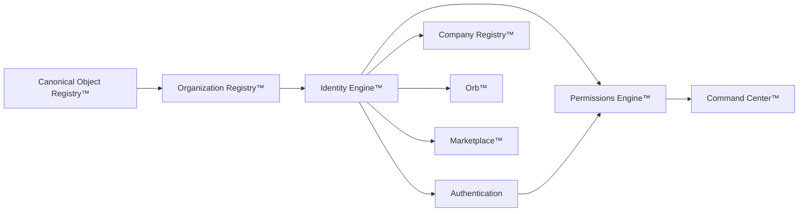

# Identity Engine™

**Project:** Studio OS  
**Phase:** Core System Architecture Sprint 1  
**Status:** Canonical architectural blueprint draft for Genesis review  
**Version:** 1.0.0  
**Authority:** Genesis.md  
**Depends on:** Constitutional Core™, Canonical Object Registry™, Universal Interaction Engine™, Universal Decision Engine™, Core Systems Blueprint™, Studio OS Build Order™, Organization Registry™ (contract)  
**Constitutional posture:** Identity is foundational platform truth — not login, not UI state, not a database row owned by a feature. Every person, company, AI worker, profession, headquarters, room, department, team, asset, certification, and future entity derives its identity through this engine.

---

## 0. Doctrine

### 0.1 What Identity Engine™ is

Identity Engine™ is Studio OS's **permanent platform capability for understanding WHO and WHAT exists inside Studio World**.

It answers:

1. **Who** can act (founders, employees, citizens, AI workers, mentors, students, clients, vendors, partners).
2. **What** exists as a durable entity (companies, organizations, departments, headquarters, rooms, workspaces, teams, profession brains, assets, products, communities).
3. **How** those actors and entities relate (membership, ownership, affiliation, delegation, composition, inheritance).
4. **Where** identity truth lives so every downstream system references one canonical source.

### 0.2 What Identity Engine™ is not

| Concern | Owning system | Identity Engine role |
|---------|---------------|----------------------|
| Sign-in, sessions, password reset | **Authentication** | Provides actor binding target only |
| Allow/deny, scopes, policy evaluation | **Permissions Engine™** | Provides subject + affiliation context only |
| Company operating DNA, flows, risks | **Company Genome™** | References company identity; does not own genome |
| User profile commerce data | Feature projections | Identity owns recognition + affiliation, not cart/wishlist |
| UI avatars and display names | Experience projections | Identity owns canonical name + aliases; UI renders |

**Authentication proves access. Permissions decide authority. Identity declares existence.**

### 0.3 Prime directive

Identity must remain **stable across industries, companies, user counts, AI worker types, and future capabilities**.

Adding a new industry, profession, or entity class must require **registration of a new identity type and relationship hooks** — never a rewrite of the identity kernel.

### 0.4 Validation criteria

The Identity Engine™ architecture is valid when:

1. Every listed identity type maps to one canonical **Identity Type** and **Lifecycle** without ambiguity.
2. No feature store invents parallel actor or company records.
3. Multi-company, cross-company, and shared-asset scenarios resolve through the **Identity Graph™** without special-case tables.
4. AI workers, profession brains, and human actors share one **Actor Model™** with type-specific extensions.
5. Orb™, Command Center™, Marketplace™, and Career Worlds™ consume identity references — they never own identity truth.
6. Authentication can be replaced (OAuth, SSO, passkeys) without migrating identity records.

---

## 1. Position in Studio OS

### 1.1 Build order placement

From **Studio OS Build Order™**:

| Attribute | Value |
|-----------|-------|
| Architectural phase | 2 — Tenancy and trust |
| Topological order | 11 |
| Recommended cycle | Cycle 4 — Identity Engine™ + Authentication MVP |
| Upstream dependencies | Canonical Object Registry™, Organization Registry™ |
| Downstream dependents | Authentication, Permissions Engine™, Orb™, Marketplace™, Asset Registry™, Notifications™, Studio Exchange™, Career Worlds™, Professional Memory™, API Layer™ |

### 1.2 Critical path role

Identity sits on the critical path immediately after **Company Registry™** and before **Authentication** and **Permissions Engine™**. No command, commerce, or AI routing is safe until actors and organizational entities are canonical.



### 1.3 System boundary

**Identity Engine owns:**

- Identity records (actors + entities)
- Identity Graph™ edges
- Role assignments (declarative, not evaluated)
- Affiliation and membership records
- Credential and certification references
- Ownership declarations
- Visibility scopes
- Identity lifecycle state
- Invitation and provisioning records

**Identity Engine does not own:**

- Session tokens or auth provider credentials (**Authentication**)
- Policy evaluation or grants (**Permissions Engine™**)
- Company department truth (**Company Registry™**)
- Asset binary storage (**Asset Registry™**)
- Knowledge or memory content (**Knowledge Core™**, **Professional Memory™**)

---

## 2. Core architecture

### 2.1 Three-layer model

```text
Identity Registry™     — canonical records (immutable ID, type, lifecycle, metadata)
Identity Graph™        — typed relationships between identities
Identity Context™      — resolved view for a request (actor + affiliations + inherited scope)
```

| Layer | Responsibility |
|-------|------------------|
| **Identity Registry™** | Create, update, suspend, archive identity records; enforce envelope schema |
| **Identity Graph™** | Link identities via stable relationship verbs; detect cycles; compute inheritance |
| **Identity Context™** | Materialize "who is acting, in what scope, with what affiliations" for downstream systems |

### 2.2 Universal identity envelope

Every identity — actor or entity — inherits this envelope:

```yaml
identityId: string              # immutable, globally unique within Studio World
officialName: string            # Official Name™ — canonical display name
identityType: IdentityType      # from §3 taxonomy
kind: actor | entity            # actors can initiate interactions; entities are subjects
purpose: string
lifecycle: IdentityLifecycle
status: active | suspended | pending | archived | deprecated
relationships: IdentityRelationship[]
roles: RoleAssignment[]         # declarative; Permissions Engine evaluates
capabilities: CapabilityRef[]   # registered capability hooks, not execution
ownership:
  stewardIdentityId: string
  owningOrganizationId: string | null
  owningCompanyId: string | null
visibility:
  scope: private | organization | company | workspace | public | system
  inheritedFrom: string | null  # parent identity for inheritance
inheritance:
  inheritsFrom: string[]
  compositionOf: string[]       # for composed identities (teams, HQs)
composition:
  members: string[]             # child identity IDs when this identity is a container
dependencies:
  upstream: string[]            # required identity/system contracts
  downstream: string[]          # identities that depend on this record
eventsProduced: string[]
eventsConsumed: string[]
securityRequirements: SecurityRequirement[]
auditRequirements: AuditRequirement[]
futureExpansion: ExpansionHook[]
canonicalObjectRef: string      # link to Canonical Object Registry™ type
createdAt: string
updatedAt: string
version: string
```

### 2.3 Actor Model™ vs Entity Model™

| Kind | Can initiate interactions | Examples |
|------|---------------------------|----------|
| **Actor** | Yes | Founder, Employee, Citizen, AI Worker, Mentor, Student, Client, Vendor, Partner |
| **Entity** | No (acted upon) | Company, Organization, Department, HQ, Room, Workspace, Team, Asset, Product, Community, Profession Brain |

**Actor envelope extension:**

```yaml
actorKind: human | ai | service | system
credentialRefs: CredentialRef[]
affiliations: Affiliation[]
preferredLocale: string | null
contactChannels: ContactChannel[]
verificationStatus: unverified | pending | verified | revoked
```

**Entity envelope extension:**

```yaml
entityKind: organization | company | place | group | asset | product | intelligence | community
containedBy: string | null      # parent container identity
operatedBy: string[]            # actor identities with operational stewardship
```

---

## 3. Identity Type taxonomy

### 3.1 Master identity catalog

Every identity type below is a **first-class registration** in the Identity Registry™. Each must define the full field matrix from §4.

| Identity Type | Kind | Purpose summary | Primary lifecycle |
|---------------|------|-----------------|-------------------|
| **Founder** | Actor | Organization/company founder with strategic authority context | `provisioned → active → transferred → archived` |
| **Employee** | Actor | Person employed by or operating within a company | `invited → active → role_changed → offboarded → archived` |
| **Citizen** | Actor | Platform participant with workspace presence | `registered → active → suspended → archived` |
| **AI Worker** | Actor | Digital worker identity (concierge, agent, automation actor) | `defined → provisioned → active → paused → retired → archived` |
| **Company** | Entity | Business operating unit under an organization | `draft → active → restructured → merged → archived` |
| **Organization** | Entity | Tenant/workspace boundary above companies | `created → active → suspended → archived` |
| **Department** | Entity | Organizational division with responsibilities | `defined → active → reorganized → archived` |
| **Headquarters** | Entity | Executive operating environment for a company | `planned → active → evolved → archived` |
| **Room** | Entity | Spatial or logical place within HQ/workspace | `defined → active → deprecated → archived` |
| **Workspace** | Entity | Scoped operational context (org or company level) | `created → active → suspended → archived` |
| **Team** | Entity | Group of actors with shared mission context | `formed → active → dissolved → archived` |
| **Client** | Actor | External customer or buyer relationship actor | `identified → active → churned → archived` |
| **Vendor** | Actor | External supplier or service provider actor | `onboarded → active → suspended → archived` |
| **Partner** | Actor | Strategic partner with cross-org relationship | `invited → active → revoked → archived` |
| **Mentor** | Actor | Teaching/guide actor in learning contexts | `nominated → active → inactive → archived` |
| **Student** | Actor | Learner in Career Worlds™ / Institute contexts | `enrolled → active → graduated → archived` |
| **Profession Brain** | Entity | Profession-specific intelligence identity (not a chatbot login) | `seeded → active → evolved → deprecated → archived` |
| **Asset** | Entity | Identity anchor for owned files, media, IP (metadata in Asset Registry™) | `registered → active → transferred → archived` |
| **Product** | Entity | Packaged offer identity (listings link here) | `draft → published → retired → archived` |
| **Community** | Entity | Group identity for shared membership and visibility | `formed → active → moderated → archived` |

### 3.2 Type registration rule

New industries or entity classes **extend the taxonomy** via Genesis proposal — they do not bypass the registry.

---

## 4. Identity definition matrix

For **every identity type**, the following fields are mandatory in the Identity Engine blueprint and runtime schema:

| Field | Definition |
|-------|------------|
| **Official Name™** | Canonical human-readable name; stable across UI projections |
| **Purpose** | Why this identity type exists in Studio World |
| **Identity Type** | Enum from §3 |
| **Lifecycle** | Allowed states and transitions |
| **Relationships** | Permitted graph edge types and cardinality |
| **Permissions** | Which permission *subjects* this type may become (evaluated elsewhere) |
| **Roles** | Declarative role templates assignable to this type |
| **Capabilities** | Registered hooks (e.g., `can_receive_notification`, `can_own_asset`) |
| **Status** | Current lifecycle state |
| **Ownership** | Steward + org/company ownership scope |
| **Visibility** | Default visibility scope + inheritance rules |
| **Inheritance** | Parent identities whose scope/visibility propagate |
| **Composition** | Child identities contained within this identity |
| **Dependencies** | Upstream identity types or systems required before creation |
| **Events Produced** | Universal Interaction events emitted on lifecycle changes |
| **Events Consumed** | Events that trigger identity updates |
| **Security Requirements** | Verification, MFA binding, impersonation guards |
| **Audit Requirements** | Immutable audit fields for create/update/suspend/transfer |
| **Future Expansion** | Named extension slots without schema break |

---

## 5. Detailed identity archetypes

### 5.1 Founder

| Field | Definition |
|-------|------------|
| Official Name™ | Legal or operating founder name |
| Purpose | Represent strategic human authority context for an organization/company |
| Identity Type | `founder` |
| Lifecycle | `provisioned → active → transferred → archived` |
| Relationships | `owns` Organization/Company, `belongs_to` Organization, `guides` Headquarters, `approves` (via Permissions) |
| Permissions subject | `founder` scope — evaluated by Permissions Engine™ |
| Roles | `org_founder`, `company_founder`, `board_member` |
| Capabilities | `command_intent`, `executive_briefing`, `delegation_source` |
| Ownership | Self-steward; org scope |
| Visibility | Organization + company; never public by default |
| Inheritance | Inherits Organization visibility |
| Dependencies | Organization Registry™, Canonical Object Registry™ |
| Events Produced | `Identity Created™`, `Founder Role Assigned™`, `Foundership Transferred™` |
| Events Consumed | `Organization Created™`, `Company Registered™` |
| Security | Verified human actor; MFA recommended; no shared credentials |
| Audit | All transfers and role changes immutable |
| Future Expansion | Multi-founder companies, successor planning hooks |

### 5.2 AI Worker

| Field | Definition |
|-------|------------|
| Official Name™ | Concierge or agent official name (e.g., Chief Concierge) |
| Purpose | Digital actor that operates inside approved guardrails |
| Identity Type | `ai_worker` |
| Lifecycle | `defined → provisioned → active → paused → retired → archived` |
| Relationships | `operated_by` Organization/Company, `belongs_to` Team/Department, `references` Profession Brain |
| Permissions subject | `ai_worker` — always scoped; never superuser |
| Roles | `concierge`, `department_agent`, `automation_actor` |
| Capabilities | `receive_command`, `emit_recommendation`, `prepare_work` — never `own_policy` |
| Ownership | Organization/company steward |
| Visibility | Company + workspace |
| Inheritance | Inherits Department + Company scope |
| Dependencies | Organization, Company, Profession Brain (optional) |
| Events Produced | `AI Worker Provisioned™`, `AI Worker Paused™`, `AI Worker Retired™` |
| Events Consumed | `Permission Granted™`, `Profession Brain Updated™`, `Command Executed™` |
| Security | No human password; bound to service credentials via Authentication adapter |
| Audit | Every identity binding change logged |
| Future Expansion | Multi-model workers, federation across orgs |

### 5.3 Company

| Field | Definition |
|-------|------------|
| Official Name™ | Registered company name |
| Purpose | Business operating unit identity |
| Identity Type | `company` |
| Lifecycle | `draft → active → restructured → merged → archived` |
| Relationships | `belongs_to` Organization, `contains` Department/Headquarters/Workspace, `owns` Asset/Product |
| Permissions subject | `company` resource scope |
| Roles | N/A (entity) — actors hold `company_admin`, `company_member` |
| Capabilities | `host_headquarters`, `own_department`, `issue_membership` |
| Ownership | Organization steward |
| Visibility | Organization + authorized cross-org when permitted |
| Inheritance | Inherits Organization tenant boundary |
| Dependencies | Organization Registry™, Company Genome™ (mapping) |
| Events Produced | `Company Identity Registered™`, `Company Restructured™`, `Company Merged™` |
| Events Consumed | `Organization Created™`, `Company Genome Mapped™` |
| Security | Merge/split requires elevated approval |
| Audit | Structural changes immutable |
| Future Expansion | Holdings, subsidiaries, franchise models |

### 5.4 Profession Brain

| Field | Definition |
|-------|------------|
| Official Name™ | Profession name (e.g., Fuel Tax Advisor Brain) |
| Purpose | Identity anchor for profession-specific intelligence — not a login |
| Identity Type | `profession_brain` |
| Lifecycle | `seeded → active → evolved → deprecated → archived` |
| Relationships | `belongs_to` Company/Organization, `guides` AI Worker, `references` Institute |
| Permissions subject | `profession_brain` read scope for authorized actors |
| Roles | N/A — entities do not log in |
| Capabilities | `inform_concierge`, `publish_expertise` (when approved) |
| Ownership | Company/org steward |
| Visibility | Company default; marketplace public only when explicitly published |
| Dependencies | Institute of Knowledge™, Knowledge Core™ |
| Events Produced | `Profession Brain Identity Registered™`, `Profession Brain Deprecated™` |
| Events Consumed | `Knowledge Artifact Approved™`, `Expert Profile Published™` |
| Security | Prevents brain identity from becoming auth superuser |
| Audit | Version lineage preserved |
| Future Expansion | Licensed profession verification hooks |

*(Remaining archetypes follow the same matrix pattern in implementation schema; §3 catalog is normative for type registration.)*

---

## 6. Identity Graph™

### 6.1 Purpose

The **Identity Graph™** is the typed relationship layer connecting all identities. It is the structural complement to **World Graph™** (which connects operational objects). Identity Graph answers: *who belongs to what, who owns what, who operates what*.

### 6.2 Permitted edge types

| Edge | Meaning | Example |
|------|---------|---------|
| `belongs_to` | Membership in container identity | Employee → Company |
| `owns` | Stewardship accountability | Founder → Organization |
| `contains` | Structural inclusion | Headquarters → Room |
| `operates` | Operational responsibility | AI Worker → Department |
| `affiliated_with` | Loose association | Partner → Company |
| `represents` | Actor represents entity | Employee → Department (lead) |
| `inherits_scope` | Visibility/scope inheritance | Team → Department |
| `composed_of` | Explicit composition | Team → Employee[] |
| `credential_linked` | Credential attached to actor | Employee → Certification |
| `cross_company_link` | Authorized cross-tenant relationship | Partner → External Company |
| `shared_asset_access` | Shared asset identity binding | Team → Asset |

### 6.3 Graph rules

1. **No identity without a steward** — every node has `ownership.stewardIdentityId`.
2. **Tenant boundary** — `belongs_to` Organization is mandatory for company-scoped identities.
3. **Cycle detection** — `contains` / `inherits_scope` chains must be acyclic.
4. **Cross-company edges** require explicit `cross_company_link` with approval record.
5. **Graph changes emit events** — all edge mutations are Universal Interaction events.

### 6.4 Graph queries (normative API surface)

| Query | Use case |
|-------|----------|
| `resolveActorContext(actorId, workspaceScope)` | Authentication session binding |
| `listAffiliations(actorId)` | Permissions subject expansion |
| `resolveContainerChain(entityId)` | HQ → Room → Workspace hierarchy |
| `findSharedIdentities(orgA, orgB)` | Cross-org collaboration |
| `listMembers(containerId)` | Team/department membership |

---

## 7. Role Model™

### 7.1 Philosophy

Roles are **declarative labels** attached to identities in context. They inform Permissions Engine™ but do not grant authority by themselves.

```text
Identity Engine declares: "Actor X has role R in scope S"
Permissions Engine decides: "Role R in scope S may perform action A"
```

### 7.2 Role dimensions

| Dimension | Description |
|-----------|-------------|
| **Scope** | organization · company · department · workspace · team · asset |
| **Subject** | actor identity ID |
| **Role template** | registered role name |
| **Effective period** | optional start/end |
| **Source** | invitation · assignment · inheritance · system |

### 7.3 Standard role templates (initial)

| Role | Typical subject | Scope |
|------|-----------------|-------|
| `org_owner` | Founder | Organization |
| `org_admin` | Employee | Organization |
| `company_admin` | Employee | Company |
| `company_member` | Employee, Citizen | Company |
| `department_lead` | Employee | Department |
| `workspace_member` | Employee, AI Worker | Workspace |
| `team_member` | Employee, AI Worker | Team |
| `concierge_operator` | AI Worker | Department |
| `external_partner` | Partner | Cross-company |
| `learner` | Student | Career World |
| `mentor` | Mentor | Institute |
| `client_contact` | Client | Company |

### 7.4 Role assignment events

- `Role Assigned™`
- `Role Revoked™`
- `Role Scope Changed™`
- `Role Inherited™`

---

## 8. Permission Philosophy™

Identity Engine **does not evaluate permissions**. It defines the philosophy and subject model Permissions Engine™ consumes.

### 8.1 Principles

1. **Identity is the subject; resources are scoped identities.**
2. **No permission without identity** — unauthenticated actions use anonymous subject with explicit deny-default.
3. **Roles inform policy; policies decide.**
4. **Delegation references identities** — delegator and delegatee are both identity records.
5. **AI workers never receive implicit founder authority.**

### 8.2 Identity → Permission handoff

```yaml
permissionSubject:
  actorIdentityId: string
  actorKind: human | ai | service
  affiliations: Affiliation[]
  roles: RoleAssignment[]
  inheritedScopes: ScopeRef[]
  verificationStatus: string
```

Permissions Engine evaluates this bundle against policy — Identity Engine never returns allow/deny.

---

## 9. Ownership Model™

### 9.1 Ownership layers

| Layer | Meaning |
|-------|---------|
| **Steward** | Identity accountable for lifecycle and accuracy |
| **Organization owner** | Tenant-level ownership for org-scoped entities |
| **Company owner** | Business-unit ownership |
| **Operational operator** | Actor(s) who operate but do not own (AI workers, admins) |

### 9.2 Transfer rules

- Ownership transfer requires approval event + audit record.
- AI workers cannot become stewards of Organization or Company.
- Asset ownership references Asset Registry™; Identity Engine holds identity anchor only.
- Foundership transfer uses `Foundership Transferred™` with successor identity ID.

---

## 10. Invitation Model™

### 10.1 Purpose

Invitations provision **pending identities** or **pending affiliations** before actors become active.

### 10.2 Invitation envelope

```yaml
invitationId: string
invitationType: membership | role | partner | client | vendor | ai_worker
targetEmail: string | null
targetIdentityId: string | null   # pre-created pending identity
invitedBy: string                 # actor identity
scope: ScopeRef
status: pending | accepted | expired | revoked
expiresAt: string
acceptedAt: string | null
```

### 10.3 Flow

```text
Invite issued → pending affiliation created → Authentication binds on accept → identity activated → Role Assigned™
```

Authentication handles verification; Identity Engine handles **who is being invited into what scope**.

---

## 11. Organization Model™

### 11.1 Hierarchy

```text
Organization (tenant)
  └── Company (business unit)
        ├── Headquarters (executive environment)
        │     └── Room
        ├── Department
        ├── Workspace
        └── Team
```

### 11.2 Organization identity

- One **Organization** identity per tenant.
- Organization Registry™ owns org envelope; Identity Engine owns **organization identity record** and graph placement.
- Companies `belong_to` exactly one Organization (multi-org holding structures use parent org composition — future expansion hook).

---

## 12. Company Membership™

### 12.1 Membership record

```yaml
membershipId: string
actorIdentityId: string
companyIdentityId: string
membershipType: employee | founder | contractor | ai_worker | client | partner
status: pending | active | suspended | terminated
joinedAt: string
terminatedAt: string | null
primary: boolean                  # default company context for actor
```

### 12.2 Rules

1. An actor may hold **multiple company memberships** across one or more organizations.
2. Exactly one membership may be marked `primary` per workspace session (Authentication resolves).
3. Termination suspends affiliations; does not delete identity (audit preservation).

---

## 13. Multi-company support™

### 13.1 Scenarios

| Scenario | Resolution |
|----------|------------|
| Founder with multiple companies | One actor identity; multiple `company_membership` edges |
| Employee in two companies | One actor identity; scope resolved per workspace context |
| Agency managing client companies | Partner identity + `cross_company_link` with Permissions approval |
| Shared services team | Team identity `composed_of` actors from multiple companies with explicit scope |

### 13.2 Context resolution

```text
session → Authentication → actorIdentityId
workspaceScope → Organization + Company selection
Identity Context™ → affiliations + roles + inherited visibility for that scope
```

---

## 14. Cross-company identities™

### 14.1 Partner / vendor / client actors

External actors receive **actor identities** with `affiliated_with` edges to the host company — never duplicate user records per company.

### 14.2 Cross-company link envelope

```yaml
linkId: string
fromIdentityId: string
toIdentityId: string
linkType: partner | vendor | client | shared_service
approvedBy: string
visibility: mutual | one_way
status: pending | active | revoked
```

### 14.3 Privacy

- Cross-company links never expose private identity fields without explicit visibility grant.
- Company Genome™ and Knowledge Core™ remain separate; identity link is structural only.

---

## 15. Shared assets™

### 15.1 Model

Assets have **entity identities** in Identity Engine; binary/metadata truth lives in **Asset Registry™**.

Shared access is modeled as:

```text
Asset identity ← shared_asset_access ← Team | Department | Cross-company link
```

### 15.2 Rules

1. Shared asset access must reference identity graph edges — not ad hoc share tables in UI.
2. Permissions Engine evaluates access using asset identity + actor context.
3. Provenance chain references steward identity at creation time.

---

## 16. Shared permissions™

Shared permissions are **not stored in Identity Engine**. Identity Engine exposes:

- Shared **teams** and **groups** as composable identities
- **Role assignments** at team scope
- **Cross-company links** for mutual access contexts

Permissions Engine evaluates group-expanded policies using graph membership queries from Identity Engine.

---

## 17. AI identities™

### 17.1 AI identity classes

| Class | Description |
|-------|-------------|
| **Concierge** | Department or executive digital worker |
| **Automation actor** | Executes approved workflow steps |
| **Profession advisor** | References Profession Brain; no independent policy |
| **System actor** | Internal service identity (Event Bus adapter, compiler) |

### 17.2 Rules

1. Every AI worker has a distinct **identityId** — no shared "the AI" singleton.
2. AI workers authenticate via **service binding**, not human password flows.
3. AI workers inherit company/org scope; cannot escalate without Permission grant.
4. Orb™ routes through Command Center™ using AI worker or human actor context — never bypasses identity.

---

## 18. Lifecycle engine

### 18.1 Global lifecycle states

| State | Meaning |
|-------|---------|
| `pending` | Created but not yet active (invitation, draft) |
| `active` | Fully operational |
| `suspended` | Temporarily disabled; preserves graph |
| `archived` | Historical; read-only references |
| `deprecated` | Superseded; migration path documented |

### 18.2 Transition governance

All transitions emit events and require audit records. Suspension and archive require steward or approved delegate action.

---

## 19. Inheritance and composition

### 19.1 Inheritance

Child identities **inherit visibility scope** from parent unless explicitly overridden:

```text
Room inherits Workspace → Company → Organization visibility chain
```

### 19.2 Composition

Container identities (Team, Headquarters, Community) use `composed_of` for explicit membership. Composition does not imply permission — only structural grouping.

---

## 20. Visibility model

| Scope | Visible to |
|-------|------------|
| `private` | Steward + explicit grants |
| `organization` | All org members with base membership |
| `company` | Company members |
| `workspace` | Workspace-scoped actors |
| `public` | Authenticated or anonymous per policy (marketplace profiles) |
| `system` | Platform services only |

Visibility is **declarative** on the identity record; Permissions Engine enforces at access time.

---

## 21. Security requirements

| Requirement | Applies to |
|-------------|------------|
| Immutable `identityId` | All types |
| Verification before elevated roles | Founders, admins, partners |
| MFA binding recommendation | Human actors with command authority |
| No credential storage in Identity Engine | All — Authentication owns secrets |
| Impersonation guard | AI workers cannot impersonate human actors |
| Cross-company approval | Partner/vendor/client links |
| PII minimization | Client/vendor contact fields scoped |

---

## 22. Audit requirements

Every mutation records:

```yaml
auditId: string
identityId: string
action: created | updated | suspended | archived | role_assigned | ownership_transferred
actorIdentityId: string       # who performed the change
previousSnapshot: object
nextSnapshot: object
timestamp: string
correlationId: string         # Universal Interaction correlation
```

Audit logs are append-only. Identity Engine emits audit events via Universal Interaction Engine™.

---

## 23. System integrations

### 23.1 Integration matrix

| System | Identity Engine provides | Identity Engine consumes |
|--------|---------------------------|---------------------------|
| **Orb™** | Actor context, affiliation summary, AI worker IDs | Command approval actor binding |
| **Atlas™** | Entity identities for map nodes (HQ, room, company) | World Graph entity cross-refs |
| **Company Genome™** | Company identity anchor | Business system → company mapping |
| **Command Center™** | Issuer identity, delegation chain | Command execution actor validation |
| **Executive Headquarters™** | Founder/employee context, HQ entity identity | Workspace scope selection |
| **Knowledge Core™** | Author/reviewer actor identity refs | Knowledge artifact ownership links |
| **Profession Brains™** | Profession brain entity identity | Brain → company affiliation |
| **Studio Exchange™** | Seller/buyer actor identities, product entity IDs | Listing ownership validation |
| **Career Worlds™** | Student/mentor identities, community membership | Progress actor binding |
| **Authentication** | Actor records for session binding | Verified email → identity link events |
| **Permissions Engine™** | Permission subject bundle | Grant/deny does not mutate identity |
| **Organization Registry™** | Org entity identity sync | Org create/update events |
| **Company Registry™** | Company entity identity sync | Department/membership structure |
| **Asset Registry™** | Asset entity identity anchor | Asset registered events |
| **Event Bus™** | Identity lifecycle events | Org/company/auth events |
| **Search™** | Indexable identity metadata (permission-filtered) | Index permission scope |

### 23.2 Orb™ connection

Orb resolves **intent → actor context → Command Center™**. Identity Engine supplies:

- Who is speaking (human or AI worker)
- Which company/workspace scope is active
- Which roles inform command authorization

Orb never stores canonical identity — only conversation references.

### 23.3 Atlas™ connection

Atlas renders structural navigation. Identity Engine provides **entity identities** for nodes (company, HQ, room, department). Atlas queries Identity Graph for containment hierarchy; World Graph provides operational overlays.

---

## 24. Events catalog

### 24.1 Produced events

| Event | Trigger |
|-------|---------|
| `Identity Created™` | New identity registered |
| `Identity Updated™` | Metadata or status change |
| `Identity Suspended™` | Suspension |
| `Identity Archived™` | Archive |
| `Role Assigned™` | Role attached to actor in scope |
| `Role Revoked™` | Role removed |
| `Membership Created™` | Company/org membership |
| `Membership Terminated™` | Membership ended |
| `Invitation Issued™` | Invitation sent |
| `Invitation Accepted™` | Invitation accepted |
| `Ownership Transferred™` | Stewardship change |
| `Cross Company Link Approved™` | Cross-tenant link active |
| `AI Worker Provisioned™` | AI actor activated |
| `Credential Linked™` | Certification/credential attached |

### 24.2 Consumed events

| Event | Source | Identity action |
|-------|--------|-----------------|
| `Organization Created™` | Organization Registry™ | Create organization identity |
| `Company Registered™` | Company Registry™ | Create company identity |
| `Authentication Verified™` | Authentication | Activate pending actor |
| `Permission Granted™` | Permissions Engine™ | No mutation — correlation only |
| `Asset Registered™` | Asset Registry™ | Create asset entity identity |
| `Expert Profile Published™` | Studio Exchange™ | Update visibility scope |

---

## 25. Minimum viable version (Cycle 4)

Per **Studio OS Build Order™** Cycle 4:

| Ship in MVP | Defer |
|-------------|-------|
| Actor envelope (human + AI worker) | Full marketplace public profiles |
| Organization + Company entity identities | Complex holding-company hierarchies |
| Company membership + primary scope | Full cross-company marketplace |
| Role assignment (declarative) | Advanced delegation chains |
| Invitation → Authentication binding | Career Worlds learner identities |
| Identity Graph: belongs_to, contains, operates | Simulation-specific identity types |
| Identity Context resolver | Portable professional identity federation |
| Lifecycle: pending, active, suspended, archived | Merger/acquisition automation |
| Event emission for lifecycle | Full credential verification marketplace |

**Exit condition:** Actors can be registered, affiliated with org/company, assigned roles, and resolved in workspace context for Authentication and Permissions.

---

## 26. Anti-patterns

| Anti-pattern | Why forbidden | Correct approach |
|--------------|---------------|------------------|
| Email as identity ID | Fragile, not portable | Immutable `identityId` + email as contact channel |
| Auth table as identity store | Couples login to existence | Identity Engine first; Authentication binds |
| UI component owns role | Security drift | Role assignments in Identity Engine |
| Duplicate company per feature | Fragmentation | One company identity; projections elsewhere |
| AI without identity record | Ungoverned agents | Every AI worker is a registered actor |
| Permission checks in Identity Engine | Boundary violation | Permissions Engine evaluates |
| Room/HQ as UI route only | No graph navigation | Entity identity in Identity Graph |

---

## 27. Future expansion

| Hook | Direction |
|------|-----------|
| Portable professional identity | Verified credentials across organizations |
| Identity federation | External IdP mapping without merge |
| Zero-knowledge proofs | Certification without exposing PII |
| Organizational succession | Founder transfer workflows |
| Identity marketplace | Expert profile identity verification |
| Biometric binding | Optional Authentication enhancement |
| Legal entity graphs | Holdings, subsidiaries, franchises |
| Agent swarms | Coordinated AI worker team identities |

---

## 28. Official architecture law

```text
Existence before access.
Access before authority.
Authority before command.
Command before commerce.
```

Studio OS builds identity truth in this order:

```text
Canonical Object Registry™
  → Organization Registry™
  → Identity Engine™
  → Authentication
  → Permissions Engine™
  → every other system
```

Every engineer, AI model, and future contributor must treat **Identity Engine™** as the first production-ready Core System of Studio OS — the permanent answer to **who and what exists** in Studio World.

---

## 29. Genesis review checklist

- [ ] Identity types cover all requested entity classes (§3)
- [ ] Authentication boundary explicit (§0.2)
- [ ] Permissions boundary explicit (§8)
- [ ] Multi-company and cross-company models defined (§12–14)
- [ ] AI identity rules prevent authority escalation (§17)
- [ ] Integration contracts for Orb, Atlas, Genome, Command, HQ, Knowledge, Profession Brains, Exchange, Career Worlds (§23)
- [ ] MVP scope aligned with Build Order Cycle 4 (§25)
- [ ] Stability validation criteria met (§0.4)
