# Studio OS Build Order™

**Project:** Studio OS  
**Phase:** Master Build Order  
**Status:** Canonical architectural roadmap draft for Genesis review  
**Version:** 1.0.0  
**Authority:** Genesis.md  
**Depends on:** Constitutional Core™, Canonical Object Model™, Universal Interaction Model™, Universal Decision Architecture™, Core Systems Blueprint™, Studio OS Dependency Map™, Company Genome™, Business Discovery™  
**Constitutional posture:** Every implementation sprint should make every future sprint easier. Build order follows architectural dependency truth, not feature excitement.

---

## 0. Doctrine

Studio OS Build Order™ is the definitive architectural dependency roadmap for Studio OS.

It exists to prevent:

1. Temporary systems that later need replacement.
2. Duplicate registries and duplicate source-of-truth ownership.
3. Experience surfaces that invent data before platform truth exists.
4. AI interfaces that route commands before authority, context, and audit exist.
5. Marketplace, simulation, and generation systems that ship before ownership, identity, assets, and permissions are stable.

### 0.1 Prime directive

Every implementation sprint must increase platform leverage:

```text
kernel -> discovery -> identity -> authority -> organization -> knowledge -> graph -> events -> workflow -> missions -> command -> production -> experience -> intelligence -> marketplace -> external platform
```

Any sprint that skips an upstream dependency must name the stable interface, mock boundary, or intentional temporary adapter that prevents a rewrite.

---

## 1. Master dependency graph

```mermaid
flowchart TD
  Genesis[Genesis™] --> CanonicalObjects[Canonical Object Registry™]
  Genesis --> Interaction[Universal Interaction Engine™]
  Genesis --> Decision[Universal Decision Engine™]
  Genesis --> DependencyMap[Studio OS Dependency Map™]

  CanonicalObjects --> CompanyGenome[Company Genome™]
  CanonicalObjects --> BusinessDiscovery[Business Discovery™]
  CanonicalObjects --> Identity[Identity Engine™]
  CanonicalObjects --> OrgRegistry[Organization Registry™]
  CanonicalObjects --> CompanyRegistry[Company Registry™]
  CanonicalObjects --> WorldGraph[World Graph™]

  BusinessDiscovery --> CompanyGenome
  BusinessDiscovery --> Blueprint[Blueprint Engine™]
  CompanyGenome --> DepartmentFramework[Department Framework™]
  CompanyGenome --> ExecutiveHQ[Executive Headquarters™]
  CompanyGenome --> Mission[Mission Engine™]

  OrgRegistry --> Auth[Authentication]
  Identity --> Auth
  Auth --> Permissions[Permissions Engine™]
  CompanyRegistry --> Permissions
  OrgRegistry --> Workspace[Workspace Framework™]
  CompanyRegistry --> DepartmentFramework

  CanonicalObjects --> KnowledgeCore[Knowledge Core™]
  KnowledgeCore --> KnowledgeGraph[Knowledge Graph™]
  KnowledgeGraph --> WorldGraph
  KnowledgeCore --> Codex[Codex™]
  KnowledgeCore --> KnowledgeRetention[Knowledge Retention™]
  KnowledgeCore --> Research[Research Engine™]
  Codex --> Institute[Institute of Knowledge™]
  Research --> Institute
  KnowledgeRetention --> ProfessionalMemory[Professional Memory™]

  Interaction --> EventBus[Event Bus™]
  EventBus --> Workflow[Workflow Engine™]
  Decision --> Workflow
  Permissions --> Workflow
  Workflow --> Mission
  Mission --> Command[Command Center™]
  Permissions --> Command
  Decision --> Command
  Command --> Automation[Automation Engine™]
  Workflow --> Automation

  WorldGraph --> Atlas[Atlas™]
  Search[Search™] --> Atlas
  Analytics[Analytics™] --> ExecutiveHQ
  Mission --> ExecutiveHQ
  Command --> ExecutiveHQ
  Permissions --> ExecutiveHQ
  KnowledgeCore --> Orb[Orb™]
  Command --> Orb
  Decision --> Orb
  WorldGraph --> Orb
  Identity --> Orb

  AssetRegistry[Asset Registry™] --> AssetCompiler[Asset Compiler™]
  AssetRegistry --> Scene[Scene Engine™]
  GenerationRecipes[Generation Recipes™] --> AssetCompiler
  Scene --> Experience[Experience Engine™]
  WorldGraph --> Experience
  Experience --> StudioFoundry[Studio Foundry™]
  Blueprint --> StudioFoundry
  AssetCompiler --> StudioFoundry

  ProfessionBrains[Profession Brains™] --> CareerWorlds[Career Worlds™]
  Institute --> ProfessionBrains
  ProfessionalMemory --> ProfessionBrains
  Experience --> CareerWorlds
  Simulation[Simulation Engine™] --> CareerWorlds

  AssetRegistry --> StudioExchange[Studio Exchange™]
  Permissions --> StudioExchange
  Identity --> StudioExchange
  CompanyRegistry --> StudioExchange
  Search --> Marketplace[Marketplace™]
  StudioExchange --> Marketplace
  Analytics --> Marketplace

  EventBus --> Notifications[Notifications™]
  EventBus --> Analytics
  WorldGraph --> Search
  KnowledgeGraph --> Search
  Permissions --> Search

  API[API Layer™] --> DeveloperSDK[Developer SDK™]
  Integration[Integration Framework™] --> API
  Permissions --> API
  EventBus --> Integration
  Workflow --> Integration
```



---

## 2. Build phases

| Phase | Architectural phase | Goal | Systems |
|-------|---------------------|------|---------|
| 0 | Kernel truth | Define canonical laws, objects, interactions, decisions, build order | Genesis™, Canonical Object Registry™, Universal Interaction Engine™, Universal Decision Engine™, Studio OS Dependency Map™ |
| 1 | Business truth | Convert real businesses into platform-understandable operating objects | Business Discovery™, Company Genome™, Blueprint Engine™ |
| 2 | Tenancy and trust | Establish organizations, companies, actors, authentication, permissions | Organization Registry™, Company Registry™, Identity Engine™, Authentication, Permissions Engine™ |
| 3 | Knowledge substrate | Store, connect, retain, and publish source-backed knowledge | Knowledge Core™, Knowledge Graph™, World Graph™, Codex™, Institute of Knowledge™, Knowledge Retention™ |
| 4 | Operational spine | Move work safely through events, workflows, missions, commands, automation | Event Bus™, Workflow Engine™, Mission Engine™, Command Center™, Automation Engine™, Notifications™ |
| 5 | Workspace and executive surfaces | Present stable operational state without owning source truth | Workspace Framework™, Department Framework™, Executive Headquarters™, Atlas™, Orb™ |
| 6 | Creation substrate | Own assets, recipes, scenes, compilers, experiences, foundry workflows | Asset Registry™, Generation Recipes™, Asset Compiler™, Scene Engine™, Experience Engine™, Studio Foundry™ |
| 7 | Professional intelligence | Build profession cognition, memory, research, and simulation | Research Engine™, Profession Brains™, Professional Memory™, Simulation Engine™ |
| 8 | Economy and learning surfaces | Package, distribute, learn, sell, license, and monetize | Career Worlds™, Studio Exchange™, Marketplace™ |
| 9 | Platform externalization | Expose Studio OS safely to developers and external integrations | Search™, Analytics™, API Layer™, Integration Framework™, Developer SDK™ |

---

## 3. System build matrix

**Readiness scale:** High = architecture/implementation can proceed now or soon; Medium = needs explicit upstream interfaces; Low = should wait.  
**Recommended sprint:** Architectural sequence slot, not a calendar guarantee.

| Official Name™ | Purpose | Phase | Minimum Viable Version | Dependencies | Blocks | Blocked By | Business Value | Platform Value | Risk | Complexity | Arch Readiness | Impl Readiness | Sprint |
|----------------|---------|-------|------------------------|--------------|--------|------------|----------------|----------------|------|------------|----------------|----------------|--------|
| Genesis™ | Canonical source-of-truth kernel. | 0 | Charter, article registry, proposals, reviews, ADRs, compile manifests. | None | All canonical systems | None | Prevents drift | Highest | Low | Medium | High | Shipped | 0 |
| Canonical Object Registry™ | Canonical object identity and validation. | 0 | Object envelope, type registry, relationship hooks. | Genesis™ | Every registry | None | Prevents duplicate models | Highest | Low | Medium | High | Shipped | 0 |
| Universal Interaction Engine™ | Shared interaction/event/workflow/command grammar. | 0 | Interaction registry, event bus primitives, audit. | Genesis™, Canonical Object Registry™ | Event Bus™, Workflow Engine™, Command Center™ | None | Makes behavior observable | Highest | Medium | High | High | Shipped | 0 |
| Universal Decision Engine™ | Shared decision, evidence, priority, confidence, review model. | 0 | Decision registry, evidence/confidence/review, audit. | Genesis™, Canonical Object Registry™, Universal Interaction Engine™ | Orb™, Command Center™, Automation Engine™, Analytics™ | None | Explainable decisions | Highest | Medium | High | High | Shipped | 0 |
| Studio OS Dependency Map™ | Live dependency planning engine. | 0 | Seeded registry, graph, readiness, risks, build order. | Genesis™, Core Systems Blueprint™ | All implementation sequencing | None | Prevents waste | Highest | Medium | Medium | High | Shipped | 0 |
| Business Discovery™ | Converts founder/business context into structured architecture inputs. | 1 | Discovery sessions, question engine, insight generator, genome/headquarters output drafts. | Canonical Object Registry™, Universal Interaction Engine™, Universal Decision Engine™ | Company Genome™, Blueprint Engine™, Company Registry™ | Canonical object/interaction/decision maturity | High | High | Medium | High | High | Medium | 1 |
| Company Genome™ | Business operating DNA map: systems, flows, risks, events, dependencies. | 1 | Company/business systems registry, flow/event/risk/opportunity graph. | Business Discovery™, Canonical Object Registry™ | Company Registry™, Department Framework™, Mission Engine™, Executive Headquarters™ | Business Discovery™ output contract | Highest | High | Medium | High | High | Medium | 2 |
| Blueprint Engine™ | Converts discovery/goals into architecture blueprints. | 1 | Blueprint envelope, source references, review status, implementation traceability. | Business Discovery™, Company Genome™, Universal Decision Engine™ | Studio Foundry™, Department Framework™, Experience Engine™ | Discovery/genome schema stability | High | High | Medium | High | Medium | Low | 3 |
| Organization Registry™ | System of record for organizations/workspaces above companies. | 2 | Org envelope, workspace membership, owner links. | Canonical Object Registry™, Identity Engine™ minimal actor model | Authentication, Workspace Framework™, Permissions Engine™ | Minimal identity contract | High | Highest | High | Medium | Medium | Low | 4 |
| Company Registry™ | System of record for companies, departments, memberships, HQs. | 2 | Company envelope, departments, membership/ownership graph. | Company Genome™, Organization Registry™, Canonical Object Registry™ | Executive Headquarters™, Mission Engine™, Permissions Engine™, Studio Exchange™ | Organization Registry™ and identity actor links | Highest | Highest | High | High | High | Low | 5 |
| Identity Engine™ | Actor identity for humans, AI workers, companies, roles, credentials. | 2 | Actor envelope, role/affiliation references, credential metadata. | Canonical Object Registry™, Organization Registry™ | Authentication, Permissions Engine™, Orb™, Marketplace™ | Organization Registry™ shape | Highest | Highest | High | High | Medium | Low | 6 |
| Authentication | Session and sign-in boundary for identified actors. | 2 | Auth adapter, session resolver, identity binding, workspace selection. | Identity Engine™, Organization Registry™ | Permissions Engine™, API Layer™, Workspace Framework™ | Identity actor model | Highest | High | Critical | High | Medium | Medium | 7 |
| Permissions Engine™ | Authority, scopes, delegation, approval, and access decisions. | 2 | Policy schema, evaluator, grants, denials, audit hooks. | Identity Engine™, Authentication, Organization Registry™, Company Registry™, Universal Decision Engine™ | Command Center™, Automation Engine™, Studio Exchange™, API Layer™ | Identity/auth/company stability | Highest | Highest | Critical | High | High | Low | 8 |
| Knowledge Core™ | Source-backed canonical knowledge store. | 3 | Knowledge artifacts, source/citation model, review status, ingest. | Canonical Object Registry™, Genesis™ | Codex™, Research Engine™, Orb™, Institute of Knowledge™ | World/knowledge graph can be stubbed with stable relation hooks | High | Highest | High | High | High | Medium | 9 |
| Knowledge Graph™ | Semantic graph of knowledge artifacts, citations, concepts, lessons. | 3 | Typed knowledge nodes/edges, citation links, query helpers. | Knowledge Core™, Canonical Object Registry™ | Search™, Codex™, Research Engine™, Profession Brains™ | Knowledge Core™ artifact model | Medium | Highest | High | High | Medium | Low | 10 |
| World Graph™ | Graph of systems, companies, rooms, missions, knowledge, assets, relationships. | 3 | Typed nodes/edges, dependency overlays, projections. | Canonical Object Registry™, Company Registry™, Knowledge Graph™ | Atlas™, Orb™, Search™, Experience Engine™, Analytics™ | Company/knowledge graph relations | High | Highest | High | High | High | Medium | 11 |
| Codex™ | Compiled developer/architect knowledge projection. | 3 | Read-only indexed projections from Genesis/Knowledge Core. | Genesis™, Knowledge Core™, Knowledge Graph™ | Developer SDK™, Institute of Knowledge™, Orb™ | Knowledge Core™ | Medium | High | Medium | Medium | High | Medium | 12 |
| Institute of Knowledge™ | Canonical learning/publishing institution. | 3 | Publish/read model, curriculum artifact registry. | Knowledge Core™, Codex™, Research Engine™ | Profession Brains™, Career Worlds™ | Research can be initially manual | Medium | Medium | Medium | Medium | Medium | Low | 13 |
| Knowledge Retention™ | Summarizes, ages, promotes, archives knowledge and memory. | 3 | Retention policies, summary workflow, archive status. | Knowledge Core™, Universal Decision Engine™ | Professional Memory™, Orb™, Research Engine™ | Analytics can be added later | Medium | High | Medium | Medium | Medium | Low | 14 |
| Event Bus™ | Shared event transport and contract registry. | 4 | Event registry, publish/subscribe adapter, audit link. | Universal Interaction Engine™ | Workflow Engine™, Notifications™, Analytics™, Integration Framework™ | Interaction event contract maturity | High | Highest | High | Medium | High | Medium | 15 |
| Workflow Engine™ | Sequences approved work across systems. | 4 | Workflow definitions, steps, statuses, recovery hooks. | Event Bus™, Universal Interaction Engine™, Universal Decision Engine™, Permissions Engine™ | Mission Engine™, Automation Engine™, Production flows | Permissions Engine™ | High | Highest | High | High | High | Low | 16 |
| Mission Engine™ | Mission state, owners, blockers, outcomes, learning. | 4 | Mission registry, status lifecycle, assignments, blocker/outcome events. | Company Registry™, Workflow Engine™, Universal Decision Engine™ | Executive Headquarters™, Production, Orb™, Analytics™ | Workflow and company registry | Highest | High | High | Medium | High | Low | 17 |
| Command Center™ | Safe command intake, authorization, routing, monitoring, rollback. | 4 | Command registry, permission gate, approval, execution status. | Permissions Engine™, Event Bus™, Workflow Engine™, Universal Decision Engine™ | Orb™, Executive Headquarters™, Automation Engine™, API Layer™ | Permissions and workflow | Highest | Highest | Critical | High | High | Low | 18 |
| Automation Engine™ | Executes delegated actions inside approved guardrails. | 4 | Automation registry, trigger rules, approvals, rollback/audit. | Command Center™, Workflow Engine™, Permissions Engine™, Universal Decision Engine™ | Production automation, Integration Framework™ | Command Center™ | High | High | Critical | High | Medium | Low | 19 |
| Notifications™ | Attention signals, prompts, reminders, digests. | 4 | Notification record, audience/priority/channel status, read/action events. | Event Bus™, Identity Engine™, Permissions Engine™ | Orb™, Executive Headquarters™, Mission Engine™ | Event Bus and identity | Medium | Medium | Medium | Medium | High | Medium | 20 |
| Workspace Framework™ | Workspace shell, scoped stores, context switching. | 5 | Workspace context provider, scope resolver, persistence boundary. | Organization Registry™, Authentication, Permissions Engine™ | Executive Headquarters™, Department Framework™, API Layer™ | Auth/org/permissions | Highest | High | High | Medium | Medium | Medium | 21 |
| Department Framework™ | Department structures, responsibilities, rooms, workflows. | 5 | Department registry, role links, mission/workflow hooks. | Company Registry™, Company Genome™, Workspace Framework™ | Executive Headquarters™, Mission Engine™, Analytics™ | Company/workspace framework | High | High | Medium | Medium | Medium | Low | 22 |
| Executive Headquarters™ | Founder/company command environment. | 5 | Read-only operating shell with command/mission/analytics hooks. | Workspace Framework™, Company Registry™, Mission Engine™, Command Center™, Permissions Engine™ | Orb™, Atlas™, department operations | Operational spine | Highest | Medium | High | High | Medium | Low | 23 |
| Atlas™ | Structural navigation map for systems, companies, rooms, worlds. | 5 | Graph-backed map projection, dependency overlays, route metadata. | World Graph™, Search™, Company Registry™, Workspace Framework™ | Executive Headquarters™, Orb™, Career Worlds™ | World Graph and Search | Medium | Medium | Medium | Medium | Medium | Low | 24 |
| Orb™ | Intelligent companion and command interface. | 5 | Intent router, recommendation handoff, command approval path, context pack. | Knowledge Core™, World Graph™, Command Center™, Permissions Engine™, Universal Decision Engine™ | Executive Headquarters™, Career Worlds™, Studio Exchange™ | Knowledge, graph, command, permission maturity | Highest | High | Critical | High | Medium | Low | 25 |
| Asset Registry™ | Source of truth for assets, files, provenance, rights, versions, usage. | 6 | Asset metadata registry, provenance, ownership, license refs. | Canonical Object Registry™, Identity Engine™, Permissions Engine™ | Scene Engine™, Asset Compiler™, Studio Foundry™, Studio Exchange™ | Identity/permissions | High | High | High | High | High | Low | 26 |
| Generation Recipes™ | Reusable generation instructions, prompts, constraints, review rules. | 6 | Recipe schema, source refs, input/output specs, approval lifecycle. | Knowledge Core™, Asset Registry™, Universal Decision Engine™, Permissions Engine™ | Asset Compiler™, Studio Foundry™, Automation Engine™ | Knowledge/assets/permissions | Medium | High | High | High | Medium | Low | 27 |
| Asset Compiler™ | Compiles assets/recipes into validated outputs. | 6 | Compile manifest, validation report, output registry hooks. | Asset Registry™, Generation Recipes™, Event Bus™ | Scene Engine™, Studio Foundry™, Studio Exchange™ | Asset + recipe schemas | Medium | High | High | High | Medium | Low | 28 |
| Scene Engine™ | Structured scene composition for spatial/experience assembly. | 6 | Scene object model, scene graph, placement validation. | World Graph™, Asset Registry™, Asset Compiler™ | Experience Engine™, Simulation Engine™, Career Worlds™ | World graph/assets/compiler | Medium | High | High | High | Medium | Low | 29 |
| Experience Engine™ | Composes/renders experiences from canonical state. | 6 | Experience envelope, renderer contract, scene/asset references. | Scene Engine™, World Graph™, Workspace Framework™, Permissions Engine™ | Executive Headquarters™, Career Worlds™, Studio Exchange™ | Scene/workspace/permission maturity | High | Medium | High | High | Medium | Low | 30 |
| Studio Foundry™ | Creation environment for worlds, assets, scenes, experiences. | 6 | Foundry project/session model, build submission, output manifest. | Blueprint Engine™, Asset Registry™, Generation Recipes™, Asset Compiler™, Scene Engine™, Experience Engine™ | Career Worlds™, Studio Exchange™ | Creation substrate | Medium | Medium | High | High | Medium | Low | 31 |
| Research Engine™ | Research questions, sources, findings, evidence, review. | 7 | Research project/finding workflow, evidence package, knowledge update hooks. | Knowledge Core™, Codex™, Universal Decision Engine™ | Institute of Knowledge™, Profession Brains™, Orb™ | Knowledge Core and decision evidence | Medium | Medium | Medium | Medium | Medium | Low | 32 |
| Professional Memory™ | Long-term profession-specific memory and lessons learned. | 7 | Memory record, applicability metadata, promotion/review flow. | Knowledge Retention™, Identity Engine™, Mission Engine™ | Profession Brains™, Career Worlds™, Orb™ | Retention and mission outcomes | Medium | Medium | High | Medium | Medium | Low | 33 |
| Profession Brains™ | Profession-specific cognition, standards, workflows, examples. | 7 | Profession model registry, competencies, templates, source refs. | Institute of Knowledge™, Research Engine™, Professional Memory™, Knowledge Core™ | Career Worlds™, Orb™, Simulation Engine™ | Institute/research/memory | High | Medium | High | High | Medium | Low | 34 |
| Simulation Engine™ | Safe what-if environments for decisions, production, worlds, careers. | 7 | Scenario runner, assumptions, outputs, confidence records. | Universal Decision Engine™, Scene Engine™, Analytics™, Experience Engine™ | Career Worlds™, Orb™, Research Engine™ | Scene/experience/analytics | Medium | Medium | High | High | Low | Low | 35 |
| Career Worlds™ | Learning/career experience worlds. | 8 | Minimal learner world shell, missions, progress, portfolio refs. | Experience Engine™, Profession Brains™, Identity Engine™, Permissions Engine™, Mission Engine™ | Studio Exchange™, Professional Memory™ | Profession/experience/mission foundations | High | Medium | Critical | High | Low | Low | 36 |
| Studio Exchange™ | Product/economy surface for packaged value. | 8 | Listings, offers, entitlement refs, fulfillment status. | Identity Engine™, Permissions Engine™, Company Registry™, Asset Registry™, Search™, Analytics™ | Marketplace™, Career Worlds monetization | Trust/assets/search/analytics | Highest | Medium | Critical | High | Low | Low | 37 |
| Marketplace™ | Commerce infrastructure and external marketplace operations. | 8 | Transaction adapter, entitlement registry, offer lifecycle, fulfillment hooks. | Studio Exchange™, Identity Engine™, Permissions Engine™, API Layer™ | External commerce integrations, Developer SDK™ | Studio Exchange and API Layer | Highest | Medium | Critical | High | Low | Low | 38 |
| Search™ | Permission-aware search over objects, knowledge, assets, missions. | 9 | Index registry, query history, result metadata, permission filter. | World Graph™, Knowledge Graph™, Permissions Engine™, Asset Registry™ | Atlas™, Orb™, Studio Exchange™, API Layer™ | Graph/permissions/assets | High | High | High | Medium | Medium | Low | 39 |
| Analytics™ | Observes events and computes metrics/trends/evidence. | 9 | Event ingestion, metric snapshots, trend/risk signal records. | Event Bus™, Mission Engine™, Company Registry™, World Graph™ | Executive Headquarters™, Simulation Engine™, Marketplace™ | Event Bus and mission/company records | High | High | High | High | Medium | Low | 40 |
| API Layer™ | Stable programmatic boundary for Studio OS capabilities. | 9 | Versioned endpoints, auth/permission middleware, typed responses. | Authentication, Permissions Engine™, Command Center™, Search™, Marketplace™ | Developer SDK™, Integration Framework™ | Security and stable core contracts | High | Highest | Critical | High | Medium | Low | 41 |
| Integration Framework™ | External systems/plugins/adapters with event/workflow contracts. | 9 | Adapter registry, event mapping, auth scopes, retry/failure model. | API Layer™, Event Bus™, Workflow Engine™, Permissions Engine™ | Developer SDK™, Marketplace integrations | API and event/workflow stability | Medium | High | Critical | High | Medium | Low | 42 |
| Developer SDK™ | Public developer interface for Studio OS. | 9 | Typed client, examples, docs generated from Codex/API. | API Layer™, Codex™, Integration Framework™, Permissions Engine™ | External developers, marketplace extensions | API/Codex/integration maturity | Medium | High | Critical | High | Medium | Low | 43 |

---

## 4. Critical path

The critical path is the longest chain that unlocks the most future work:

```text
Genesis™
  -> Canonical Object Registry™
  -> Universal Interaction Engine™
  -> Universal Decision Engine™
  -> Business Discovery™
  -> Company Genome™
  -> Organization Registry™
  -> Company Registry™
  -> Identity Engine™
  -> Authentication
  -> Permissions Engine™
  -> Event Bus™
  -> Workflow Engine™
  -> Mission Engine™
  -> Command Center™
  -> Workspace Framework™
  -> Executive Headquarters™
  -> Orb™
```

### 4.1 Why this is the critical path

1. Studio OS cannot operate companies until business structure is canonical.
2. Company structure cannot be secure until organization, identity, auth, and permissions exist.
3. Commands cannot be safe until permissions, events, workflow, and decisions exist.
4. Executive Headquarters™ and Orb™ should not own data; they need stable operational sources first.

---

## 5. Topological build order

1. Genesis™
2. Canonical Object Registry™
3. Universal Interaction Engine™
4. Universal Decision Engine™
5. Studio OS Dependency Map™
6. Business Discovery™
7. Company Genome™
8. Blueprint Engine™
9. Organization Registry™
10. Company Registry™
11. Identity Engine™
12. Authentication
13. Permissions Engine™
14. Knowledge Core™
15. Knowledge Graph™
16. World Graph™
17. Codex™
18. Event Bus™
19. Workflow Engine™
20. Mission Engine™
21. Command Center™
22. Notifications™
23. Workspace Framework™
24. Department Framework™
25. Executive Headquarters™
26. Search™
27. Atlas™
28. Knowledge Retention™
29. Research Engine™
30. Institute of Knowledge™
31. Asset Registry™
32. Generation Recipes™
33. Asset Compiler™
34. Scene Engine™
35. Experience Engine™
36. Studio Foundry™
37. Analytics™
38. Automation Engine™
39. Professional Memory™
40. Profession Brains™
41. Simulation Engine™
42. Career Worlds™
43. Studio Exchange™
44. API Layer™
45. Marketplace™
46. Integration Framework™
47. Developer SDK™

---

## 6. Parallel implementation opportunities

These can be built in parallel **only after their shared upstream contracts are stable**.

| Parallel track | Can proceed after | Systems |
|----------------|------------------|---------|
| Business truth | Canonical Object + Interaction + Decision primitives | Business Discovery™, Company Genome™, Blueprint Engine™ |
| Trust substrate | Organization and identity contracts | Authentication, Permissions Engine™, Company Registry™ refinements |
| Knowledge substrate | Knowledge artifact envelope | Knowledge Graph™, Codex™, Knowledge Retention™ |
| Operational spine | Event Bus + Permissions Engine™ | Workflow Engine™, Mission Engine™, Notifications™ |
| Executive surfaces | Mission + Command + Workspace contracts | Executive Headquarters™, Department Framework™, Atlas™ |
| Creation substrate | Asset Registry™ contract | Generation Recipes™, Asset Compiler™, Scene Engine™ |
| Intelligence substrate | Knowledge + Research + Memory contracts | Research Engine™, Profession Brains™, Professional Memory™ |
| External platform | API Layer™ contract | Integration Framework™, Developer SDK™, Marketplace adapters |

---

## 7. Systems that should never be built early

| System | Why not early | Required before implementation |
|--------|---------------|-------------------------------|
| Orb™ | Becomes ungoverned AI shell without command, permission, knowledge, graph, decision audit. | Knowledge Core™, World Graph™, Command Center™, Permissions Engine™, Universal Decision Engine™ |
| Executive Headquarters™ | Becomes dashboard duplication without company, mission, command, analytics state. | Company Registry™, Mission Engine™, Command Center™, Workspace Framework™ |
| Studio Exchange™ | Commerce and entitlement risk without identity, permissions, assets, search, analytics. | Identity Engine™, Permissions Engine™, Asset Registry™, Search™, Analytics™ |
| Marketplace™ | External transaction/integration risk without Studio Exchange/API/entitlements. | Studio Exchange™, API Layer™, Integration Framework™ |
| Developer SDK™ | Freezes bad APIs if built before API Layer and Codex stabilize. | API Layer™, Codex™, Integration Framework™ |
| Simulation Engine™ | Produces fantasy outputs without scene, experience, decision, analytics sources. | Scene Engine™, Experience Engine™, Universal Decision Engine™, Analytics™ |
| Career Worlds™ | Duplicates learning/mission/memory if profession and experience substrates are immature. | Experience Engine™, Profession Brains™, Mission Engine™, Professional Memory™ |
| Automation Engine™ | Unsafe without permission, command, workflow, rollback, audit. | Permissions Engine™, Command Center™, Workflow Engine™, Event Bus™ |

---

## 8. Hidden dependencies

| Hidden dependency | Where it appears | Why it matters |
|-------------------|------------------|----------------|
| Authentication before Permissions | Permissions Engine™, API Layer™, Marketplace™ | Policies need a session-bound actor. |
| Organization Registry before Company Registry maturity | Company Registry™, Workspace Framework™ | Companies need a tenant/workspace boundary. |
| Business Discovery before Company Genome scale | Company Genome™, Blueprint Engine™ | Genome needs structured business inputs, not hand-authored assumptions. |
| Knowledge Graph before Search quality | Search™, Orb™, Codex™ | Search over disconnected markdown creates low-quality answers. |
| Event Bus before Analytics | Analytics™, Notifications™, Integration Framework™ | Metrics and notifications need observable events. |
| Workspace Framework before Headquarters | Executive Headquarters™, Department Framework™ | HQ state must be scoped correctly per workspace. |
| Asset Registry before Studio Foundry | Studio Foundry™, Scene Engine™, Studio Exchange™ | Generated outputs need provenance and rights. |
| API Layer before Developer SDK | Developer SDK™, Integration Framework™ | SDK should wrap stable APIs, not internal modules. |
| Entitlement model before Marketplace | Studio Exchange™, Marketplace™ | Selling/licensing requires ownership and fulfillment truth. |

---

## 9. Potential rewrite risks

| Rewrite risk | Trigger | Prevention |
|--------------|---------|------------|
| Duplicate company models | Building HQ before Company Registry™ | Company Registry owns company/department/membership truth. |
| AI command rewrite | Building Orb before Command Center™ | Orb only routes through command/permission contracts. |
| Analytics rewrite | Tracking metrics before Event Bus™ | Analytics consumes event contracts only. |
| Search rewrite | Building feature-specific search | Search indexes World Graph/Knowledge Graph with permissions filters. |
| Marketplace rewrite | Building commerce before Asset/Identity/Entitlement | Studio Exchange owns listings; Marketplace owns transaction adapters. |
| SDK rewrite | Publishing SDK before API contract stability | API Layer is the public boundary; SDK is generated/wrapped from it. |
| Experience rewrite | Building scenes without Scene Engine™ | Experience Engine consumes scene/asset/world references. |
| Automation rewrite | Automating without workflow/permission/audit | Automation executes only approved Command Center/Workflow steps. |

---

## 10. Technical debt risks

| Debt risk | Consequence | Governance rule |
|-----------|-------------|-----------------|
| Feature-specific stores | State fragmentation and migrations later. | Every store declares owning system and canonical object type. |
| Hidden event side effects | Debugging and audit failures. | Cross-system behavior emits Universal Interaction events. |
| Direct permission checks in UI | Security drift. | UI asks Permissions Engine/API Layer, never owns policy. |
| AI memory mixed with knowledge truth | Hallucinated source-of-truth. | Memory candidates go through Knowledge Retention/Professional Memory review. |
| Components as architecture | UI becomes source of platform semantics. | UI is projection; registries own semantics. |
| Premature public API | External compatibility locks bad internals. | API Layer comes after permission and core contracts stabilize. |
| Marketplace before entitlement truth | Revenue, licensing, and fulfillment ambiguity. | Entitlement model ships before marketplace transactions. |

---

## 11. Recommended implementation order for the next 12 months

This is a 12-cycle architectural sequence. The labels below are governance slots, not estimates of engineering duration.

| Cycle | Primary build | Secondary parallel work | Exit condition |
|-------|---------------|-------------------------|----------------|
| 1 | Business Discovery™ MVP | Blueprint Engine™ schema draft | Discovery sessions produce canonical company inputs. |
| 2 | Company Genome™ platform MVP | Company Genome → Company Registry mapping | Business systems, flows, risks, events become reusable company objects. |
| 3 | Organization Registry™ + Company Registry™ MVP | Identity actor envelope draft | Studio OS has tenant/company/workspace truth. |
| 4 | Identity Engine™ + Authentication MVP | Workspace Framework™ scope resolver | Actors can sign in and resolve workspace/company context. |
| 5 | Permissions Engine™ MVP | API permission middleware draft | Commands and APIs can be authorized/audited. |
| 6 | Knowledge Core™ MVP | Knowledge Graph™ schema | Source-backed artifacts and citations exist. |
| 7 | World Graph™ MVP | Search™ index prototype | Systems, companies, knowledge, missions, assets can be related. |
| 8 | Event Bus™ + Workflow Engine™ MVP | Notifications™ records | Cross-system work is evented, sequenced, auditable. |
| 9 | Mission Engine™ + Command Center™ MVP | Analytics™ event ingestion | Work can be commanded, tracked, blocked, completed. |
| 10 | Workspace Framework™ + Executive Headquarters™ shell | Department Framework™ | Founder/company operating surface consumes stable state. |
| 11 | Asset Registry™ + Generation Recipes™ MVP | Asset Compiler™ skeleton | Creation work has provenance, recipes, and validation. |
| 12 | API Layer™ + Integration Framework™ internal MVP | Codex™ projection + Developer SDK draft | Core capabilities can be safely exposed after permission contracts. |

### 11.1 What is intentionally postponed beyond this sequence

- Full Orb™ autonomy
- Studio Exchange™ transactions
- Marketplace™ external commerce
- Career Worlds™ production experiences
- Simulation Engine™ scenario automation
- Developer SDK™ public release

These should begin only when their upstream contracts are stable enough to avoid rewrites.

---

## 12. Official roadmap law

Studio OS builds compounding architecture in this order:

```text
Business truth
  -> tenant truth
  -> actor truth
  -> authority truth
  -> knowledge truth
  -> graph truth
  -> event truth
  -> workflow truth
  -> mission truth
  -> command truth
  -> workspace projection
  -> creation substrate
  -> intelligence substrate
  -> marketplace substrate
  -> external platform
```

Every engineer, AI model, and future contributor should use this Build Order before proposing or implementing new Studio OS systems.
