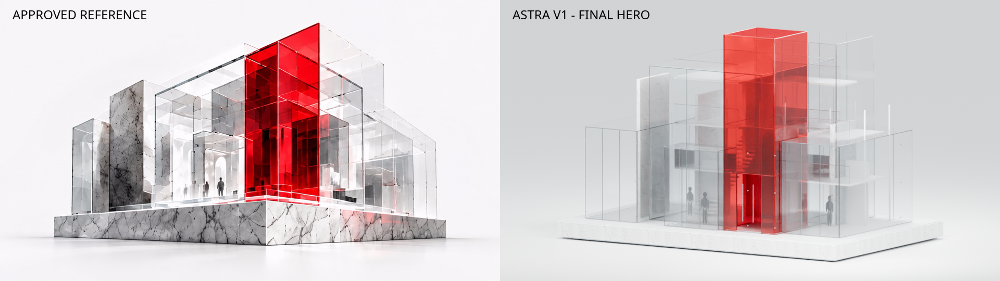

# SITE 00 — Build Object Astra V1

**Candidate for founder review. Newly modeled geometry; not a V2 re-export.**

| View | Render generation | Purpose |
|---|---|---|
| [Hero](../03_RENDERS/01_HERO_REFERENCE_MATCH.png) | Targeted revision | Reference composition, marble, red acrylic |
| [Front three-quarter](../03_RENDERS/02_FRONT_THREE_QUARTER.png) | Initial pass | Opposite facade and interior sight lines |
| [Side](../03_RENDERS/03_SIDE_INSPECTION.png) | Initial pass | Layered glazing and floor plates |
| [Elevated](../03_RENDERS/04_ELEVATED_INSPECTION.png) | Targeted revision | Pavilion arrangement and mezzanines |
| [Detail](../03_RENDERS/05_ARCHITECTURAL_DETAIL.png) | Initial pass | Portal construction and glazing joints |

The three initial inspection images retain the initial material/lighting state, per the one-revision/two-render limit. The saved Blender scene and GLB contain the final revision. Rebuilding without `--revision` renders all five views from that final scene.

- [Blender source](../01_SOURCE/SITE00_Build_Object_Astra_V1.blend)
- [Rebuild script](../01_SOURCE/build_astra_v1.py)
- [Web GLB](../02_EXPORTS/SITE00_Build_Object_Astra_V1_Web.glb)
- [Measured export validation](../05_DOCUMENTATION/export-validation-report.json)
- [Creative fidelity assessment](../06_DOCUMENTATION/creative-fidelity-assessment.md)
- [Technical art audit](../06_DOCUMENTATION/technical-art-audit.json)

Approval is pending. The contact sheet is a comparison, not a claim of exact visual parity or browser certification.
