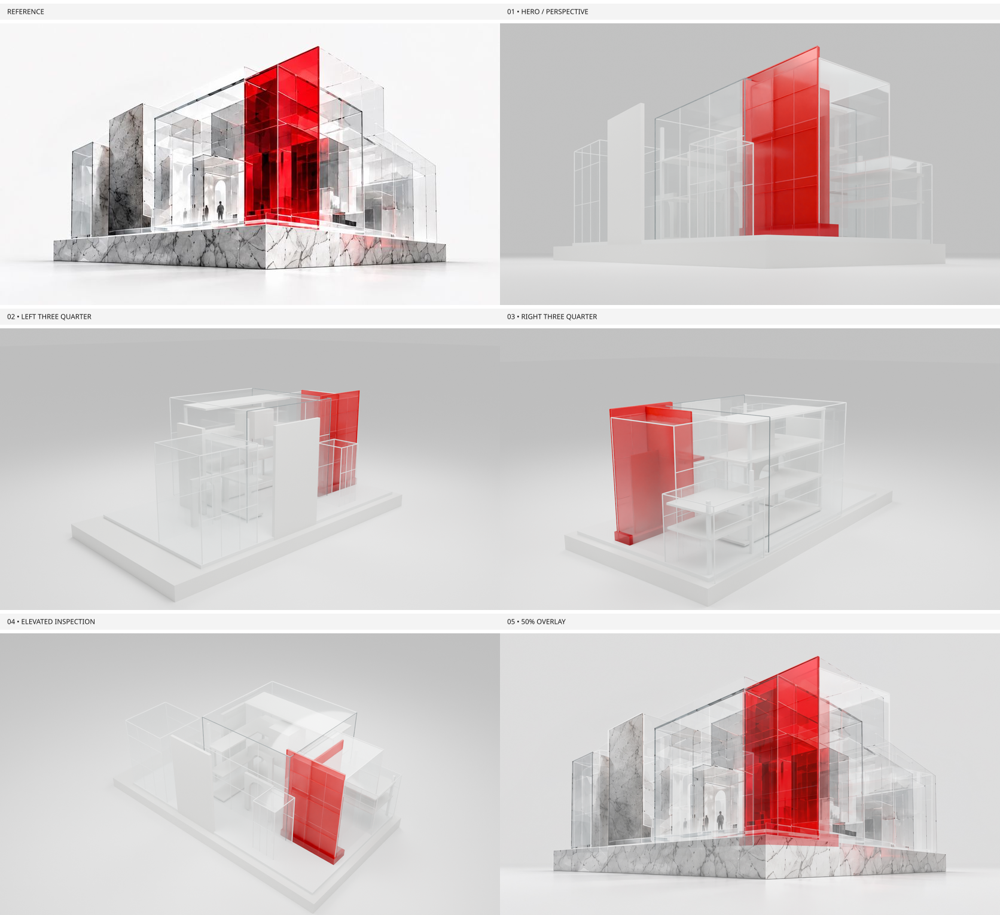

# SITE 00 Astra V2 — Stage 01 founder review

**Status: PENDING. Reference fidelity: PARTIAL. One structural revision used.**

- [Editable Blender source](../01_SOURCE/SITE00_Build_Object_Astra_V2_Blockout.blend)
- [Headless rebuild instructions](../01_SOURCE/README.md)
- [01 — Reference camera / perspective](../02_RENDERS/01_REFERENCE_CAMERA_BLOCKOUT.png)
- [02 — Left three quarter](../02_RENDERS/02_LEFT_THREE_QUARTER.png)
- [03 — Right three quarter](../02_RENDERS/03_RIGHT_THREE_QUARTER.png)
- [04 — Elevated inspection](../02_RENDERS/04_ELEVATED_INSPECTION.png)
- [05 — Exact 50% reference blend](../02_RENDERS/05_REFERENCE_OVERLAY.png)
- [Side-by-side comparison](../03_COMPARISONS/blockout-vs-reference-hero.png)
- [Selected landmark overlay](../03_COMPARISONS/landmark-overlay-hero.png)
- [Structural fidelity and limitations](../04_DOCUMENTATION/structural-fidelity-report.md)
- [Camera measurements](../04_DOCUMENTATION/camera-match-report.json)
- [Usage / cost unknown](../04_DOCUMENTATION/usage-report.json)

## Review focus

Does the asymmetric fin / portal / tiered-glass composition now provide the correct architectural basis? The portal is physically interlocked but still appears flatter than the reference; interior density and plinth top profile remain incomplete. Diagnostic white/glass contrast and missing marble texture are not final-material decisions. Do not infer approval from file completeness or mesh counts.

No automatic progression to Stage 02. The approval JSON intentionally remains PENDING.
